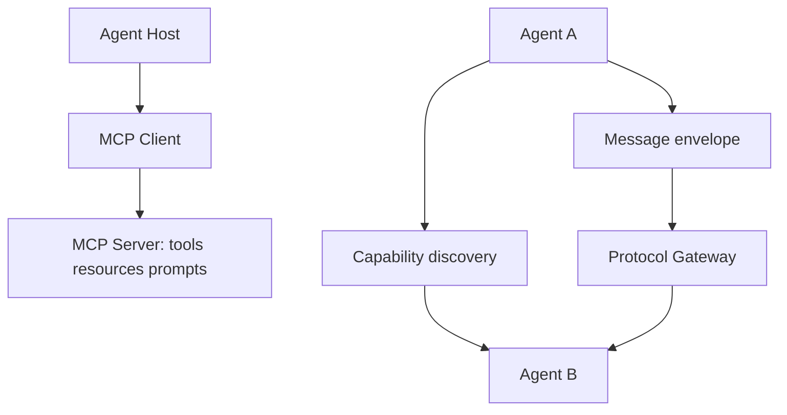

# A2A、ACP 和 MCP 的职责边界分别是什么？

## 30 秒回答

MCP 主要解决模型应用如何连接 tools、resources 和 prompts。A2A 或 ACP 这类协议更关注 Agent 之间如何做 capability discovery、message envelope、task_id、correlation_id、auth 和 protocol boundary。前者偏工具上下文接入，后者偏跨 Agent 协作。

## 面试定位

这题容易变成名词背诵。面试官真正想看的是你能否按系统边界解释协议，而不是把所有新名词混在一起。

回答里要讲架构、数据流、指标、取舍和追问。重点是“谁和谁通信，通信目的是什么，边界在哪里”。

## 标准回答

MCP 的典型关系是 Host、Client、Server。Host 是模型应用，Server 暴露工具、资源和提示模板。它让应用以标准方式发现和调用外部能力。

A2A 或 ACP 的典型关系是 Agent 到 Agent。调用方需要知道目标 Agent 有什么 capability，如何提交任务，怎样跟踪生命周期，如何认证，以及结果如何返回。

Tool schema 是更低层的单动作接口。Workflow API 则是业务系统自己的流程接口。不要把这些层混掉，否则权限和审计会很难做。

## 架构与运行机制

跨 Agent 协议的 message envelope 通常要包含 sender、receiver、task_id、correlation_id、capability、payload、context_refs、auth_scope、deadline 和 trace_id。

## 可画图

建议画两条边界。第一条是 Agent Host 到 MCP Server，标注 tool/resource/prompt。第二条是 Agent A 到 Agent B，标注 capability discovery 和 task lifecycle。

## 系统设计案例

企业内部 Research Agent 需要调用文档检索工具时，可以通过 MCP Server 获取 search tool 和资源。它如果要请求 Coding Agent 生成示例代码，则应走 A2A/ACP 风格的任务协议，发送 envelope，而不是直接暴露自己的内部 prompt。

数据流是：Research Agent 先用 MCP 取证据，再通过 Agent 协作协议提交代码任务。Gateway 校验 auth 和 schema，Coding Agent 返回 artifact_refs，最终 trace 用 correlation_id 串起来。

## 真实问题与排障

如果调用失败，先判断失败发生在哪层。MCP 层看 tool schema、server 连接和权限。Agent 协议层看 envelope、task state、auth、correlation_id 和目标 capability。

指标包括 protocol_error_rate、schema_violation_rate、auth_denial_rate、task_timeout_rate 和 cross_agent_success_rate。

## 面试官追问

- MCP Server 是否等于一个 Agent？
- capability discovery 应暴露多少信息？
- message envelope 为什么需要 correlation_id？
- 跨 Agent auth 如何做最小权限？
- 协议版本升级怎么兼容旧调用方？

## 项目化回答

我会把 MCP 用在工具与上下文接入，把 A2A/ACP 用在跨 Agent 任务协作。项目里会定义 protocol boundary，所有跨 Agent 消息都有 envelope、auth、task lifecycle 和 trace，避免自然语言裸传。

## 常见错误

- 把 MCP 和 Agent 协作协议混为一谈。
- capability discovery 暴露内部工具和 prompt。
- envelope 缺少 task_id 或 correlation_id。
- 没有 auth_scope，导致权限过大。
- 排障时分不清是哪一层失败。

## 深挖技术细节

这类协议边界可以按“连接对象”和“生命周期”来讲。MCP 的核心对象是 Host/Client/Server，Server 暴露 tools、resources、prompts，Client 负责发现和调用，重点是把外部系统能力接入模型应用。A2A 的核心对象是 Agent/Agent Card/Task/Message/Artifact，重点是让不同框架或组织的 Agent 发现能力、提交任务、跟踪状态和返回产物。ACP 在不同语境中可能指 Agent Communication Protocol 或 Agent Client Protocol，回答时要先澄清语境：是 Agent-to-Agent，还是 IDE/Client 到 Agent。

跨 Agent 协作的 message envelope 应该比普通 tool call 更完整。典型字段包括 `protocol_version`、`sender`、`receiver`、`task_id`、`correlation_id`、`capability`、`input_schema`、`payload`、`context_refs`、`artifact_refs`、`auth_scope`、`deadline`、`return_policy`、`trace_id`。Task lifecycle 要能表达 submitted、working、input_required、completed、failed、canceled 等状态，否则调用方无法判断是等待、重试、追问还是回滚。

权限和可观测性也不同。MCP tool 调用要关注 tool schema、resource permission、server auth；A2A/ACP 协作要关注目标 Agent capability、任务所有权、跨边界 auth、结果 artifact 和 correlation trace。指标包括 `protocol_error_rate`、`schema_violation_rate`、`auth_denial_rate`、`task_timeout_rate`、`capability_mismatch_rate`、`cross_agent_success_rate`。

## 边界条件与反例

反例一：把 MCP Server 当成完整 Agent，结果把业务规划、状态管理和工具调用混在一层。MCP Server 可以封装复杂能力，但协议角色仍是暴露工具/资源/提示。反例二：A2A discovery 直接暴露内部 prompt 和私有工具，造成能力泄露。反例三：跨 Agent 只传自然语言消息，没有 task_id 和 correlation_id，失败后无法追踪。

边界在于：协议解决互操作，不自动解决业务安全。即使 A2A 能发现目标 Agent，也要由 Gateway 校验身份、租户、scope 和风险。即使 MCP tool schema 合法，也要做执行层权限和审计。版本升级时要靠 `protocol_version`、capability version 和兼容策略保护旧调用方。

## 深问准备

- 问：MCP Server 是否等于 Agent？答：不等于；它主要暴露 tools/resources/prompts，是否内部用 Agent 实现是实现细节。
- 问：capability discovery 暴露多少？答：只暴露能力名称、输入输出 schema、风险等级和版本，不暴露内部 prompt、凭据和私有工具。
- 问：为什么要 correlation_id？答：跨服务、跨 Agent、异步任务需要把请求、状态、artifact 和 trace 串起来。
- 问：协议版本怎么兼容？答：message envelope 带 protocol_version 和 capability version，Gateway 做协商、降级或拒绝。

## 来源与延伸阅读

- [Agent2Agent Protocol](https://github.com/a2aproject/A2A)
- [Model Context Protocol Specification](https://modelcontextprotocol.io/specification/2025-06-18)
- [Agent Client Protocol Introduction](https://agentclientprotocol.com/get-started/introduction)
