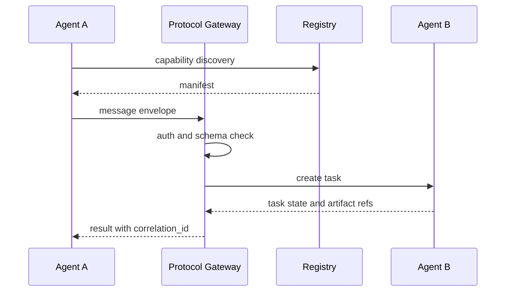

# 如果多个 Agent 需要互相调用，协议层最需要解决哪些问题？

## 30 秒回答

协议层最需要解决六件事：capability discovery、message envelope、task lifecycle、auth、context_refs 和 trace。也就是说，调用方要知道目标 Agent 能做什么，怎样提交任务，权限是否足够，状态如何变化，结果在哪里，失败后怎么恢复。

## 面试定位

这题考跨系统协作设计。面试官想听到的是协议字段、生命周期和安全边界，而不是“让 Agent 互相发消息”。

回答要覆盖架构、数据流、指标、取舍和追问。尤其要强调 protocol boundary，防止把内部上下文和私有工具泄漏出去。

## 标准回答

第一是能力发现。每个 Agent 应公开有限的 capability manifest，说明输入输出 schema、限制、权限要求和版本。

第二是消息封装。message envelope 要携带 task_id、correlation_id、sender、receiver、intent、payload、context_refs、auth_scope、deadline 和 trace_id。

第三是任务生命周期。远程 Agent 应能返回 accepted、running、blocked、completed、failed 或 cancelled。调用方不能只等待一段自然语言。

第四是安全和审计。Gateway 要做 auth、rate limit、schema validation、policy check 和日志记录。目标 Agent 不应读取超出 context_refs 授权范围的内容。

## 架构与运行机制

协议层要让每一步可验证。输入错了返回 schema error，权限不足返回 auth denial，目标繁忙返回 retryable 状态。

## 可画图

可以画成 Gateway 架构：左边多个调用 Agent，中间 Protocol Gateway 和 Registry，右边多个目标 Agent。下方放 trace store，用 correlation_id 串起链路。

## 系统设计案例

在一个企业 Agent 平台中，Sales Agent 需要 Legal Agent 审查合同摘要。Sales Agent 只应传合同片段引用、审查目标和截止时间，不应传完整客户数据库。Legal Agent 返回 verdict、risk list 和 artifact_refs。

数据流是：Sales Agent 查 capability，发送 envelope，Gateway 校验 auth_scope，Legal Agent 接收任务并更新状态。结果回到 Sales Agent 后，Orchestrator 决定继续、补充材料或转人工。

## 真实问题与排障

如果任务丢失，先用 correlation_id 查 Gateway 日志，再看目标 Agent 是否创建 task_id。若权限错误，看 auth_scope 和 context_refs。若结果不一致，检查协议版本和 payload schema。

指标包括 task_creation_success_rate、state_transition_error_rate、auth_denial_rate、context_ref_denial_rate、timeout_rate 和 retry_success_rate。

## 面试官追问

- capability manifest 应该多详细？
- context_refs 如何防止越权读取？
- 协议如何支持流式进度？
- 失败重试怎样保证幂等？
- 多版本 Agent 如何兼容？

## 项目化回答

我会说协议层是跨 Agent 的控制面。项目里我会把 capability、envelope、task lifecycle、auth、context_refs 和 trace 作为基本契约，并在 Gateway 层统一校验。这样 Agent 可以独立升级，但协作仍然可审计。

## 常见错误

- 让 Agent 之间直接传完整上下文。
- 没有任务状态，只靠最终文本。
- 缺少 auth 和租户隔离。
- payload 没有 schema，无法兼容升级。
- 没有 trace，排障只能猜。

## 深挖技术细节

跨 Agent 协议最需要把“任务”和“消息”分开。消息 envelope 负责传递一次请求，Task lifecycle 负责跟踪长期状态。Envelope 字段建议包括 `protocol_version`、`sender`、`receiver`、`task_id`、`correlation_id`、`intent`、`capability`、`payload_schema`、`payload`、`context_refs`、`auth_scope`、`deadline`、`trace_id`。Task 状态至少要能表达 submitted、accepted、working、input_required、completed、failed、canceled。

Capability manifest 也要最小暴露。它可以公开 capability name、input/output schema、版本、SLA、权限要求和不支持场景，但不应暴露内部 prompt、私有工具、检索库细节或凭据。Protocol Gateway 负责 schema validation、auth、rate limit、tenant isolation、context_ref 授权和 audit trace。目标 Agent 只能读取 context_refs 授权的 artifact，不能拿到调用方完整上下文。

可靠性要考虑幂等与重试。创建任务时使用 idempotency key 或 task_id 去重；流式进度要带 sequence number；失败要区分 retryable 与 non-retryable；版本升级通过 protocol_version 和 capability version 协商。指标包括 `task_creation_success_rate`、`state_transition_error_rate`、`auth_denial_rate`、`context_ref_denial_rate`、`timeout_rate`、`retry_success_rate`。

## 边界条件与反例

反例一：Sales Agent 把完整客户数据库上下文传给 Legal Agent，只为审查一个合同片段。正确做法是传 artifact ref 和最小 scope。反例二：协议只返回最终自然语言，调用方不知道目标 Agent 是 running、blocked 还是 failed。反例三：payload 没 schema，目标 Agent 升级后旧调用方静默失败。

边界在于：协议层保证互操作和审计，不保证业务正确性。目标 Agent 的输出仍要由调用方 verifier、policy 和 human review 检查。跨组织 Agent 协作还要考虑更强的身份、租户、数据驻留和审计要求。

## 深问准备

- 问：capability manifest 应该多详细？答：足够让调用方选择能力和构造请求，但不暴露内部 prompt、工具和敏感实现。
- 问：context_refs 如何防越权？答：引用带 scope、TTL、tenant、resource id 和访问审计，由 Gateway 校验。
- 问：如何支持流式进度？答：任务状态事件带 sequence number、partial artifact refs 和 correlation_id。
- 问：失败重试如何幂等？答：task_id/idempotency_key 去重，retryable error 明确，副作用动作要状态查询。

## 来源与延伸阅读

- [Agent2Agent Protocol](https://github.com/a2aproject/A2A)
- [Model Context Protocol Specification](https://modelcontextprotocol.io/specification/2025-06-18)
- [Agent Client Protocol Introduction](https://agentclientprotocol.com/get-started/introduction)
