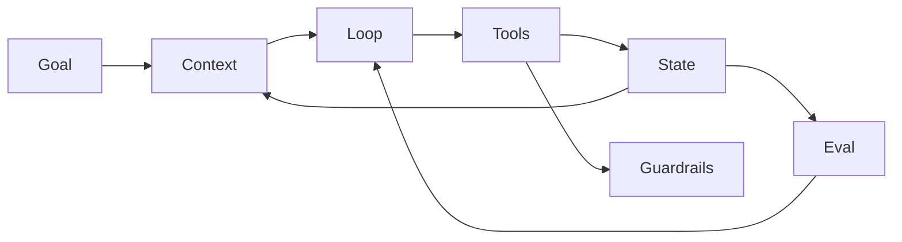

# 一个完整 Agent 通常由哪些核心组件构成？

## 面试定位

这题考你是否能把 Agent 讲成工程系统，而不是“模型加工具”。回答要覆盖架构、数据流、指标、取舍和追问。

## 30 秒回答

我会用七个模块回答：Goal、State、Context、Tools、Loop、Guardrails、Eval。Goal 定义成功标准，State 保存可信任务状态，Context 是给模型的工作视图，Tools 连接外部能力，Loop 推进观察和行动，Guardrails 控制风险，Eval 证明系统有效。

缺少这些模块，Agent 容易只停留在 demo。例如没有 State 就无法恢复，没有 Eval 就无法证明稳定，没有 Guardrails 就不能安全执行真实动作。

## 标准回答

先讲边界。Agent 不是单次聊天，也不是一次 tool call。它要围绕目标持续决策，所以必须有状态、工具、反馈和停止条件。

再讲数据流。用户目标进入 Goal，State 提供当前进展，Context Builder 选择相关状态和工具说明，模型在 Loop 中选择动作，Tools 返回 observation，Guardrails 判断风险，Eval 决定继续还是停止。

最后讲取舍。模块越完整，系统越可控，但开发成本也更高。首版可以先做 Goal、State、Tools、Trace 和 Verifier，再逐步加强复杂能力。

## 架构与运行机制

图 1：一个完整 Agent 的七模块闭环。图中 Goal 提供目标和停止条件，State 保存可信运行事实，Context 是投给模型的当前视图，Loop 推进行动，Tools 连接外部系统，Guardrails 控制风险，Eval/Verifier 决定继续、重试、handoff 或停止。

这张图里最容易被忽略的是 State 和 Context 的边界。State 是可持久化、可审计、可恢复的系统账本；Context 是本轮模型输入，可以被压缩和裁剪。把聊天历史当 State，会在长任务恢复、工具失败和上下文压缩后出现漂移；把所有 State 原样塞进 Context，又会制造噪声和成本。

State 是系统可信状态，Context 是模型看到的短期视图。这个区别是回答里的关键细节。

## 可画图

可以画七模块闭环，并强调 observation 会写回 State，Eval 会影响下一步 Loop。

## 系统设计案例

Coding Agent 中，Goal 是修复测试，State 保存计划和补丁，Context 放相关文件片段，Tools 包含 read/apply_patch/run_tests，Guardrails 限制写文件和 shell，Eval 用测试和 diff 判断是否完成。

## 真实问题与排障

如果 Agent 失败，按模块定位。目标漂移看 Goal，重复工具调用看 Loop，越权看 Guardrails，无法复盘看 Trace，修复后又坏看 Eval。

指标包括 `task_success_rate`、`tool_chain_success_rate`、`state_restore_success_rate`、`guardrail_trigger_rate` 和 `eval_regression_pass_rate`。

事故排查也按模块拆：影响面先确认是目标不清、状态不可恢复、上下文缺证据、工具错误，还是评测漏判；止血可以暂停高风险工具、收紧 max steps、把写操作切到 requiresConfirmation；根因要查 goal、state_version、context blocks、tool args、observation、guardrail verdict 和 eval case；回归要把失败 run 固化成 trajectory eval，而不只补一句 prompt。

## 面试官追问

### 追问 1：State 和 Context 有什么区别？

State 是可信持久状态，Context 是本轮给模型的压缩视图。

### 追问 2：Eval 为什么是核心模块？

没有 Eval 就只能展示成功 demo，不能证明系统稳定。

## 多轮追问模拟

**追问 1：为什么不能只说模型、Prompt 和工具？**  
答题要点：真实 Agent 需要目标、状态、上下文、工具、循环、风险控制和评测闭环；否则只能跑 demo，不能恢复、审计和上线。考察点是工程系统观。陷阱是把一次 tool call 当 Agent。

**追问 2：Guardrails 和 Tool permission 有什么区别？**  
答题要点：guardrails 做输入/工具/输出风险判断，permission 是确定性的权限边界；高风险动作还需要 preview、confirmation、idempotency 和 audit。考察点是安全分层。陷阱是用 prompt 代替权限系统。

**追问 3：Eval 为什么要接在 Loop 后面？**  
答题要点：Eval/Verifier 判断结果是否达到 success criteria，失败时决定 retry、recover、handoff 或 stop；没有 eval 就无法区分“看起来完成”和“业务完成”。考察点是闭环控制。陷阱是只在项目结束后人工看结果。

## 项目化回答

Paper Agent 强调 Context 和 citation Eval。Travel Agent 强调 Goal、Tools 和 Guardrails。Coding Agent 强调 State、Loop 和测试验证。

## 常见错误

- 只说模型、工具、prompt。
- 把聊天历史当 State。
- 不讲 Guardrails 和 Eval。
- 没有指标和失败恢复。

## 深挖技术细节

完整 Agent 的核心不是模块名，而是模块之间的数据契约。Goal 要包含 `objective`、`success_criteria`、`constraints` 和 `stop_condition`；State 保存可恢复的任务事实，例如 plan、completed_steps、tool_results、risk_flags；Context Builder 从 State、Memory、检索结果和工具说明里选本轮最相关的信息；Loop 产出 action；Tools 返回 observation；Verifier/Eval 决定继续、重试、handoff 或停止。

State 和 Context 是最容易被混淆的两层。State 是系统可信账本，应该可持久化、可回放、可审计；Context 是给模型的临时窗口，可以被压缩、裁剪和重排。把聊天历史当 State，会在长任务里造成信息漂移；把完整 State 原样塞进 Context，又会增加成本、延迟和干扰。

## 边界条件与反例

并不是所有项目都要一开始做全量 Agent 平台。低风险 demo 可以先有 model、tools 和 trace；但只要进入生产写操作，就至少需要权限、幂等、审计、失败恢复和 eval。反例是“让模型直接调用退款接口”：即使 tool schema 正确，没有 Guardrails、permission gate、preview 和 user confirmation，也不应该自动执行。

另一个边界是 Memory。长期记忆不等于状态数据库。Memory 适合存用户偏好、历史经验和可复用背景；State 记录当前任务事实和执行进度。把未验证的模型总结写进 State，会污染后续决策；把执行结果只放 Memory，不进入 trace，就无法复盘一次失败 run。

## 深问准备

面试官追问“如何判断 Agent 可上线”时，可以用指标回答：`task_success_rate`、`tool_chain_success_rate`、`state_restore_success_rate`、`guardrail_trigger_rate`、`manual_handoff_rate`、`eval_regression_pass_rate` 和 `cost_per_success`。这些指标要按任务类型拆开看，不能用总体成功率掩盖高风险场景失败。

如果问“失败怎么定位”，按模块逆推：Goal 是否定义模糊，Context 是否缺证据，Tool 是否 schema 或权限错误，Loop 是否重复无效动作，Guardrail 是否漏放，Eval 是否把坏结果判成成功。好的回答要能把一次失败 trace 映射到具体模块，而不是泛泛说“模型不稳定”。

## 来源与延伸阅读

- [OpenAI A practical guide to building agents](https://cdn.openai.com/business-guides-and-resources/a-practical-guide-to-building-agents.pdf)：官方指南用于支持 Agent 需要目标、工具、控制流、评估和人类确认等工程模块。
- [OpenAI Agents SDK Tracing](https://openai.github.io/openai-agents-python/tracing/)：官方文档用于说明 tool call、handoff、guardrail 和运行过程要进入 trace。
- [OpenAI Agents SDK Guardrails](https://openai.github.io/openai-agents-python/guardrails/)：官方文档用于说明输入、工具和输出风险控制在 Agent 架构中的位置。
- [Anthropic Building effective agents](https://www.anthropic.com/engineering/building-effective-agents)：工程文章用于补充 workflow、agent、tool use 与 eval 的边界取舍。
