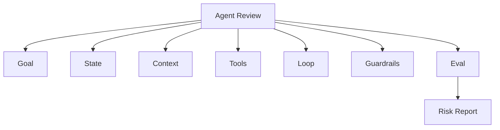

# 如果要审查一个 Agent 项目，你会按哪些模块判断它是不是生产级？

## 面试定位

这是项目审查题。重点不是列组件，而是用模块清单发现风险，并能给出整改建议。

## 30 秒回答

我会按七层审查：Goal 是否有成功标准，State 是否可恢复，Context 是否可控，Tools 是否有 schema 和权限，Loop 是否有停止条件，Guardrails 是否覆盖风险动作，Eval 是否有回归样本和线上指标。

如果项目只能跑一次 demo，但没有 trace、失败分类和评测集，我不会认为它是生产级。

## 标准回答

第一看目标和边界。任务做什么，不能做什么，失败后怎么办。第二看状态和上下文。是否把长期可信状态和模型上下文分开。第三看工具。是否有 JSON Schema、runtime validation、permission 和 structured error。

第四看 Loop。是否有 max steps、timeout、预算和 stop reason。第五看 Guardrails 和 Eval。是否能拦截高风险动作，是否有 golden cases、trajectory eval 和 regression。

## 架构与运行机制

图 1：生产级 Agent 审查的七模块矩阵。图中审查不是看 README，而是围绕 Goal、State、Context、Tools、Loop、Guardrails、Eval 分别找证据，最后输出 Risk Report。每个模块都要能映射到真实 run trace 中的输入、动作、状态变化和 verdict。

这张图的边界是：生产级不是“所有能力都自动化”，而是 supported、unsupported、requiresConfirmation 三类边界说清楚，并且每类都有证据。高风险写操作即使暂不支持，也比假装支持更专业；低风险只读能力也需要 trace 和 regression，否则无法解释失败。

审查的数据流不是看 README，而是看一次真实 run 的 trace。每一步输入、工具参数、observation、状态变化和 verdict 都要能解释。

这里的关键取舍是审查粒度。按模块逐项审查更慢，但能把事故归因到 Goal、State、Tools 或 Eval，适合生产系统复盘。

## 可画图

可以画审查矩阵：模块、证据、风险、整改动作。这样比泛泛说“看架构”更有说服力。

## 系统设计案例

审查 Travel Agent 时，搜索行程是低风险，支付改签是高风险。生产级设计必须有 preview、用户确认、幂等键和审计。只展示“生成一个旅行计划”不够。

## 真实问题与排障

如果项目事故频发，我会看失败是否能归因到模块。比如工具误用对应 Tools 和 Guardrails，目标漂移对应 Goal 和 Eval，上下文污染对应 Context Builder。

指标包括 `unsafe_action_block_rate`、`tool_error_rate`、`recovery_rate`、`trace_coverage` 和 `regression_pass_rate`。

事故审查时先定影响面：是单个工具权限问题，还是整条 Loop 缺 stop condition；止血优先处理 P0 风险，例如越权、数据泄漏、不可逆写无确认；根因看 run trace、tool schema、permission gate、state_version、guardrail verdict、eval coverage；回归要把事故路径做成 golden trajectory，并在 CI 或发布门禁里跑。

## 面试官追问

### 追问 1：没有 Eval 怎么办？

从历史失败和高频任务构建 golden set，先做离线回归，再灰度。

### 追问 2：哪个模块最容易漏？

State 和 Eval。很多 demo 只靠 messages 和人工感觉。

## 多轮追问模拟

**追问 1：审查一个 Agent 项目时第一眼看什么？**  
答题要点：先看目标边界和真实 trace，而不是 README；确认 supported、unsupported、requiresConfirmation 是否清楚。考察点是审查入口。陷阱是只看是否接入了工具。

**追问 2：如何给风险分级？**  
答题要点：P0 是越权、数据泄漏、不可逆写无确认；P1 是状态不可恢复、trace 缺失、eval 不覆盖核心路径；P2 是成本、延迟和维护性。考察点是整改优先级。陷阱是把所有问题都当体验优化。

**追问 3：没有历史失败样本怎么建 Eval？**  
答题要点：先从高频路径、高风险动作、业务边界和人工验收样例构造 golden set，再逐步加入线上失败和反例。考察点是从零落地评测。陷阱是等事故发生后才建评测。

## 项目化回答

可以把自己的 Paper、Travel、Web、Coding Agent 都用同一套审查框架讲。这样面试官会觉得你有系统方法，而不是只会堆框架。

## 常见错误

- 只看是否接了工具。
- 不看 trace。
- 不区分只读和写操作。
- 没有失败样本。

## 深挖技术细节

生产级 Agent 审查要看模块 contract，而不是只看页面 demo。Goal 模块要有 `success_criteria`、`out_of_scope`、`fallback`；State 模块要有 `state_version`、`checkpoint`、`artifact_refs`；Context 模块要有 prompt manifest、trust_level 和 token budget；Tools 模块要有 schema、runtime validation、permission、structured error；Loop 模块要有 stop policy、retry policy；Guardrails 和 Eval 要有 fixture、trace 和 regression。

审查最好从一条真实 run trace 开始。看模型收到哪些 context block，调用了什么 tool，参数是否通过 schema，observation 是否写 state，verifier 如何判断完成，高风险动作是否被 permission gate 拦截。只看 README 或架构图很容易漏掉状态恢复、权限和失败处理。

输出审查报告时按风险分级：P0 是越权、数据泄漏、不可逆写无确认；P1 是状态不可恢复、trace 缺失、eval 不覆盖核心路径；P2 是成本、延迟、维护性。指标包括 `trace_coverage`、`tool_error_rate`、`unsafe_action_block_rate`、`recovery_rate`、`regression_pass_rate`、`cost_per_success`。

## 边界条件与反例

反例一：项目能演示一次成功，但没有 trace 和 regression，页面一变就坏。反例二：工具全权限，模型可以直接发邮件或删除数据。反例三：State 只是 messages，压缩或重启后无法恢复。反例四：Eval 只有 happy path，没有 forbidden behavior。

边界在于：生产级不是要求所有能力都自动化，而是明确 supported、unsupported 和 requiresConfirmation。对高风险能力，不支持比假装支持更专业；对低风险能力，也要有可观测性和基本回归。

## 深问准备

- 问：没有 Eval 怎么办？答：先从历史失败、高频路径和高风险动作构建 golden set，再接 CI 或发布门禁。
- 问：哪个模块最容易漏？答：State 和 Eval，很多 demo 只靠 messages 和人工感觉。
- 问：如何判断工具模块是否合格？答：看 schema、权限、error taxonomy、idempotency、audit 和 rollback。
- 问：如何给整改建议？答：按风险优先级，从权限、trace、state、eval 到体验逐层修。

## 来源与延伸阅读

- [OpenAI Agents Guide](https://cdn.openai.com/business-guides-and-resources/a-practical-guide-to-building-agents.pdf)：官方指南用于支持 Agent 需要明确边界、工具、人类确认和评估体系。
- [OpenAI Agents SDK Tracing](https://openai.github.io/openai-agents-python/tracing/)：官方文档用于说明审查应基于可追踪的 tool call、handoff、guardrail 和 span。
- [OpenAI Agents SDK Guardrails](https://openai.github.io/openai-agents-python/guardrails/)：官方文档用于支撑输入、工具和输出风险控制是生产级审查重点。
- [Anthropic Building effective agents](https://www.anthropic.com/engineering/building-effective-agents)：工程文章用于补充 workflow、agent、tool use 与评测之间的设计取舍。
