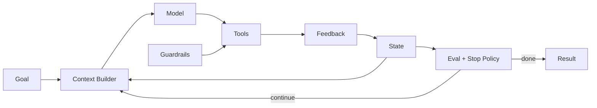

# 你如何定义一个基于 LLM 的 Agent？

## 面试定位

这道题考察你能不能把 Agent 从“聊天机器人”“LLM 应用”“function calling”里区分出来。回答要落到架构、数据流、指标、取舍和追问边界。

## 30 秒回答

我会把 LLM Agent 定义为：模型参与多步控制流的工程系统。它围绕 Goal 读取 Context 和 State，选择 Tools，接收 Feedback，再由 Guardrails 和 Eval 判断是否继续或停止。

关键点是“受控”。模型可以决定下一步动作，但真实执行权、权限、状态持久化、审计和回滚必须由宿主系统管理。不是所有接入 LLM 的应用都叫 Agent。

## 标准回答

先讲边界：一次聊天、一次总结、一次 tool call 都不一定是 Agent。只有当模型根据中间反馈动态决定下一步，并推进一个不完全固定路径的任务时，才更接近 Agent。

再讲组成：一个生产级 Agent 至少包含 Goal、State、Context Builder、Tools、Loop Controller、Guardrails、Trace 和 Eval。Goal 定义成功标准，State 保存任务进展，Tools 连接外部系统，Feedback 改变下一步决策，Eval 证明结果是否可靠。

最后讲取舍：路径固定、强事务、强合规的场景优先 workflow。路径开放、需要探索、工具结果会影响下一步的场景才适合 Agent。

## 架构与运行机制

Agent 的数据流是：用户目标进入系统，宿主抽取约束和成功标准，Context Builder 汇总状态、工具和证据，模型提出下一步动作，Tool Runtime 执行并返回 observation，State Store 记录变化，Verifier 根据指标和停止策略决定继续、重试、降级或转人工。

## 可画图

## 系统设计案例

Coding Agent 是典型例子。它先读取失败测试和相关文件，再提出补丁，运行测试，根据结果继续修改或停止。模型不是直接写生产代码，而是通过受控工具读文件、打 patch、跑测试。每一步都有 trace 和验证器。

## 真实问题与排障

如果 Agent 线上不稳定，我会按层排查：Goal 是否含糊，State 是否丢失，Context 是否缺证据，Tool 是否失败，Loop 是否停不下来，Guardrails 是否误放行，Eval 是否漏了失败样本。

关键指标包括 `task_success_rate`、`avg_steps`、`tool_error_rate`、`recovery_rate`、`unsafe_action_block_rate` 和 `cost_per_task`。

## 面试官追问

### 追问 1：Agent 和普通 LLM 应用区别是什么？

看模型是否参与多步控制流，以及系统是否有状态、工具、反馈和停止策略。

### 追问 2：Agent 必须自主吗？

不应该把自主理解成无控制。生产 Agent 是受控自主，外部动作必须经过宿主权限和审计。

### 追问 3：如何证明不是 demo？

要有 trace、eval、失败样本、回归集和线上指标，而不是只展示一次成功路径。

## 项目化回答

Paper Agent 可以讲 claim-to-evidence 和 citation eval。Travel Agent 可以讲预算、偏好、候选方案和人工确认。Coding Agent 可以讲测试反馈、patch、diff 和 verifier。

## 常见错误

- 把任何聊天机器人都叫 Agent。
- 把 function calling 等同于 Agent。
- 只讲框架名，不讲 Goal、State 和 Eval。
- 忽略权限、审计和停止条件。

## 深挖技术细节

一个更工程化的定义是：Agent 是由宿主系统约束的闭环控制系统。模型不是“单独自治”，而是在每一轮接收目标、状态摘要、工具说明和历史 observation，输出下一步 action；Tool Runtime 执行后返回结构化 observation；Verifier 根据成功标准、风险和预算决定继续、重试、降级或停止。

因此 Agent 的最小生产记录不应只是对话文本，而应该包含 `run_id`、`goal`、`state_version`、`context_refs`、`action_type`、`tool_call`、`observation_id`、`verifier_verdict`、`risk_flags` 和 `stop_reason`。这些字段让失败可复盘，也能支撑 eval。没有 trace 的 Agent 很难从 demo 走向可维护系统。

## 边界条件与反例

一次 RAG 问答、一次摘要、一次 function call 不一定是 Agent。如果控制流是固定的“检索、生成、返回”，模型没有根据反馈决定下一步，那更像 LLM workflow。反过来，如果系统需要根据测试结果反复修改代码、根据网页状态选择下一步点击、根据检索缺口重写查询，就更接近 Agent。

Agent 也不等于无限自主。生产里的 Agent 必须有边界：max steps、成本预算、工具权限、停止条件、人工接管和回滚策略。越是高风险动作，越要把执行权放在确定性后端，而不是让模型直接承担安全责任。

## 深问准备

被问“Agent 必须有记忆吗”时，可以区分 State、Memory 和 Context。State 是当前任务可信事实，Memory 是跨任务可复用偏好或经验，Context 是本轮给模型的工作视图。三者混在一起，会导致状态漂移、隐私泄漏或上下文污染。

被问“如何证明 Agent 有用”时，不要只展示一次成功录像。要有离线 golden set、失败样本、trace replay、线上分桶指标和回归门禁。核心指标是成功率、恢复率、人工接管率、工具错误率、安全拦截率、延迟和成本。

## 来源与延伸阅读

- [Anthropic Building effective agents](https://www.anthropic.com/engineering/building-effective-agents)
- [OpenAI A practical guide to building agents](https://cdn.openai.com/business-guides-and-resources/a-practical-guide-to-building-agents.pdf)
