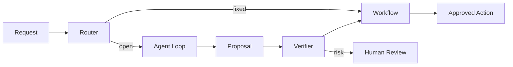

# 如果面试官说普通 workflow 也能做，你如何解释为什么某场景需要 Agent？

## 面试定位

这道题不是让你证明 Agent 永远更好，而是看你有没有取舍意识。高质量回答必须承认 workflow 是默认首选，然后说明什么条件下 Agent 的动态决策才有收益。

## 30 秒回答

我不会一上来否定 workflow。固定路径、状态机清楚、失败可枚举的任务应该优先 workflow。只有当任务路径不可预先枚举，中间工具结果会改变下一步，需要探索、重规划或恢复时，Agent 才有价值。

所以我会先做 workflow baseline，再用指标证明 Agent 在成功率、人工节省或恢复率上有收益。如果收益不能覆盖成本和风险，就不该用 Agent。

## 标准回答

先划边界：workflow 的控制流由代码决定，Agent 的控制流由模型结合状态和反馈动态决定。这个区别比“有没有 LLM”更重要。

再举场景：订单退款审批适合 workflow，因为状态、规则和风险边界明确。代码修复、网页任务、论文证据查找更适合 Agent，因为下一步取决于搜索结果、测试结果或页面状态。

最后讲生产做法：常用 hybrid。外层 workflow 管鉴权、预算、审批、降级和提交；内层 Agent 处理开放探索，并把候选动作交回 workflow 验证。

## 架构与运行机制

数据流可以这样讲：请求先进入 Router，Router 根据任务类型、风险等级和置信度选择 workflow 或 Agent。Agent 子流程执行开放探索，输出结构化 proposal。最终写操作、交易动作或发布动作回到 workflow 和 human confirmation。

## 可画图

## 系统设计案例

旅行规划里，搜索航班、比较酒店、根据用户反馈调整方案适合 Agent。支付下单、取消订单、改签提交必须 workflow。这样既利用 Agent 的开放探索能力，又避免模型直接执行高风险交易。

## 真实问题与排障

如果引入 Agent 后效果不好，我会看 Router 是否把固定任务误送给 Agent，Agent 是否缺少状态，工具 observation 是否不足，Verifier 是否没有阻止低质量 proposal。

指标要比较 baseline：`task_success_rate`、`manual_handoff_rate`、`p95_latency`、`cost_per_task`、`unsafe_action_block_rate` 和 `recovery_rate`。

## 面试官追问

### 追问 1：如何判断场景适不适合 Agent？

看路径是否可枚举、中间反馈是否改变下一步、失败代价是否可控、是否有评测集证明收益。

### 追问 2：Agent 成本高怎么办？

缩小 Agent 负责的开放子任务，外层用 workflow 控制；做 model tiering 和缓存；设置预算和 max steps。

### 追问 3：如何上线验证？

先做 shadow/eval，再灰度，对比 workflow baseline 的成功率、延迟、成本和人工接管率。

## 项目化回答

Coding Agent 可以说明：文件定位和修复尝试由 Agent 处理，代码写入通过 patch 工具，测试和 diff 由 Verifier 判断。Web Agent 可以说明：页面探索由 Agent 处理，表单提交和购买动作必须人工确认。

## 常见错误

- 为了高级感强行使用 Agent。
- 不做 workflow baseline。
- 让 Agent 控制高风险写操作。
- 只比较效果，不比较成本、延迟和安全。

## 深挖技术细节

我会把“为什么需要 Agent”讲成控制流问题。Workflow 的状态转移由代码提前定义，适合路径固定、规则可枚举、失败处理确定的任务；Agent 的状态转移由模型结合 observation 动态选择，适合路径开放、信息不完整、工具结果会改变下一步的任务。这个差异可以落到数据结构：workflow 是固定 DAG/state machine，Agent run 是 `goal + state + context + action + observation + verifier verdict` 的循环。

为了避免“Agent 崇拜”，我会先做 baseline：把同一批任务分别跑 workflow 和 Agent shadow run，比较 `task_success_rate`、`recovery_rate`、`manual_handoff_rate`、`p95_latency`、`cost_per_success` 和 `unsafe_block_rate`。只有 Agent 在开放场景里显著提升成功率或恢复率，并且成本和风险可控，才值得上线。

## 边界条件与反例

退款、转账、改签提交、权限变更这类强事务动作不因为接了 LLM 就变成 Agent 场景。它们可以使用 Agent 理解用户意图、生成解释或准备 proposal，但最终动作必须走 workflow 的权限、确认、幂等、审计和回滚链路。

相反，代码修复、网页任务、事故排查和论文证据检索很难预先写死完整路径。比如测试失败后要读哪个文件、改哪段代码、是否需要回滚，取决于工具 observation；这时 Agent 的动态重规划有收益。但即使如此，写文件、运行 shell 和提交 PR 也应该由受控 Tool Runtime 执行。

## 深问准备

如果面试官追问“Agent 和 workflow 能不能共存”，答案是应该共存。workflow 做控制面：鉴权、预算、审批、事务和最终提交；Agent 做开放子任务：探索、候选生成、解释和恢复。这个 hybrid 架构比“全 Agent”更容易上线，也更容易做 trace 和回归测试。

如果追问“怎么防止 Agent 乱来”，我会从四个层面答：缩小 tool surface、限制 max steps 和预算、用 verifier 检查 proposal、把 side effect tool 放到 preview + confirmation 后。模型可以参与决策，但权限、状态和审计必须由宿主系统掌握。

## 来源与延伸阅读

- [Anthropic Building effective agents](https://www.anthropic.com/engineering/building-effective-agents)
- [OpenAI A practical guide to building agents](https://cdn.openai.com/business-guides-and-resources/a-practical-guide-to-building-agents.pdf)
