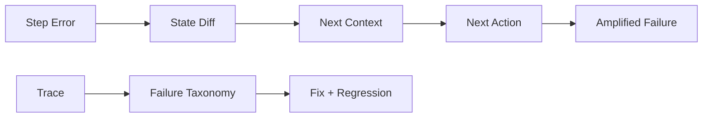

# 构建复杂 Agent 时最主要的挑战是什么？

## 面试定位

这题要从失败模式回答。面试官想看你能否把复杂 Agent 的风险拆成可治理问题，而不是只说“模型不稳定”。

## 30 秒回答

复杂 Agent 最大挑战是错误会在多步闭环中累积。常见风险包括目标漂移、上下文污染、工具误用、状态污染、权限失控、循环不止和缺少 Eval。

我会用 trace-first 的方式治理：每一步记录 action、arguments、observation、state diff 和 verdict，再把失败样本归类进入 regression。

## 标准回答

先讲目标漂移。任务没有成功标准，Agent 会越做越偏。再讲上下文污染，不可信网页或文档可能诱导模型忽略系统指令。工具误用和状态污染会把一次错误变成后续多步错误。

然后讲工程控制：schema validation、permission gate、stop policy、state rollback、human handoff 和 eval set。复杂 Agent 的可靠性来自这些系统设计，而不是期待模型永远正确。

## 架构与运行机制

数据流里最危险的是错误 observation 写入 State 后继续影响下一轮 Context。

关键取舍是恢复速度和安全边界。自动重试能提高完成率，但高风险动作要优先冻结、确认和回滚。

## 可画图

画“错误放大链路”最容易说明问题：单步错误并不可怕，不可复盘和不可恢复才可怕。

## 系统设计案例

Web Agent 如果误点按钮，下一步仍按旧计划继续，就会连续犯错。必须在每步动作后用 DOM/screenshot verifier 检查页面状态。

## 真实问题与排障

排障先看 trace 的第一处偏差。是目标理解错，工具参数错，权限缺失，还是 observation 与预期不一致。先止血，再修复 schema、context、tool 或 verifier。

指标包括 `task_success_rate`、`tool_error_rate`、`loop_timeout_rate`、`context_pollution_rate`、`unsafe_action_block_rate` 和 `recovery_rate`。

## 面试官追问

### 追问 1：如何避免目标漂移？

写清 success criteria，设置 step verifier 和 stop reason。

### 追问 2：上下文污染怎么办？

做 instruction/data separation，标记来源，限制不可信内容权限。

## 项目化回答

Coding Agent 可以讲错误 patch 如何通过测试发现。RAG Agent 可以讲错误证据如何通过 citation verifier 拦截。Travel Agent 可以讲高风险动作确认。

## 常见错误

- 只说 prompt 优化。
- 不记录 trace。
- 没有失败分类。
- 失败样本不进回归。

## 深挖技术细节

复杂 Agent 的失败通常来自错误放大链路。一个小错误如果写入 State，就会进入下一轮 Context，影响下一个 Action，最后变成多步事故。因此系统要记录 `goal`、`context_manifest`、`tool_call`、`observation`、`state_diff`、`verifier_verdict`、`policy_verdict` 和 `stop_reason`。排障时找 first bad step，而不是只看最终答案。

失败分类可以包括 `goal_drift`、`context_pollution`、`tool_misuse`、`state_corruption`、`permission_bypass`、`loop_timeout`、`missing_eval`、`unsafe_recovery`。每类对应控制手段：目标漂移靠 success criteria；上下文污染靠 trust label；工具误用靠 schema 和 permission gate；状态污染靠 reducer、checkpoint 和 rollback；循环失控靠 stop policy。

生产治理要把失败样本变成 regression。每次事故保存 trace、输入、artifact、policy version 和 expected verdict。指标包括 `task_success_rate`、`tool_error_rate`、`loop_timeout_rate`、`context_pollution_rate`、`unsafe_action_block_rate`、`recovery_rate`、`regression_escape_rate`。

## 边界条件与反例

反例一：模型误读网页，系统把错误 observation 写进 state，后续动作全部偏离。反例二：RAG 检索到恶意 chunk，Context Builder 未标 untrusted，导致 prompt injection。反例三：工具 schema 太宽，模型填错参数，外部系统仍执行。

边界在于：复杂 Agent 不可能靠单一 prompt 解决可靠性。越开放、工具越多、外部副作用越强，就越需要 deterministic policy、trace、eval 和 human handoff。低风险任务可以容忍自动恢复，高风险任务要优先冻结和确认。

## 深问准备

- 问：如何避免目标漂移？答：明确 success criteria、step verifier、stop reason 和 user constraint retention。
- 问：上下文污染怎么办？答：instruction/data separation、trust label、permission filter 和 prompt injection eval。
- 问：失败先修哪里？答：看 first bad step，定位到 goal、context、tool、state、guardrail 或 eval。
- 问：为什么不是继续调 prompt？答：很多失败来自执行层和状态层，prompt 只能覆盖一部分。

## 来源与延伸阅读

- [Anthropic Building effective agents](https://www.anthropic.com/engineering/building-effective-agents)
