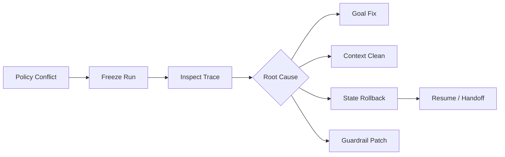

# Agent 误判导致策略冲突时，你会如何定位和恢复？

## 面试定位

这是事故处理题。回答要体现分层排查、恢复动作、补偿和回归，而不是泛泛说“让模型重新思考”。

## 30 秒回答

我会先暂停当前 run，保留 trace，然后找第一次偏差：目标是否被误解，Context 是否混入错误信息，工具 observation 是否不可信，State 是否被污染，Guardrails 是否漏拦。恢复时优先回滚 state diff，必要时降级到 workflow 或 human handoff。

最后把样本加入 regression，修复 prompt、schema、policy 或 verifier。

## 标准回答

第一步止血。高风险动作先冻结，避免继续放大。第二步定位。沿 run trace 查 action、args、observation、state diff 和 verdict。第三步恢复。根据错误类型选择重规划、换工具、回滚状态、追问用户或转人工。

策略冲突通常不是单点问题。可能是 Goal 和工具结果冲突，也可能是用户约束和系统策略冲突。必须让 verifier 明确优先级。

## 架构与运行机制

图 1：Agent 策略冲突后的冻结、定位、恢复链路。Policy Conflict 先进入 Freeze Run，避免错误动作继续写入外部系统；Inspect Trace 用 `tool_call`、`observation`、`state_diff` 和 `policy_verdict` 找 first bad step；Root Cause 再分流到目标修正、上下文清理、状态回滚或 guardrail patch。图中最关键的数据流边界是 State Rollback：只有回到可信 checkpoint 后，Resume 或 Handoff 才不会继续携带污染状态。

这里的取舍是继续执行还是冻结任务。长任务冻结会影响体验，但能避免错误状态继续污染后续动作。

## 可画图

可以画“冻结、定位、恢复、回归”四阶段流程图，强调每一步都有证据。

## 系统设计案例

Travel Agent 同时满足“最便宜”和“最短时间”时可能冲突。系统要让 Verifier 根据用户优先级或追问用户来解决，而不是让模型随意选择。

## 真实问题与排障

排查指标包括 `policy_conflict_rate`、`human_handoff_rate`、`state_rollback_count`、`recovery_success_rate` 和 `repeat_failure_rate`。

如果同类问题复发，说明 regression 没覆盖或优先级规则没有落到 deterministic policy。

## 面试官追问

### 追问 1：什么时候转人工？

高风险、状态不确定、用户约束冲突、补偿成本高时转人工。

### 追问 2：如何恢复长任务？

从最近可信 checkpoint 恢复，并丢弃污染后的 state diff。

## 多轮追问模拟

### 追问 1：怎么证明你找到了 first bad step？

回答要点：不能只看最终答案，要沿 trace 对比 `expected_state`、`actual_observation`、`state_diff` 和 verifier verdict；如果某一步开始把错误 observation 写入 state，后续错误都只能算传播结果。  
考察点：候选人是否理解 Agent 事故是状态传播问题，而不是单轮输出问题。  
常见陷阱：直接改 prompt 或让模型重新运行，没有证据证明根因已经定位。

### 追问 2：外部副作用状态不明时如何恢复？

回答要点：先查询 side effect 状态，例如订单、支付、邮件或发布记录；使用 idempotency key 和业务唯一键判断是否已经生效；无法确认时冻结并转人工，而不是重复执行。  
考察点：是否能处理“模型动作成功但 observation 超时”的真实生产问题。  
常见陷阱：把 timeout 当失败，直接 retry，造成重复提交或重复发送。

### 追问 3：策略冲突如何沉淀为系统能力？

回答要点：把失败样本保存为 regression fixture，记录 policy version、冲突类型、预期 verdict、修复动作和回放断言；同时把优先级规则落到 deterministic policy 或 verifier 中。  
考察点：是否能把事故从一次处理升级为长期质量门禁。  
常见陷阱：只在 prompt 里补一句“注意安全”，没有可回归的 policy 测试。

## 项目化回答

Coding Agent 可回滚 patch。Web Agent 可回到上一个页面状态。Paper Agent 可丢弃 unsupported evidence 并重新检索。

## 常见错误

- 继续让模型试。
- 不保存 checkpoint。
- 没有策略优先级。
- 事故样本不回归。

## 深挖技术细节

策略冲突要先冻结 run，再做 trace triage。Trace 中至少要能看到 `run_id`、`step_id`、`goal`、`context_manifest`、`tool_call`、`arguments_hash`、`observation`、`state_diff`、`policy_verdict`、`verifier_verdict`。第一处偏差可能在目标理解、context 注入、工具参数、外部 observation、state reducer 或 guardrail。定位 first bad step 后再决定恢复策略。

恢复动作要按冲突类型分层。目标冲突要追问用户或重写 success criteria；工具 observation 冲突要重新查询或换工具；state 污染要 rollback 到可信 checkpoint；权限冲突要 deny/confirm；证据冲突要进入 citation verifier 或 no-answer。高风险外部副作用先查 side_effect_status 和 idempotency_key，不能简单重复执行。

回归不是只保存最终问题，而要保存失败 fixture、policy version、state diff、修复策略和 expected verdict。指标包括 `policy_conflict_rate`、`state_rollback_count`、`recovery_success_rate`、`repeat_failure_rate`、`human_handoff_rate`、`regression_pass_rate`。

## 边界条件与反例

反例一：Travel Agent 同时满足“最便宜”和“最快”，模型擅自选一个，没有询问优先级。反例二：Web Agent 已经点击支付但 timeout，又重试一次。反例三：污染后的 state 继续进入 Context Builder，后续所有动作都被带偏。

边界在于：低风险冲突可自动 replan；涉及支付、删除、发送、权限、生产发布或用户硬约束冲突时，要冻结、回滚或人工确认。恢复速度不能压过安全边界。

## 深问准备

- 问：什么时候转人工？答：高风险、状态不确定、用户约束冲突、外部副作用状态不明或补偿成本高时。
- 问：如何恢复长任务？答：从最近可信 checkpoint 恢复，丢弃污染 state diff，重新验证外部事实。
- 问：策略优先级怎么定？答：system/security > current user hard constraints > trusted external facts > old memory/preference。
- 问：同类问题复发说明什么？答：regression 没覆盖、policy 没落到执行层或 trace 缺字段。

## 来源与延伸阅读

- [OpenAI A practical guide to building agents](https://cdn.openai.com/business-guides-and-resources/a-practical-guide-to-building-agents.pdf)：用于支持 tools、guardrails、handoff、eval 与 Agent 工程可靠性之间的关系。
- [Anthropic Building effective agents](https://www.anthropic.com/engineering/building-effective-agents)：用于说明复杂 Agent 应优先采用清晰 workflow、evaluator 与 human feedback 等可控模式，而不是让模型无限自治。
- [OWASP Top 10 for LLM Applications - Prompt Injection](https://genai.owasp.org/llmrisk/llm01-prompt-injection/)：用于支撑上下文污染、指令与数据隔离、不可信 observation 进入 state 前必须验证的安全边界。
