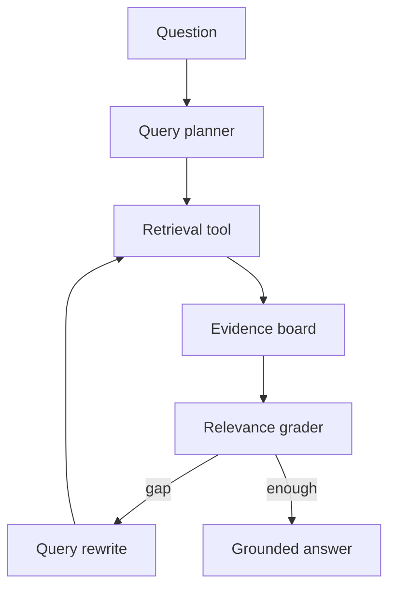

# 什么是 Agentic RAG？

## 30 秒回答

Agentic RAG 是让 Agent 主动规划、检索、评估证据和补检索的 RAG。它包含 query planner、retrieval tool、relevance grader、query rewrite、evidence board 和 stop policy。普通 RAG 多是一轮检索生成，Agentic RAG 是围绕证据缺口的受控 loop。

## 面试定位

这题考普通 RAG 与 Agent 检索循环的边界。面试官想听到你能说明收益、风险和控制方式。

回答要覆盖架构、数据流、指标、取舍和追问。重点是每轮检索都要有理由，不是盲目多查。

## 标准回答

普通 RAG 通常是 query -> retrieve -> generate。Agentic RAG 会先用 query planner 拆子问题，然后调用 retrieval tool。检索后由 relevance grader 判断证据是否足够。如果存在 evidence gap，系统通过 query rewrite 进入下一轮。

它适合复杂调研、多跳问答、比较分析和故障排查。代价是延迟、成本和 drift 风险更高，所以要有 stop policy、最大轮数、成本预算和 trace。

最终答案仍然要经过 citation grounding。Agentic RAG 解决的是证据发现，不代表生成可以不受证据约束。

## 架构与运行机制

数据流中，每轮都要记录 query、reason、evidence_ids、grader verdict 和 cost。这样才能复盘为什么继续检索。

## 可画图

可以画闭环图：规划、检索、证据板、打分、改写查询、停止。旁边写 stop policy：轮数、成本、证据充分度和 drift 检查。

## 系统设计案例

用户问“LangGraph 和 OpenAI Agents SDK 如何选型”。系统先拆成状态管理、工具调用、handoff、trace、部署和生态。每个子问题检索官方文档，Evidence board 汇总证据，最后输出对比表。

如果某个维度缺证据，relevance grader 会触发 query rewrite。否则进入 grounded answer。

## 真实问题与排障

如果答案跑题，检查 query rewrite 是否偏离原始问题。如果成本高，检查 loop_count 和每轮 top_k。如果证据不足仍生成，说明 relevance grader 或 stop policy 过松。

指标包括 answer_success_rate、evidence_gap_rate、loop_count、drift_rate、citation_precision、latency_p95 和 cost_per_answer。

## 面试官追问

- Agentic RAG 什么时候不值得用？
- relevance grader 如何设计？
- 如何防止 drift？
- stop policy 看哪些信号？
- 多轮检索如何做 trace replay？

## 项目化回答

我会说 Agentic RAG 是受控检索循环。项目里每轮检索都有计划、原因、证据和 verdict，继续检索必须来自 evidence gap，最终答案仍要做 citation grounding。

## 常见错误

- 把 Agentic RAG 等同于多检索几次。
- 没有 stop policy。
- query rewrite 逐轮漂移。
- 不记录检索轨迹。
- relevance grader 把相关误判为可回答。

## 深挖技术细节

Agentic RAG 的关键是“证据缺口驱动的检索循环”。每一轮都应保存 `round_id`、`subquestion`、`query_text`、`query_reason`、`retriever_config`、`candidate_ids`、`selected_evidence_ids`、`grader_verdict`、`evidence_gap`、`rewrite_reason`、`cost` 和 `latency_ms`。只有当 Evidence Grader 明确指出缺少某个维度的证据，才允许 query rewrite 进入下一轮；否则进入 grounded generation 或 no-answer。

Evidence Board 是中间状态，不是简单把检索结果拼进上下文。它要按子问题组织证据，记录每条证据支持哪个 claim、来自哪个来源、权限范围、版本和冲突关系。Stop Policy 通常包括 max_rounds、cost_budget、evidence_sufficiency、drift_score、no_new_evidence_count 和 citation_coverage。如果连续两轮没有新增可回答证据，应停止并说明不足。

风险在于 drift 和成本。Query rewrite 如果只追求相关内容，会从“LangGraph 选型”漂到“所有 Agent 框架比较”，最后答案跑题。排障指标包括 `evidence_gap_rate`、`loop_count`、`drift_rate`、`no_new_evidence_rate`、`citation_precision`、`answer_success_rate`、`p95_latency` 和 `cost_per_answer`。

## 边界条件与反例

反例一：把同一个 query 重复检索 5 次，然后叫 Agentic RAG。反例二：relevance grader 只判断主题相关，没判断能否直接回答问题。反例三：没有 stop policy，模型为了“更完整”不断扩展检索范围。反例四：最终答案没有 citation grounding，以为多轮检索天然减少幻觉。

边界在于：简单 FAQ、单跳事实、语料很小或 SLA 很紧时，普通 RAG 更合适。Agentic RAG 适合多跳、比较、调研、故障排查和证据缺口明显的任务。它解决证据发现，不替代引用验证和权限过滤。

## 深问准备

- 问：relevance grader 如何设计？答：输入 query、候选证据和子问题，输出 supported、partial、missing、contradicted 以及缺口原因。
- 问：如何防止 drift？答：每轮 rewrite 必须绑定原始问题和未满足子问题，计算 drift_score，超过阈值停止或回退。
- 问：什么时候不值得用？答：问题简单、一次检索即可、成本敏感、结果不可验证或高实时性场景。
- 问：怎么 replay 多轮检索？答：保存每轮 query、candidate、grader verdict、rewrite reason 和工具版本。

## 来源与延伸阅读

- [LangChain Retrieval](https://docs.langchain.com/oss/python/langchain/retrieval)
- [LangGraph Overview](https://docs.langchain.com/oss/python/langgraph/overview)
- [OpenAI Agents SDK Tracing](https://openai.github.io/openai-agents-python/tracing/)
