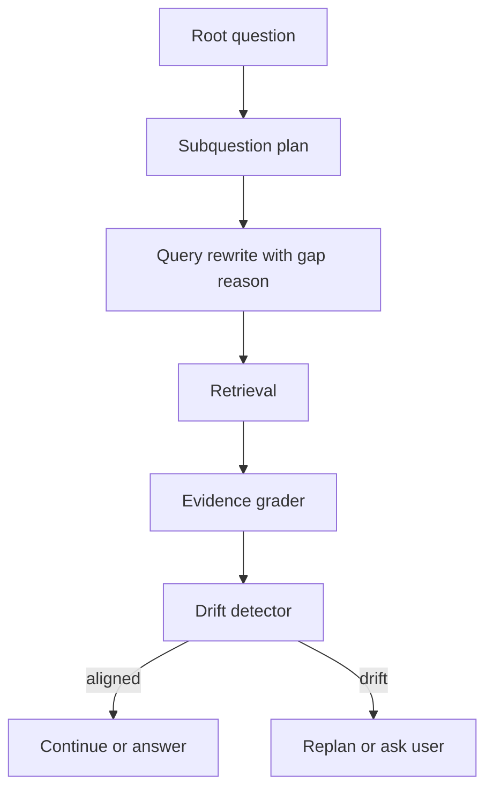

# Agentic RAG 如何避免多轮检索带来的主题漂移？

## 30 秒回答

要把每轮检索绑定回原始问题和 evidence gap。query rewrite 必须说明缺什么证据，relevance grader 检查新证据是否支持原始目标，drift detector 比较原问题、当前 query、evidence 和 final claim。超过轮数、成本或漂移阈值就停止或追问用户。

## 面试定位

这是 Agentic RAG 的风险控制题。面试官想知道你是否意识到多轮检索会逐步偏离任务。

回答要覆盖架构、数据流、指标、取舍和追问。核心是用状态和评测约束 loop。

## 标准回答

第一，保留 root question 和 task intent。所有子查询都要声明自己服务于哪个子问题，不能只根据上一轮结果自由发散。

第二，继续检索必须来自明确 evidence gap。例如缺少定义、缺少版本对比、缺少最新来源或存在冲突证据。没有 gap 就不要继续查。

第三，设置 drift detector。它比较 root question、current query、selected evidence 和 candidate claim 的一致性。若偏离，就回退到 planner 或向用户澄清。

第四，stop policy 要综合最大轮数、成本、延迟和证据充分度。无限循环通常说明任务边界不清。

## 架构与运行机制

数据流里每轮都保存 root_intent、subquestion_id、gap_reason、query、evidence_ids 和 drift verdict。

## 可画图

可以画带护栏的循环图。循环内是 query rewrite 和 retrieval，循环外有 root question、stop policy 和 drift detector 三个约束。

## 系统设计案例

用户问“Agent 框架选型”，第一轮查到 LangGraph 文档后，系统可能被文档里的示例带去查图数据库。Drift detector 会发现图数据库不是原始选型维度，要求回到状态管理、工具、handoff 和部署对比。

数据流是：planner 定义维度，query rewrite 只围绕维度补证据，evidence board 按维度组织。最终 claim 必须回到这些维度。

## 真实问题与排障

如果 trace 显示后几轮 query 与原问题相关性下降，先看 gap_reason 是否为空或过宽。若 relevance grader 总是要求补更多资料，可能是证据充分标准过高。

指标包括 drift_rate、average_loop_count、gap_resolution_rate、user_clarification_rate、cost_per_answer 和 final_claim_alignment。

## 面试官追问

- drift detector 用规则还是模型？
- 原问题本身含糊时怎么办？
- 什么时候应该追问用户？
- 如何避免过早停止？
- 多轮检索失败样本如何进入 eval？

## 项目化回答

我会说自己把 Agentic RAG 的 loop 做成有边界的状态机。每轮必须有 gap_reason，query rewrite 绑定 root question，drift detector 负责回拉方向，stop policy 控制成本和时间。

## 常见错误

- 让模型根据上一轮结果自由发散。
- 继续检索没有证据缺口。
- 没有 root question 对齐检查。
- 只限制轮数，不看主题漂移。
- 最终答案没有 claim alignment 验证。

## 深挖技术细节

防漂移要把 Agentic RAG 的状态机显式化。State 中应有 `root_question`、`task_intent`、`subquestion_plan`、`active_gap`、`allowed_dimensions`、`query_history`、`evidence_board`、`drift_score`、`stop_budget`。Query Rewrite 的输入不是上一轮全文，而是当前未解决的 evidence gap。每条新 query 都要声明 `subquestion_id` 和 `gap_reason`，并和 root intent 做一致性检查。

Drift Detector 可以用规则和模型结合。规则检查 query 是否仍包含核心实体、时间范围、领域和比较维度；模型 judge 评估新证据是否服务于原始问题。Evidence Grader 则区分 related 和 answerable，防止“主题相关但不能回答”的文档推动 loop 继续发散。超过 drift 阈值时，系统应 replan、回退上一轮 query 或向用户澄清。

Stop Policy 要避免两种失败：过早停止导致证据不足，无限检索导致漂移和成本高。常见条件包括 `max_rounds`、`cost_budget`、`latency_budget`、`no_new_evidence_count`、`gap_resolved`、`drift_score` 和 `citation_coverage`。指标包括 `drift_rate`、`gap_resolution_rate`、`average_loop_count`、`final_claim_alignment`、`cost_per_answer`、`user_clarification_rate`。

## 边界条件与反例

反例一：用户问 Agent 框架选型，第二轮因为看到“图数据库”例子就去查数据库，偏离原问题。反例二：只设 max_rounds，虽然能停，但前几轮已经漂移。反例三：证据缺口为空还继续检索，只是为了让答案看起来更丰富。

边界在于：原始问题模糊时，继续检索并不能解决需求不清，应该追问用户。对于强实时、低延迟任务，宁可普通 RAG 加清晰拒答，也不要开多轮循环。最终答案还要做 claim alignment，确认每个结论都回到 root question。

## 深问准备

- 问：drift detector 用规则还是模型？答：规则守住实体、范围和维度，模型判断语义目的，两者结合。
- 问：如何避免过早停止？答：用 evidence gap 和 citation coverage，而不是只看轮数。
- 问：什么时候追问用户？答：root question 多义、约束冲突、证据不足且继续检索可能漂移时。
- 问：失败样本如何进 eval？答：保存 query_history、gap_reason、drift verdict 和最终 claim alignment。

## 来源与延伸阅读

- [LangChain Retrieval](https://docs.langchain.com/oss/python/langchain/retrieval)
- [LangGraph Overview](https://docs.langchain.com/oss/python/langgraph/overview)
- [LangSmith Evaluation](https://docs.smith.langchain.com/evaluation)
