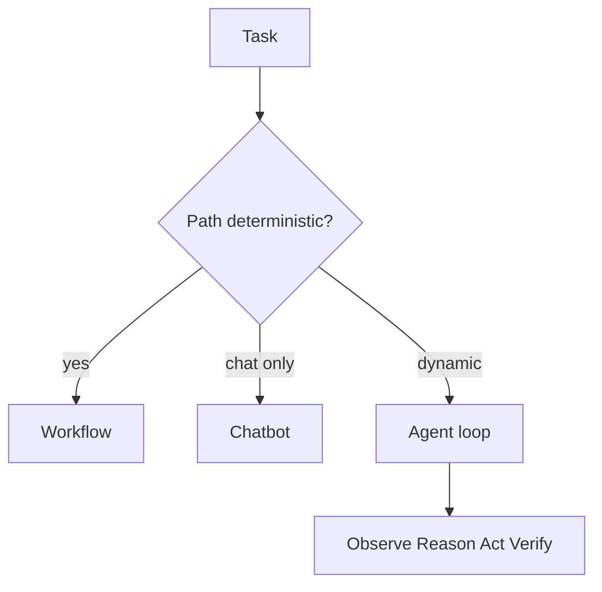

# 什么时候应该使用 Agent，而不是普通 workflow 或聊天机器人？

## 30 秒回答

当任务需要动态决策、工具选择、状态更新、异常恢复和多步验证时，才适合 Agent。普通 workflow 适合路径确定、规则清楚的流程。聊天机器人适合问答和轻交互。Agent 的代价是成本、延迟、安全和可观测性复杂，所以要用 eval 证明收益。

## 面试定位

这题考 Agent 边界。面试官想看你会不会把所有 LLM 应用都叫 Agent。

## 标准回答

判断标准是任务路径是否可预编排。如果流程固定，比如提交表单、固定审批、简单 FAQ，用 workflow 更稳。如果任务需要观察环境、选择工具、根据结果调整计划，例如 coding agent 排查 bug、web agent 操作页面、research agent 多轮检索，就适合 Agent。

Agent 必须有 Goal、State、Tools、Loop、Guardrails 和 Eval。没有状态、工具和反馈循环，只是聊天应用。

## 架构与运行机制

数据流是 Agent 每一步观察状态、推理下一步、调用工具、验证结果，再决定继续或停止。

## 可画图

可以画三列对比：workflow、chatbot、agent。每列写输入、执行方式、状态、工具和评测指标。

## 系统设计案例

Coding Agent 修 bug 时，无法预先知道要读哪些文件、跑哪些测试、遇到什么错误。它需要根据 observation 动态选择工具，并用 test_pass_rate 和 trace 判断是否成功。

## 真实问题与排障

Agent 失败通常来自目标漂移、工具误用、状态污染或停止条件不清。指标包括 task_success_rate、avg_iterations、tool_error_rate、unsafe_action_block_rate 和 cost_per_success。

工程取舍不是“Agent 更高级”，而是“动态决策是否值得”。workflow 的优势是确定、低成本、易审计，缺点是覆盖不了开放路径；Agent 能处理未知环境和异常恢复，但会带来更多 token、工具失败、安全审批和 trace 存储成本。生产系统常见做法是 workflow 负责主干，Agent 只处理需要观察和推理的分支。

## 面试官追问

- Function calling 是否等于 Agent？
- Agent 和 workflow 如何组合？
- 什么时候应该降级为 workflow？
- 如何控制 Agent 成本？
- 如何证明 Agent 比 workflow 更好？

## 项目化回答

我会说先做 workflow baseline，再看失败是否来自动态路径。如果确实需要根据观察调整动作，再引入 Agent，并用 eval 比较成功率、成本和安全指标。

## 常见错误

- 所有 LLM 应用都叫 Agent。
- 没有状态和工具循环。
- 不设置停止条件。
- 不做安全边界。
- 没有 baseline 对比。

## 深挖技术细节

判断是否需要 Agent，可以把任务拆成几个可量化维度：路径不确定性、环境可观察性、工具数量、状态跨度、异常恢复、外部副作用和验收复杂度。普通 workflow 的核心是预定义 DAG 或状态机；聊天机器人主要是自然语言交互；Agent 则需要在每一步根据 observation 更新 state，再决定下一步工具和停止条件。没有 observe-reason-act-verify loop，就不要轻易叫 Agent。

工程上可以先做 workflow baseline：固定检索、固定工具、固定 verifier。如果 baseline 的失败来自动态路径，例如不知道该查哪个文件、需要根据报错选择下一步、需要跨多个网页观察状态，就引入 Agent loop。Agent runtime 至少要有 `goal`、`state`、`tool_registry`、`permission_policy`、`step_budget`、`stop_condition`、`trace_store` 和 `eval_runner`。没有这些字段，系统通常只是“LLM 调用工具”。

指标也要能证明 Agent 值得。除了 `task_success_rate`，要看 `avg_iterations`、`tool_error_rate`、`recovery_success_rate`、`unsafe_action_block_rate`、`cost_per_success`、`p95_latency` 和 `human_override_rate`。如果成功率只提升 1%，但成本和延迟翻倍，边界上就应该回退为 workflow 或只把异常分支交给 Agent。

## 边界条件与反例

反例一：FAQ、固定报表、审批流都包装成 Agent，结果可审计性更差。反例二：只有 function calling，没有状态更新、验证和停止条件，却宣称是多步 Agent。反例三：把高风险写操作交给 Agent 自主决定，没有权限和确认。

适合 Agent 的边界是“路径开放但结果可验证”。如果路径开放且结果不可验证，Agent 会变成不可控黑盒；如果路径固定且结果明确，workflow 更便宜、更稳。面试时最好说“Agent 是局部能力”，主干流程仍可由 workflow 编排，Agent 处理无法预先枚举的观察和恢复。

## 深问准备

- 问：Function calling 是 Agent 吗？答：只是 Agent 的一个执行机制；没有状态、循环和验证，不构成完整 Agent。
- 问：什么时候从 Agent 降级成 workflow？答：路径稳定、规则明确、失败代价高或成本不可接受时。
- 问：如何控制迭代发散？答：step budget、stop condition、verifier、工具白名单和失败回退。
- 问：如何证明不是 demo？答：拿 workflow baseline 对比成功率、成本、延迟、安全拦截和恢复能力。

## 来源与延伸阅读

- [OpenAI Agents SDK](https://openai.github.io/openai-agents-python/)
- [LangGraph Overview](https://docs.langchain.com/oss/python/langgraph/overview)
- [LangSmith Evaluation](https://docs.smith.langchain.com/evaluation)
