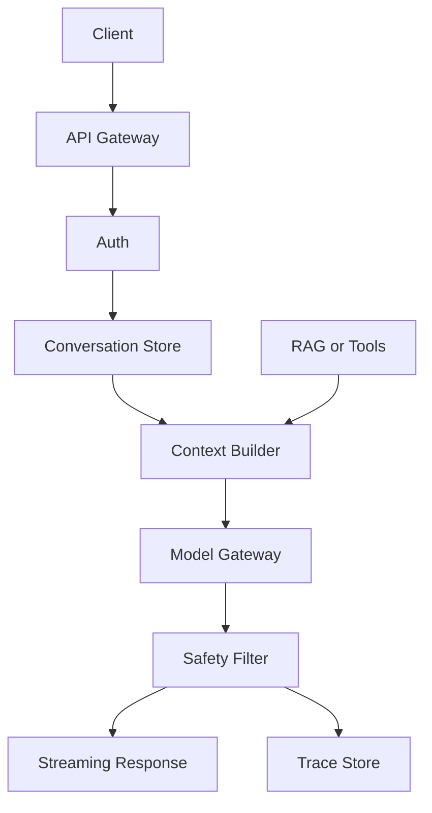

# ChatGPT 类应用一次请求通常经过哪些系统环节？

## 30 秒回答

一次请求通常经过 Client、API Gateway、Auth、Conversation Store、Context Builder、RAG 或 Tools、Model Gateway、safety filter、streaming response 和 Trace/Eval Store。关键不是“发给模型”，而是上下文、权限、安全、成本和可观测性如何串起来。

## 面试定位

这题考 LLM 应用运行链路。面试官想知道你能否从后端服务角度讲清一次请求的真实数据流。

## 标准回答

用户请求先到 API Gateway，生成 request_id，做鉴权、限流和场景识别。Conversation Store 读取历史和摘要。Context Builder 按权限拼接系统指令、用户问题、RAG 证据和工具说明。

Model Gateway 选择模型、参数和超时策略。模型输出通过 safety filter、schema check 或 verifier。前端通常用 streaming 降低首 token 体感延迟。全链路写入 trace，用于排障和 eval。

## 架构与运行机制

数据流里 request_id 必须贯穿每个模块，否则线上问题无法回放。

## 可画图

可以画在线推理链路图。图上标出每个模块负责什么，哪些地方会产生延迟、成本和安全风险。

## 系统设计案例

企业内部助手回答制度问题时，Auth 先确认用户部门。Context Builder 只检索有权限文档。模型生成后，verifier 检查引用和敏感信息。最终 streaming 返回，同时写 trace。

## 真实问题与排障

首 token 慢时，拆分检索耗时、模型排队、上下文过长和安全过滤。跨租户泄漏时，重点查权限过滤和缓存 key。指标包括 first_token_latency、context_tokens、fallback_rate、safety_block_rate 和 cost_per_request。

工程取舍在于是否把更多逻辑前置到 API Gateway 和 Context Builder。前置越多，权限、安全和可观测性越强，但首 token 延迟会上升；放给模型自由发挥实现更快，却会增加越权、幻觉和不可回放风险。面试时要说明 SLA、风险等级和成本预算如何影响链路设计。

## 面试官追问

- streaming 如何做安全检查？
- 会话历史太长怎么办？
- Model Gateway 负责什么？
- 工具调用如何接入链路？
- 失败样本如何进入 eval？

## 项目化回答

我会把 ChatGPT 类应用讲成在线推理服务。入口治理、上下文构建、模型调用、安全过滤、流式输出和 trace 都是工程模块，不是简单 API 转发。

## 常见错误

- 只说前端调用模型。
- 历史消息无限拼接。
- 权限过滤放在生成后。
- streaming 没有最终审计。
- 没有 request_id 和 trace。

## 深挖技术细节

一次请求可以按 span 拆开：gateway/auth、conversation read、context build、retrieval/tool、model inference、safety/verifier、streaming、trace write。每个 span 要记录 start/end、input summary、output summary、version、error_code 和 retryable。这样首 token 慢时才能判断是 retrieval 慢、context 太长、模型排队，还是 safety filter 阻塞。

Context Builder 的细节很关键。它不能简单拼接最近 N 条消息，而要按优先级组装：system policy 最高，当前用户问题其次，强相关 evidence 再其次，历史摘要和 memory 最后。每个 evidence item 要带 source、ACL、score、timestamp 和 citation id。被压缩或丢弃的上下文也要记录 `dropped_context_reason`，否则模型答错时无法判断是否因为关键信息被挤出窗口。

## 边界条件与反例

如果是纯 FAQ 或固定表单流程，不一定需要完整 ChatGPT 链路，workflow + 搜索可能更稳、更便宜。反过来，如果涉及权限、工具、副作用和长会话，就不能只做 API proxy。另一个反例是把 safety filter 放在 streaming 之后，用户可能已经看到了敏感片段，最终拦截也来不及。

缓存也有边界。系统可以缓存 embedding、检索结果或低风险公开回答，但不能把带用户权限的完整回答用 prompt 文本当唯一 key 缓存。相同问题在不同 tenant、role、文档版本下应该得到不同 evidence pack。

## 深问准备

- 追问 first token latency：拆成 gateway、retrieval、context build、model queue、generation、safety buffer。
- 追问 streaming 安全：说明分句缓冲、最终审计、高风险延迟流和中途 abort。
- 追问会话历史太长：回答摘要、检索式历史、状态对象和 token budget。
- 追问 trace 字段：列出 request_id、span_id、model、prompt_hash、context_refs、latency、cost、verdict。

## 参考资料

- [OpenAI Text generation guide](https://platform.openai.com/docs/guides/text)
- [OpenAI API streaming reference](https://platform.openai.com/docs/api-reference/streaming)
