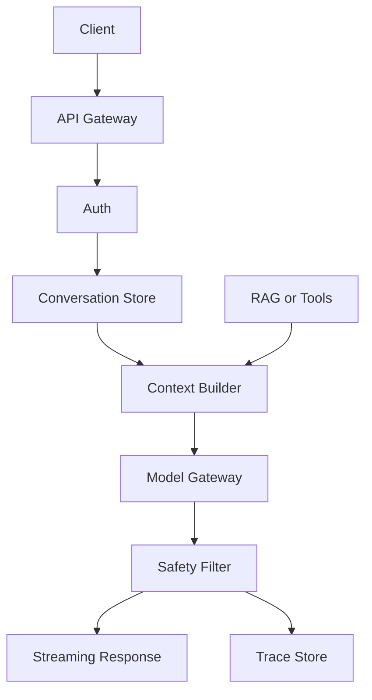

# ChatGPT 类应用一次请求通常经过哪些系统环节？

## 30 秒回答

一次请求通常经过 Client、API Gateway、Auth、Conversation Store、Context Builder、RAG 或 Tools、Model Gateway、safety filter、streaming response 和 Trace/Eval Store。关键不是“发给模型”，而是上下文、权限、安全、成本和可观测性如何串起来。

## 面试定位

这题考 LLM 应用运行链路。面试官想知道你能否从后端服务角度讲清一次请求的真实数据流。

## 标准回答

用户请求先到 API Gateway，生成 request_id，做鉴权、限流和场景识别。Conversation Store 读取历史和摘要。Context Builder 按权限拼接系统指令、用户问题、RAG 证据和工具说明。

Model Gateway 选择模型、参数和超时策略。模型输出通过 safety filter、schema check 或 verifier。前端通常用 streaming 降低首 token 体感延迟。全链路写入 trace，用于排障和 eval。

## 架构与运行机制

图 1：ChatGPT 类应用的在线推理链路。API Gateway 负责入口治理，Conversation Store 和 Context Builder 负责把“能不能看、该看什么、哪些证据可信”整理成模型上下文，Model Gateway 负责模型路由、超时和成本，Safety Filter 与 Trace Store 负责发布前的风险控制和事后复盘。数据流里 `request_id` 必须贯穿每个模块，否则线上问题无法回放。

## 可画图

可以画在线推理链路图。图上标出每个模块负责什么，哪些地方会产生延迟、成本和安全风险。

## 系统设计案例

企业内部助手回答制度问题时，Auth 先确认用户部门。Context Builder 只检索有权限文档。模型生成后，verifier 检查引用和敏感信息。最终 streaming 返回，同时写 trace。

## 真实问题与排障

首 token 慢时，拆分检索耗时、模型排队、上下文过长和安全过滤。跨租户泄漏时，重点查权限过滤和缓存 key。指标包括 first_token_latency、context_tokens、fallback_rate、safety_block_rate 和 cost_per_request。

一个发布级排障链路可以这样讲：影响面先按 tenant、model、route 和 request_type 分组，看是否只影响带 RAG 的长上下文请求；止血时临时切到较短上下文策略、关闭高风险工具或提高缓存命中；根因通常落在检索 fan-out、模型队列、上下文预算或安全缓冲；修复后把失败样本写入 eval set，用固定 `request_id` 回放首 token、引用正确性和安全 verdict。

工程取舍在于是否把更多逻辑前置到 API Gateway 和 Context Builder。前置越多，权限、安全和可观测性越强，但首 token 延迟会上升；放给模型自由发挥实现更快，却会增加越权、幻觉和不可回放风险。面试时要说明 SLA、风险等级和成本预算如何影响链路设计。

## 面试官追问

- streaming 如何做安全检查？
- 会话历史太长怎么办？
- Model Gateway 负责什么？
- 工具调用如何接入链路？
- 失败样本如何进入 eval？

## 多轮追问模拟

### 追问 1：streaming 如何做安全检查？

回答要点：低风险场景可以边生成边做分句级检查，高风险场景要做缓冲、延迟流或先完整生成再释放。考察点是你是否理解“最终拦截”不等于“用户没有看到”。容易踩坑的是把 streaming 当成纯前端优化，忽略中途 abort、审计和 trace。

### 追问 2：会话历史太长怎么办？

回答要点：不要把历史无限拼接，而是分成当前问题、短期摘要、长期记忆、检索式历史和强相关 evidence。考察点是上下文预算和可回放性。容易踩坑的是只说“做摘要”，但不记录摘要版本、丢弃原因和引用来源。

### 追问 3：Model Gateway 负责什么？

回答要点：它负责模型路由、参数、超时、fallback、成本、版本和审计，不负责业务授权。考察点是模型调用治理。容易踩坑的是把 provider SDK 直接散落在业务代码里，导致灰度、回滚和成本归因都做不了。

## 项目化回答

我会把 ChatGPT 类应用讲成在线推理服务。入口治理、上下文构建、模型调用、安全过滤、流式输出和 trace 都是工程模块，不是简单 API 转发。

## 常见错误

- 只说前端调用模型。
- 历史消息无限拼接。
- 权限过滤放在生成后。
- streaming 没有最终审计。
- 没有 request_id 和 trace。

## 深挖技术细节

一次请求可以按 span 拆开：gateway/auth、conversation read、context build、retrieval/tool、model inference、safety/verifier、streaming、trace write。每个 span 要记录 start/end、input summary、output summary、version、error_code 和 retryable。这样首 token 慢时才能判断是 retrieval 慢、context 太长、模型排队，还是 safety filter 阻塞。

Context Builder 的细节很关键。它不能简单拼接最近 N 条消息，而要按优先级组装：system policy 最高，当前用户问题其次，强相关 evidence 再其次，历史摘要和 memory 最后。每个 evidence item 要带 source、ACL、score、timestamp 和 citation id。被压缩或丢弃的上下文也要记录 `dropped_context_reason`，否则模型答错时无法判断是否因为关键信息被挤出窗口。

## 边界条件与反例

如果是纯 FAQ 或固定表单流程，不一定需要完整 ChatGPT 链路，workflow + 搜索可能更稳、更便宜。反过来，如果涉及权限、工具、副作用和长会话，就不能只做 API proxy。另一个反例是把 safety filter 放在 streaming 之后，用户可能已经看到了敏感片段，最终拦截也来不及。

缓存也有边界。系统可以缓存 embedding、检索结果或低风险公开回答，但不能把带用户权限的完整回答用 prompt 文本当唯一 key 缓存。相同问题在不同 tenant、role、文档版本下应该得到不同 evidence pack。

## 深问准备

- 追问 first token latency：拆成 gateway、retrieval、context build、model queue、generation、safety buffer。
- 追问 streaming 安全：说明分句缓冲、最终审计、高风险延迟流和中途 abort。
- 追问会话历史太长：回答摘要、检索式历史、状态对象和 token budget。
- 追问 trace 字段：列出 request_id、span_id、model、prompt_hash、context_refs、latency、cost、verdict。

## 公开阅读校验

公开读者读这篇时，应该能得到一个后端视角的检查清单：一次请求不是“前端把 prompt 发给模型”，而是一条有身份、权限、上下文预算、模型路由、安全缓冲和回放能力的在线链路。任何模块说不清输入、输出、版本和失败语义，都会在真实流量下变成不可定位的问题。

设计这类系统时，最容易漏掉的是缓存和 streaming 的边界。缓存 key 不能只包含 prompt，还要包含 tenant、role、document_version、model_version 和 policy_version；否则同一句问题可能跨租户复用错误证据。Streaming 也不能只追求首 token 快，高风险场景要有分句缓冲、最终审计和中途 abort 策略，否则敏感片段已经被用户看到后再拦截没有意义。

面试或方案评审里，可以把链路压成四个问题：Context Builder 是否只拼接授权证据？Model Gateway 是否能灰度、降级和归因成本？Safety/Verifier 是否在流式输出前后都有策略？Trace 是否能用 request_id 回放到每个 span？这四个问题都能回答，才算真的理解 ChatGPT 类应用的工程运行时。

## 来源与延伸阅读

- [OpenAI Text generation guide](https://platform.openai.com/docs/guides/text)：用于说明文本生成请求、模型参数和应用侧生成链路的基本语义。
- [OpenAI API streaming reference](https://platform.openai.com/docs/api-reference/streaming)：用于确认 streaming response 的接口行为和工程边界。
