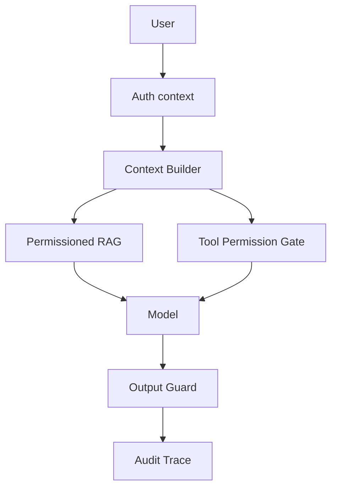

# 企业内部 ChatGPT 助手如何做权限隔离和上下文控制？

## 30 秒回答

权限隔离要在检索、工具和缓存层完成，不能靠模型自觉。Context Builder 只能注入当前用户有权访问的 evidence 和工具结果，缓存 key 必须包含 tenant/user/scope。工具调用走 Tool Permission Gate，输出再做敏感信息和 citation 检查。

## 面试定位

这题考企业级 LLM 应用安全。面试官想听到权限模型、上下文分层、缓存隔离和输出控制。

## 标准回答

第一，身份和权限要在 API Gateway 确认。用户、租户、部门、角色和数据域进入 request context。

第二，RAG 检索必须带 metadata filter。文档 chunk 要有 tenant、department、acl、version 和 source。无权限文档不能进入候选集。

第三，工具调用必须独立鉴权。模型想调用工具不代表被授权。写操作要有 riskLevel、preview 和 approval。

第四，输出要检查 citation、PII、secret 和跨租户内容。Trace 要脱敏存储。

## 架构与运行机制

数据流的关键是权限前置。不要先召回全量文档，再让模型决定该不该看。

## 可画图

可以画权限漏斗：用户身份、文档 ACL、工具 scope、输出 guard、trace 脱敏。每层都能拦住不同风险。

## 系统设计案例

内部制度助手里，HR 文档只允许 HR 角色访问。检索时 metadata filter 限定部门和角色。答案引用的 citation 也不能暴露无权限文档标题。

## 真实问题与排障

如果用户看到无权限信息，先查检索过滤条件、缓存 key、历史摘要和 trace 是否混入他人内容。止血可以关闭跨会话 memory 和共享缓存。

指标包括 permission_denial_rate、cross_tenant_leak_count、sensitive_output_block_rate、cache_scope_miss 和 audit_coverage。

核心取舍是安全边界前置还是后置。检索和工具调用前置鉴权会增加实现复杂度，但能从源头减少敏感证据进入上下文；只在输出侧过滤实现简单，却可能让无权限内容进入 trace、缓存或模型上下文，后续很难审计和清理。

## 面试官追问

- 历史摘要如何防权限漂移？
- 缓存如何设计 key？
- citation 会不会泄露文档存在性？
- 工具权限和文档权限是否一样？
- trace 如何脱敏？

## 项目化回答

我会说企业助手的安全边界在宿主系统，不在模型。Context Builder、RAG filter、Tool Permission Gate、Output Guard 和 Audit Trace 共同保证权限隔离。

## 常见错误

- 先召回全量文档再过滤。
- 缓存 key 缺少 tenant。
- citation 泄露无权限来源。
- 工具调用只看模型理由。
- trace 存明文敏感内容。

## 深挖技术细节

权限隔离要贯穿四个位置。检索前，用 `tenant_id`、department、role、document_acl、data_region 做 metadata filter。上下文构建时，每个 chunk 保留 `source_id`、`acl_hash`、`version` 和 `visibility_label`。工具调用前，Tool Permission Gate 根据用户身份、工具 scope、risk_level 和业务状态重新鉴权。输出前，Output Guard 检查 citation 是否引用无权限来源、是否泄露文档标题、是否包含 PII 或 secret。

历史摘要是容易被忽略的风险点。用户角色变化、部门调整、文档撤权后，旧 summary 可能包含过去可见但现在不可见的信息。解决方案是 summary 也带 scope 和 source refs，每次使用前重新校验 scope；高风险系统不复用跨权限变更前的摘要。Memory 同理，不能把权限事实永久写进用户记忆。

## 边界条件与反例

反例一是“召回全量再让模型过滤”，因为敏感证据已经进入上下文和 trace。反例二是共享缓存只按 query hash 命中，不包含 tenant/user/scope/version。反例三是 citation 显示无权限文档标题，即使正文没泄露，也暴露了文档存在性。

如果所有文档都是公开知识库，权限链路可以简化，但仍要保留文档版本和来源。若涉及 HR、财务、法务、客户数据，就必须以前置过滤为主，输出过滤为兜底，不能反过来。

## 深问准备

- 追问缓存 key：建议包含 tenant_id、user_scope_hash、source_version、model_route、prompt_version。
- 追问权限漂移：回答 summary/memory/source refs 重新授权，角色变更后清理或降权。
- 追问 trace 脱敏：保留 hash、source id、摘要和 verdict，不存明文 secret。
- 追问 citation 泄漏：可用 opaque citation id，前端只展示用户有权看的标题。

## 参考资料

- [OpenAI Prompt engineering guide](https://platform.openai.com/docs/guides/prompt-engineering)
- [OpenAI Evals](https://platform.openai.com/docs/guides/evals)
