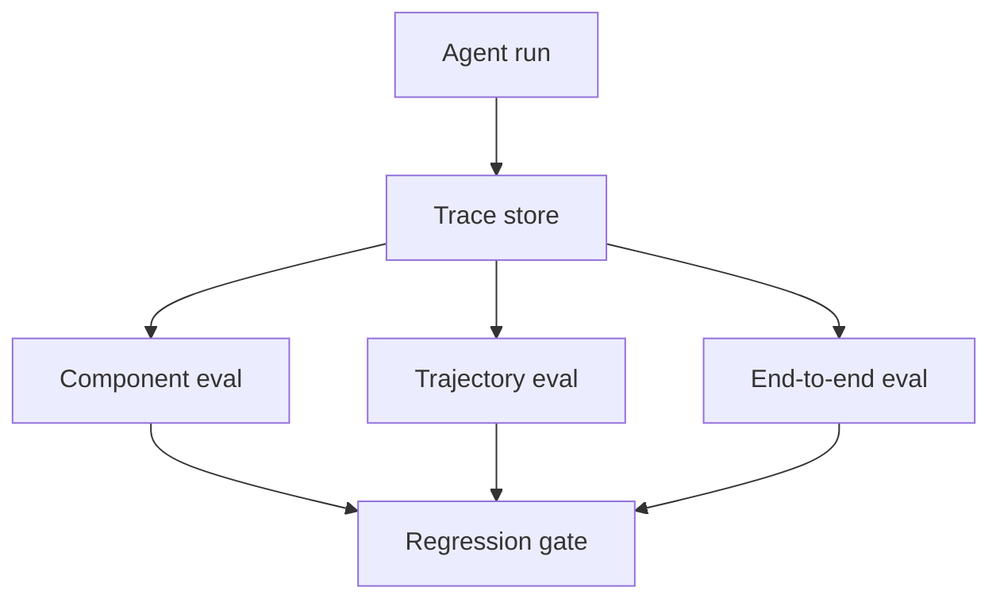

# Agent 系统如何做 Eval 和可观测性，才能不是只看 demo？

## 30 秒回答

要把 Eval 和可观测性做成闭环。离线 eval 用 golden cases 测 task_success、citation_precision、tool_selection、safety 和 cost。线上 trace 记录每一步输入、状态、工具、输出、verdict 和用户反馈。失败样本进入回归集，下一次发布必须通过。

## 面试定位

这题考生产化能力。面试官想听到你如何证明 Agent 可用，而不是只展示成功 demo。

## 标准回答

Eval 要分层。组件评测看检索、rerank、工具 schema、verifier。轨迹评测看 Agent 每一步是否选对工具、更新状态、遵守安全策略。端到端评测看任务是否完成。

可观测性要记录 trace。每次 run 有 run_id，每步有 step_id，包含 prompt、context refs、tool call、observation、latency、cost、verdict 和 error。敏感字段要脱敏。

## 架构与运行机制

数据流是线上失败样本进入样本库，人工或 verifier 标注期望行为，成为下一轮回归。

## 可画图

可以画 Eval 金字塔：component eval、trajectory eval、end-to-end eval、online monitoring。每层写指标。

## 系统设计案例

Web Agent 的 eval 不只看最终是否成功，还看每一步 observation、selector、action、expected_state 和 recovery。失败页面进入 fixture，后续版本必须重放通过。

## 真实问题与排障

如果线上成功率下降，按 trace 分桶：检索失败、工具失败、状态污染、安全拦截、模型输出错误。指标包括 task_success_rate、step_success_rate、tool_error_rate、citation_precision、latency_p95 和 cost_per_success。

工程取舍在于评测深度和发布速度。只做端到端成功率成本低，但定位慢；组件 eval 和轨迹 eval 更费样本设计，却能说明是检索、工具、模型还是策略失败。生产环境通常把高风险路径放进强门禁，低风险体验优化走抽样监控，避免每次小改动都拖慢发布。

## 面试官追问

- golden set 怎么构建？
- 轨迹评测如何打分？
- trace 里哪些字段要脱敏？
- 线上用户反馈如何进入 eval？
- 如何做发布门禁？

## 项目化回答

我会说 Agent 项目必须有 eval gate。每个 run 可回放，每个失败可分桶，每次修复都进入 regression。这样才能证明不是只靠演示样例。

## 常见错误

- 只看 demo 成功。
- 没有 trace replay。
- 不区分组件失败和整体失败。
- eval 样本没有版本。
- 指标只看准确率，不看成本和安全。

## 深挖技术细节

Agent Eval 要把 run 拆成可回放的事件流。一个 trace 至少包含 `run_id`、`step_id`、`parent_step_id`、`model`、`input_refs`、`context_manifest_hash`、`tool_name`、`tool_args_hash`、`observation_ref`、`policy_verdict`、`latency_ms`、`cost`、`error_type`、`verifier_verdict` 和 `redaction_status`。敏感字段不要直接落盘，保存引用、hash 和脱敏摘要即可。

评测要分层设计。Component eval 测检索、rerank、tool schema、citation verifier、guardrail；trajectory eval 测每一步是否遵守权限、是否更新状态、是否用正确工具；end-to-end eval 测最终任务是否完成。线上 observability 则负责发现新分布：模型版本变化、工具错误率上升、成本异常、某类页面失败、某个租户权限被频繁拦截。

发布门禁可以按风险分级。高风险路径要求 regression 全绿、unsafe action 为零、trace coverage 达标；中风险路径允许抽样人工 review；低风险体验改动看在线指标。关键不是有一张漂亮 dashboard，而是失败样本能进入 eval set，下一次发布能阻止同类回归。

## 边界条件与反例

反例一：只保存最终 answer，没有 step trace，导致线上失败无法复现。反例二：只做 LLM judge，不记录工具和策略 verdict，judge 可能偏向最终结果而忽略危险路径。反例三：eval set 没有版本和样本来源，指标上涨可能只是样本变简单。

边界在于：不是所有 trace 都能完整保存明文。涉及 PII、密钥、客户文档时，要保存脱敏字段、引用和访问控制；调试权限也要审计。Eval 的深度要匹配风险，不能为了每个低风险文案改动都跑完整重型评测。

## 深问准备

- 问：golden set 怎么来？答：历史失败、人工设计边界样本、线上抽样、红队攻击和用户高频路径。
- 问：trajectory 怎么打分？答：硬规则一票否决，软指标按工具选择、状态更新、恢复、成本和证据链评分。
- 问：如何发现数据漂移？答：按任务类型、工具、模型版本、页面模板和用户群体切分线上指标。
- 问：trace 里哪些要脱敏？答：用户输入、文件内容、PII、密钥、业务 ID、工具参数中的敏感资源。

## 来源与延伸阅读

- [OpenAI Agents SDK Tracing](https://openai.github.io/openai-agents-python/tracing/)
- [LangSmith Observability](https://docs.smith.langchain.com/observability)
- [LangSmith Evaluation](https://docs.smith.langchain.com/evaluation)
