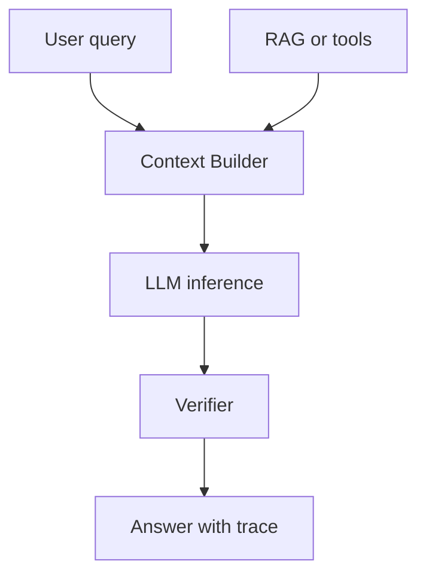

# LLM 是什么？为什么不能把它当成数据库或规则引擎？

## 30 秒回答

LLM 是基于大规模文本和代码训练的概率生成模型。它在 context window 内根据 prompt、历史、RAG 证据、工具结果和 sampling 参数逐 token 生成输出。不能把它当数据库，因为参数不是可查询事实表。也不能当规则引擎，因为输出受上下文和采样影响，需要 verifier、citation 和 eval 约束。

## 面试定位

这题考模型边界。面试官想知道你是否理解 LLM 的生成机制、事实可靠性问题，以及如何把它放进后端系统。

回答要覆盖架构、数据流、指标、取舍和追问。重点是把“模型能力”与“系统可靠性”分开。

## 标准回答

LLM 的核心是根据上下文预测后续 token。模型参数保存的是语言、代码和世界知识的统计规律，不保证实时、完整、可追溯。对于事实型任务，系统应提供外部证据。

数据库提供确定查询和事务语义，规则引擎提供可解释规则执行。LLM 更适合自然语言理解、生成、总结、改写、代码辅助和开放推理。生产系统要用 RAG、tool calling、schema check、safety filter 和 verifier 管住输出。

## 架构与运行机制

图 1：LLM 在生产系统中的受控生成链路。图中 Context Builder 把系统约束、用户问题、RAG 证据和工具结果拼成 ContextPack；LLM inference 负责基于上下文生成候选答案；Verifier 再检查事实、引用、格式和安全策略；最终答案应带 trace，而不是只返回一段看似可信的文字。

这张图的核心边界是：LLM 的输入是上下文，输出是概率生成结果；数据库和规则引擎才负责确定事实、事务和可解释规则。LLM 可以解释事实、组织语言、提出候选操作，但事实源、权限判断、金额扣减、审批结论和状态变更必须由确定性系统给出。

数据流是用户问题进入 Context Builder，系统拼接指令、证据和工具 observation。模型生成答案后，由 verifier 检查事实、格式和安全。

## 可画图

可以画“用户问题 -> 上下文构建 -> 模型生成 -> 校验输出”的图。旁边标出数据库、规则引擎和 LLM 的边界。

## 系统设计案例

企业制度问答中，LLM 不能凭记忆回答政策。系统先按权限检索制度文档，生成 evidence pack。模型基于证据回答，verifier 检查每个关键 claim 是否有 citation。

## 真实问题与排障

如果模型编造事实，先看上下文中有没有正确证据。如果没有，是检索或工具问题。如果有但没引用，是生成或 verifier 问题。指标包括 citation_precision、unsupported_claim_rate、latency_p95 和 cost_per_request。

事故处理可以按四类根因拆。影响面先确认是事实缺失、上下文冲突、采样不稳定、schema 失败，还是 verifier 漏判；止血可以降温、强制引用、关闭自由生成、回退模型版本或只返回检索片段；根因要查 ContextPack、evidence_id、prompt_version、model_version、temperature、finish_reason、unsupported_claim 和 verifier verdict；回归要覆盖无证据、证据冲突、旧版本事实、格式约束和拒答边界。

## 面试官追问

- context window 决定什么？
- hallucination 的根因是什么？
- embedding 相似为什么不等于正确？
- 温度参数如何影响稳定性？
- 事实型业务怎么降级？

## 多轮追问模拟

**追问 1：LLM 为什么不能当数据库？**  
答题要点：参数不是可查询表，没有事务、权限过滤、版本号和来源证明；事实型问题要走 RAG、数据库或工具。考察点是系统边界。陷阱是说“模型知道很多知识所以可以查”。

**追问 2：为什么 embedding 相似不等于答案正确？**  
答题要点：语义相似可能忽略实体、时间版本、权限和问题意图；召回后还需要 rerank、citation check 和 claim verification。考察点是检索与生成边界。陷阱是把 top1 相似段落当真相。

**追问 3：事实型业务如何降级？**  
答题要点：无证据时返回“不确定”或引用片段；高风险动作转人工确认；关键事实走工具查询；保留 trace 方便回放。考察点是可靠性设计。陷阱是让模型补齐缺失事实。

## 项目化回答

我会把 LLM 当受控推理服务。Model Gateway 管模型和参数，Context Builder 管证据，Verifier 管输出，Trace/Eval 管线上质量，而不是把模型当事实库。

## 常见错误

- 说模型参数就是知识库。
- 只讲模型规模，不讲上下文。
- 事实错误只靠 prompt 修。
- 没有 citation 和 verifier。
- 不记录模型版本和 prompt 版本。

## 深挖技术细节

可以把 LLM 的一次回答拆成四个对象：`ContextPack`、`GenerationConfig`、`ModelOutput`、`VerificationResult`。`ContextPack` 包含系统约束、用户问题、历史摘要、RAG evidence、tool observation 和输出格式。`GenerationConfig` 包含 model、temperature、top_p、max_output_tokens、stop 和 seed。`ModelOutput` 不应该只有文本，还要记录 finish_reason、usage、latency 和 model_version。`VerificationResult` 记录 citation 是否覆盖关键 claim、schema 是否通过、安全策略是否触发。

这个拆法能解释为什么它不是数据库：数据库查询依赖 schema、索引、事务和确定结果；LLM 依赖上下文和概率分布生成 token。也能解释为什么它不是规则引擎：规则引擎把输入映射到确定分支，LLM 则可能因为 prompt 顺序、证据排序或采样参数变化而输出不同答案。生产系统要用 rule/verifier 包住模型，而不是让模型替代规则。

## 边界条件与反例

不适合直接交给 LLM 的场景包括余额查询、权限判断、库存扣减、合规审批、医疗诊断结论和订单状态变更。这些任务需要确定事实源、审计链路和可回滚动作。LLM 可以解释规则、生成摘要、提出候选操作，但最终状态必须由数据库、规则引擎或审批系统决定。

如果面试官追问“LLM 知道很多事实，为什么不能当数据库”，反例可以说模型可能知道旧事实、泛化事实或训练语料中的噪声，但它不能提供事务隔离、版本号、权限过滤和来源证明。即使答案偶尔正确，也不满足工程系统对一致性和可追溯的要求。

## 深问准备

- 追问 context window：说明它是本次推理的可见边界，不是长期记忆，也不是数据库容量。
- 追问 hallucination：按 evidence missing、context conflict、instruction ambiguity、sampling instability、verifier gap 分层回答。
- 追问 embedding：讲语义相似、实体精确匹配、时间版本和权限过滤之间的差异。
- 追问降级：可以降级为检索摘要、结构化“不确定”、人工确认或只返回引用片段。

## 公开阅读校验

这篇文章要让读者形成一个稳定判断：LLM 可以参与理解和表达，但不能拥有事实最终解释权。数据库回答“当前真实状态是什么”，规则引擎回答“按规则应该走哪条分支”，LLM 回答“如何把上下文组织成候选解释或候选动作”。把三者混用，短期 demo 可能顺滑，长期一定会在权限、版本、审计和一致性上出问题。

在真实系统里，可以用一个小决策矩阵约束 LLM 使用方式。问题需要最新事实、权限过滤、金额状态或可撤销来源时，先走数据库、RAG 或工具；问题需要总结、改写、分类、解释或生成候选方案时，才让 LLM 介入；问题风险高且证据不足时，输出应该是“不确定 + 所需证据”，而不是让模型补齐。这个矩阵比单纯说“减少幻觉”更可执行。

如果读者要排查 LLM 答错，顺序也应该固定：先看证据有没有进入 ContextPack，再看 evidence 是否被正确引用，再看采样和 prompt 是否引入不稳定，最后看 verifier 为什么没有拦住。直接改 prompt 往往只是把问题藏起来，不能证明事实链路被修好。

## 来源与延伸阅读

- [OpenAI Text generation guide](https://platform.openai.com/docs/guides/text)：官方文档用于支持 LLM 是基于输入上下文和生成参数产生输出的模型服务。
- [OpenAI Embeddings guide](https://platform.openai.com/docs/guides/embeddings)：官方文档用于说明 embedding 适合语义表示和检索，但不等于事实验证。
- [OpenAI Prompt engineering guide](https://platform.openai.com/docs/guides/prompt-engineering)：官方文档用于补充通过指令、示例和格式约束改善输出，但不能替代证据和 verifier。
- [OpenAI Evals](https://platform.openai.com/docs/guides/evals)：官方文档用于说明事实性、格式和安全策略需要通过样例与指标回归验证。
