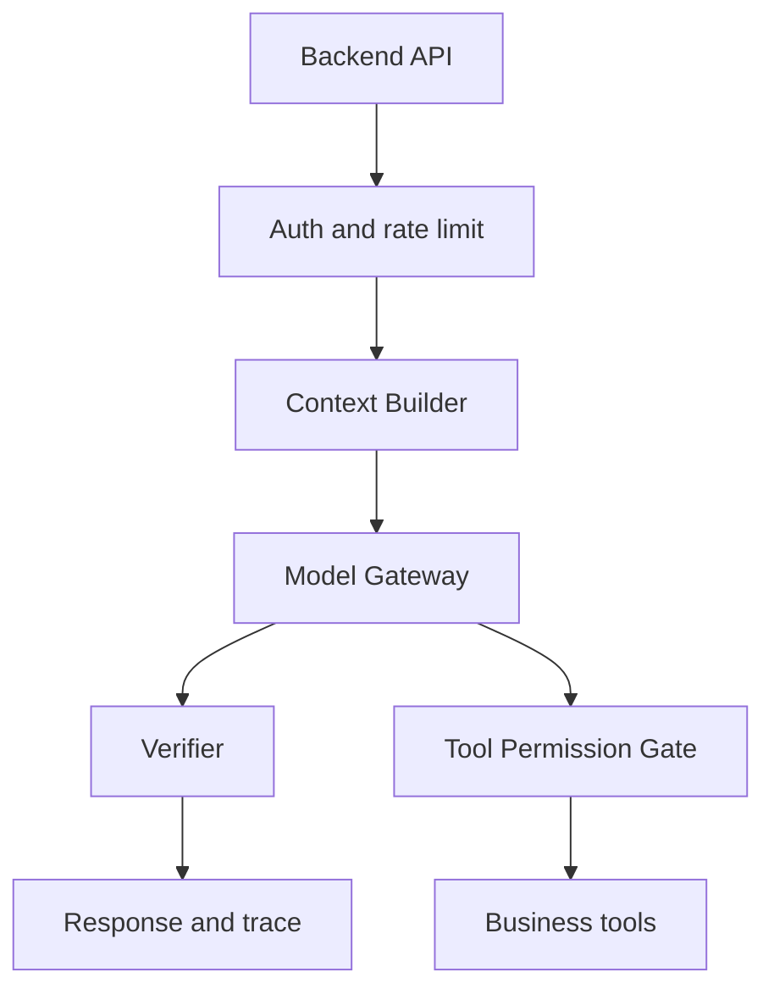

# 如果你要把 LLM 接入后端业务系统，最核心的工程边界是什么？

## 30 秒回答

核心边界是把 LLM 放在受控服务层，而不是让它直接读写业务系统。后端要通过 Model Gateway 管模型调用，通过 Context Builder 管权限和证据，通过 Tool Permission Gate 管副作用，通过 Verifier 管输出质量，通过 Trace/Eval 管回归和审计。

## 面试定位

这题考后端工程化能力。面试官想听你如何处理权限、事实、工具、副作用、成本和可观测性。

回答要覆盖架构、数据流、指标、取舍和追问。重点是 LLM 不直接拥有业务权限。

## 标准回答

我会把接入分成五层。入口层做鉴权、限流和 request_id。上下文层按权限取 RAG 证据、历史摘要和工具结果。模型层统一管理 timeout、retry、fallback 和成本。工具层只暴露 schema 化能力，并做权限确认。输出层做 schema、citation、安全和业务规则校验。

这样设计可以把不确定性限制在模型层，把事实和副作用交给可控系统。LLM 负责理解、规划和表达，业务系统负责真实状态和权限。

## 架构与运行机制

数据流要保证所有工具调用都有 user、scope、riskLevel 和 audit。模型生成的理由不能当作授权依据。

## 可画图

建议画分层架构图：入口、上下文、模型、工具、安全、观测。每层写一个责任和失败指标。

## 系统设计案例

内部工单助手可以让 LLM 总结工单、推荐处理步骤，但真正修改工单状态要通过后端工具。工具层检查用户是否有权限，写入前生成 preview，高风险动作要求确认。

## 真实问题与排障

如果出现越权数据，先查 Context Builder 的权限过滤和缓存 key。如果出现错误写操作，检查 Tool Permission Gate 和 audit。指标包括 tool_denial_rate、schema_pass_rate、fallback_rate、safety_block_rate 和 user_negative_feedback_rate。

## 面试官追问

- 如何防 prompt injection？
- 工具调用失败如何恢复？
- 如何控制成本？
- 模型输出不符合 schema 怎么办？
- 如何做灰度和回滚？

## 项目化回答

我会说 LLM 接入后端不是直接调模型，而是设计一条可治理链路。所有上下文、工具、输出和 trace 都有边界，失败可以降级、回放和进入 eval。

## 常见错误

- 让模型直接拼 SQL 或调用内部接口。
- 上下文不做权限过滤。
- 工具没有 schema 和审批。
- 输出不校验就入库。
- 没有成本和安全指标。

## 深挖技术细节

接入后端时可以设计五个强边界。第一是 `Model Gateway`，统一封装模型、timeout、retry、fallback、usage 和成本。第二是 `Context Builder`，只接收已授权的 evidence、memory 和工具结果，并记录被丢弃的上下文。第三是 `Tool Permission Gate`，每次 tool call 都要带 `user_id`、`scope`、`risk_level`、`idempotency_key` 和 `approval_status`。第四是 `Verifier`，检查 schema、citation、PII、secret、business invariant。第五是 `Trace/Eval Store`，把失败样本固化成回归 case。

关键技术点是副作用隔离。模型可以提出调用 `update_ticket_status`，但工具层必须重新鉴权，检查状态机是否允许从 open 到 resolved，写入前生成 preview，写入后记录 audit ledger。模型输出的自然语言理由不能成为授权依据，也不能绕过业务事务。这样回答能体现后端工程师对权限和一致性的敏感度。

## 边界条件与反例

反例一是让模型直接生成 SQL 并执行。它可能误删数据、绕过租户过滤或把用户输入当作系统指令。反例二是把全部内部文档塞进上下文，再要求模型“不要泄露”。这会让无权限证据进入模型和 trace，已经越界。反例三是工具失败后让模型猜结果，这会把真实系统状态和回答状态分叉。

在低风险场景可以放宽，例如摘要、草稿、分类建议、搜索 query rewrite。高风险场景必须收紧，例如支付、删除、发邮件、改权限、发布配置。边界不是“能不能用模型”，而是副作用、权限和审计成本是否可控。

## 深问准备

- 追问 prompt injection：回答要点是把外部内容标成 untrusted data，工具执行只听系统策略和权限网关。
- 追问 schema 失败：可以 retry with repair、降级为草稿、返回可解释错误或转人工。
- 追问成本控制：按 task_type 路由模型，限制 context_tokens，缓存只缓存权限安全的中间结果。
- 追问灰度回滚：模型版本、prompt_version、verifier_version 和工具版本都进入 trace，失败时按版本回退。

## 参考资料

- [OpenAI Text generation guide](https://platform.openai.com/docs/guides/text)
- [OpenAI Prompt engineering guide](https://platform.openai.com/docs/guides/prompt-engineering)
