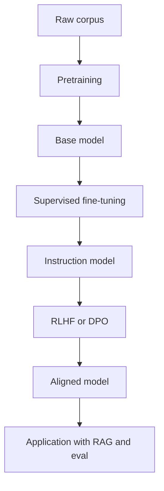

# 预训练、微调和对齐分别解决什么问题？

## 30 秒回答

pretraining 让模型学习语言和代码的通用规律。supervised fine-tuning 让模型学会按指令和格式回答。alignment 通过 RLHF、DPO 等偏好优化，让输出更符合人类偏好和安全要求。业务事实仍要靠 RAG、工具和 eval，不应指望微调解决实时知识。

## 面试定位

这题考训练阶段的边界。面试官想确认你不会把所有问题都归因于“需要微调”。

## 标准回答

预训练使用大规模文本和代码，目标是获得通用语言建模能力。SFT 使用高质量指令样本，让模型更会遵循任务、格式和风格。RLHF 或 DPO 使用偏好数据，让模型更符合人类选择和安全要求。

应用层还要做 Prompt、RAG、工具、guardrails 和 eval。事实最新性、内部权限数据和交易状态不适合靠参数记忆解决。

## 架构与运行机制

数据流体现的是从通用能力到指令能力，再到偏好对齐，最后由应用系统接入业务事实。

## 可画图

可以画训练漏斗：pretraining、SFT、RLHF/DPO、eval、应用层。旁边标注每层解决的问题。

## 系统设计案例

客服助手如果回答政策事实错误，优先检查 RAG 和知识库。如果只是语气不统一、输出格式不稳，可以用 prompt 或 SFT。高风险拒答策略要通过 alignment、guardrail 和 eval 共同控制。

## 真实问题与排障

模型答错时先分桶：事实缺失、格式不稳、安全失败、工具错误。事实缺失走 RAG，格式问题考虑 SFT，安全问题看 guardrail 和 alignment。指标包括 format_pass_rate、hallucination_rate、preference_win_rate 和 safety_violation_rate。

工程取舍要看问题是否真的来自模型参数。RAG 的好处是知识可更新、可引用、可按权限过滤，代价是检索链路变长；SFT 能稳定格式和领域表达，代价是数据治理、训练回归和模型版本维护；alignment 能改善偏好和安全边界，但不能替代业务规则。面试里把这些取舍说清楚，比笼统回答“微调一下”更可靠。

## 面试官追问

- RLHF 和 DPO 有什么区别？
- 微调能不能更新企业知识？
- 什么情况用 RAG？
- 微调数据如何脱敏？
- 模型升级如何回归？

## 项目化回答

我会说训练解决模型行为，RAG 和工具解决外部事实，eval 证明质量。项目里先做失败归因，再决定 prompt、RAG、fine-tune 或 guardrail。

## 常见错误

- 把微调当知识库更新。
- 认为对齐后一定安全。
- 没有评测集就训练。
- 训练数据不脱敏。
- 不区分格式错误和事实错误。

## 深挖技术细节

可以把训练阶段理解成能力来源不同。Pretraining 通过大规模语料学习 token 之间的统计规律，得到基础语言、代码和推理能力。SFT 用指令样本把“会续写”调整成“会按任务回答”，重点是格式、步骤、语气和工具使用示例。RLHF 通常引入偏好比较和 reward model，DPO 则直接用 chosen/rejected pairs 优化偏好边界。Eval 不属于训练本身，但决定这些阶段是否真的改善了目标任务。

工程上要把失败样本先归因。`fact_missing` 说明上下文没有证据，优先 RAG。`format_drift` 说明输出契约不稳，先 schema/prompt，再考虑 SFT。`unsafe_answer` 说明 guardrail 或安全对齐不足。`tool_misuse` 说明工具描述、权限或 error protocol 有问题。只有大量、稳定、可标注的行为错误才值得进入 fine-tune 数据池。

## 边界条件与反例

微调不适合更新每天变化的制度、价格、库存、权限和订单状态。这些事实需要可引用、可撤销、可按用户过滤。把它们写进参数会带来版本滞后、删除困难和无法解释来源。对齐也不是绝对安全保证，模型仍可能在长上下文、对抗输入或工具结果污染下输出错误内容。

另一个反例是没有 eval 就训练。没有固定验证集和回归集，训练后的“更好”只是主观感受。面试时要强调训练前先建立 baseline，再比较 format_pass_rate、task_success_rate、safety_violation_rate、over_refusal_rate 和 regression_fail_count。

## 深问准备

- 追问 SFT 和 RAG：SFT 改行为和格式，RAG 提供外部事实和 citation。
- 追问 RLHF 与 DPO：从 reward model、偏好数据、训练复杂度和稳定性角度解释。
- 追问训练数据脱敏：讲 PII scan、secret scan、source policy、reviewer signoff 和 dataset_version。
- 追问模型升级：回答 golden set、红队样本、灰度流量、trace 对比和 rollback model。

## 参考资料

- [OpenAI Fine-tuning guide](https://platform.openai.com/docs/guides/fine-tuning)
- [OpenAI Evals guide](https://platform.openai.com/docs/guides/evals)
