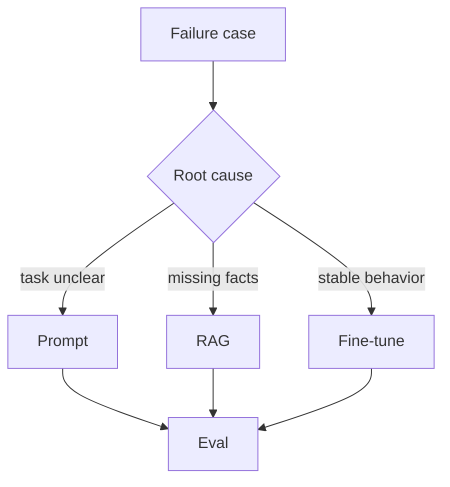

# 业务团队应该如何在 Prompt、RAG 和微调之间做技术选型？

## 30 秒回答

我会先做失败归因。任务表达不清、格式不稳，先用 Prompt。事实外部化、知识更新、需要引用，优先 RAG。固定风格、固定分类、稳定格式且有高质量样本，才考虑微调。无论选哪种，都要用 eval 验证质量、延迟和成本。

## 面试定位

这题考技术选型。面试官想听到你能根据问题类型选择方案，而不是追新名词。

## 标准回答

Prompt 成本最低，适合快速约束角色、格式、步骤和少量示例。但它对复杂稳定行为的控制有限。

RAG 适合业务知识、政策文档、论文证据、权限数据和时效性内容。它能提供 citation，但依赖检索质量和 grounding。

微调适合模型输出风格、格式、分类边界和领域表达习惯。它不适合作为事实数据库，也不适合频繁变化的数据。

## 架构与运行机制

图 1：Prompt、RAG、微调的失败归因决策树。图中不是从技术名词出发，而是从 failure case 出发：任务不清先改 prompt，缺外部事实先走 RAG 或工具，稳定行为问题再考虑 fine-tune，所有分支最后都进入 Eval 做回归。

这张图的边界是：三种方案解决的问题不同。Prompt 改变本次上下文里的指令和格式；RAG 把可更新、可引用、可授权的事实放到上下文；微调改变模型在大量相似输入上的行为倾向。把业务知识塞进 prompt 会膨胀且难维护；把动态知识做进微调会固化旧事实；把行为稳定性全靠 RAG 也会导致输出契约不稳。

数据流是从失败样本出发，先做根因分类，再选择方案并通过 eval 回归。

## 可画图

可以画决策树：格式问题、事实问题、行为问题、安全问题分别走 Prompt、RAG、fine-tune、guardrail。

## 系统设计案例

面试学习站要回答 AI、ES、MQ 知识点，事实和文档内容应走 RAG 或静态内容库。用户学习偏好可以放 Memory。回答格式可以用 prompt 约束。只有当大量答案风格不稳定且有标注样本时，才考虑微调。

## 真实问题与排障

如果 RAG 后仍答错，检查 citation 和 retrieval，不要直接改成微调。如果 prompt 很长仍不稳定，要看是否需要结构化输出 schema 或微调。指标包括 answer_accuracy、citation_precision、format_pass_rate、latency 和 cost。

选型取舍可以按变更频率、证据要求、样本质量和上线成本拆开。知识每天变化、需要权限和引用时，RAG 通常优先；输出格式长期稳定且已有高质量标注样本时，微调才有性价比；只是表达不清、角色不稳或步骤缺失时，Prompt 和 schema 往往更快。落地时还要比较 p95 latency、token cost、维护人力和回滚路径。

事故处理要先看影响面：是事实错误、引用错误、格式不稳、拒答过度、工具误用，还是新模型/新 prompt 灰度后回归。止血可以回滚 prompt_version、禁用新索引、回退微调模型、缩小流量或强制人工确认。根因要查 failure taxonomy、golden set 命中、retrieval candidates、citation verdict、training_data_version、model_version 和 safety verdict。回归要保留 prompt-only、RAG、RAG+rerank、fine-tune、fine-tune+RAG 的对照结果。

## 面试官追问

- 微调和 RAG 可以一起用吗？
- 什么时候 prompt 已经不够？
- RAG 的知识更新如何做？
- 微调数据量不够怎么办？
- 如何比较三种方案成本？

## 多轮追问模拟

**追问 1：什么时候 prompt 已经不够？**  
答题要点：同类失败在高质量 prompt、schema 和 few-shot 后仍反复出现，且问题是稳定行为或格式边界，而不是缺事实。考察点是失败归因。陷阱是 prompt 变长就继续堆规则。

**追问 2：RAG 和微调能不能一起用？**  
答题要点：可以，RAG 提供事实和引用，微调稳定领域表达、分类边界或工具使用习惯；两者都要 eval 和回滚。考察点是组合架构。陷阱是把微调用成知识库。

**追问 3：如何证明选型正确？**  
答题要点：用同一 golden set 对比 answer_accuracy、citation_precision、format_pass_rate、latency_p95、cost_per_success 和 rollback complexity。考察点是方案评审。陷阱是只凭一次人工体验决定。

## 项目化回答

我会说选型从失败样本出发。事实问题优先 RAG，行为稳定性问题考虑微调，表达和流程问题先用 prompt。所有方案都必须进入 eval，而不是凭主观感觉。

## 常见错误

- 一上来就微调。
- 用 prompt 保存大量知识。
- RAG 没有 citation 评测。
- 微调数据没有验证集。
- 不比较延迟和成本。

## 深挖技术细节

选型时先建立 failure taxonomy，而不是直接挑方案。`instruction_ambiguous` 用 prompt、few-shot 或任务拆解解决。`missing_external_fact` 用 RAG、数据库或工具解决。`output_contract_unstable` 用 JSON schema、function calling 或 SFT 解决。`domain_style_mismatch` 可以考虑 SFT。`unsafe_or_policy_failure` 需要 guardrail、拒答策略、红队 eval 和可能的对齐优化。

RAG 方案还要继续拆：ingest 是否正确、chunk 是否保留标题和层级、embedding 模型是否版本化、metadata filter 是否前置、rerank 是否提升 answerability、citation verifier 是否能发现 unsupported claim。微调方案要拆数据：样本是否高质量、是否覆盖反例、是否有验证集、是否可回滚、是否会让模型过拟合固定模板。Prompt 方案也不是随便写一段话，而是要有 prompt_version、输入输出契约和回归样本。

## 边界条件与反例

如果业务知识频繁变化，RAG 的维护成本通常低于微调，因为文档更新可以重新索引，而训练要重新准备数据、跑 eval 和灰度发布。如果任务只是固定字段抽取，强 schema 和小模型可能比大模型微调更经济。如果高风险问题需要严格拒答，单靠 prompt 很脆弱，应配合 policy engine 和 output guard。

反例可以用“政策问答答错”说明：如果知识库没有最新政策，微调旧样本只会把错误固化；如果检索召回了正确政策但模型格式乱，才考虑 schema 或 SFT；如果模型引用无关证据，要优化 rerank 和 citation grounding，而不是先训练。

## 深问准备

- 追问成本比较：讲 token cost、向量索引成本、训练成本、标注成本、上线回归和维护人力。
- 追问 RAG 与微调能否组合：可以，RAG 提供事实，微调稳定领域格式和工具使用。
- 追问样本不足怎么办：先 prompt/schema/RAG，收集线上失败样本，人工审核后再训练。
- 追问怎么证明选型正确：做 A/B 或离线 eval，对比 accuracy、citation_precision、latency_p95、cost_per_success。

## 来源与延伸阅读

- [OpenAI Fine-tuning guide](https://platform.openai.com/docs/guides/fine-tuning)：官方文档用于支持微调适合稳定输出行为、格式和领域表达，而不是替代动态事实源。
- [OpenAI Prompt engineering guide](https://platform.openai.com/docs/guides/prompt-engineering)：官方文档用于说明 prompt、示例和结构化指令适合先解决表达与任务约束问题。
- [OpenAI Text generation guide](https://platform.openai.com/docs/guides/text)：官方文档用于补充模型输入、输出、采样和生成参数对结果稳定性的影响。
- [OpenAI Evals](https://platform.openai.com/docs/guides/evals)：官方文档用于支撑 Prompt、RAG、微调方案都要以样例集和指标做回归验证。
