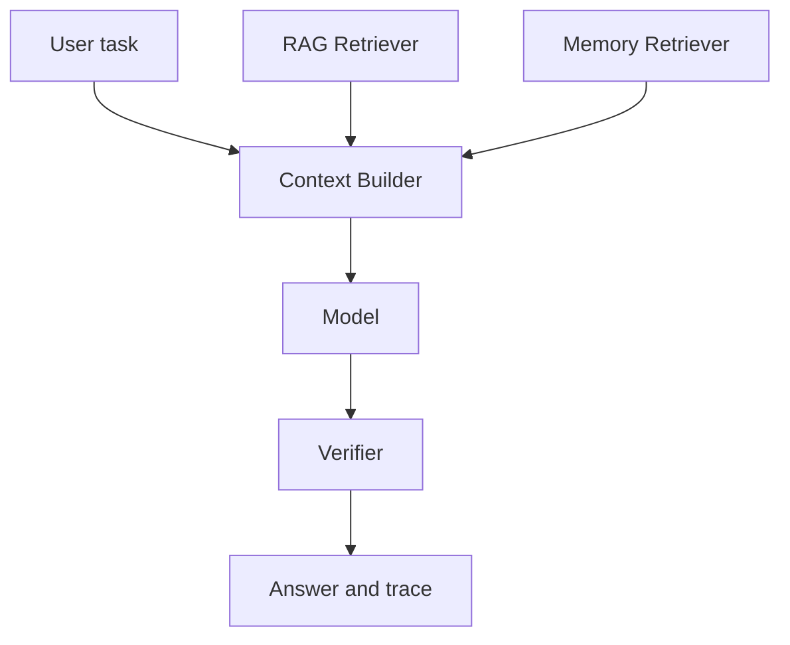

# RAG 和 Memory 的区别是什么，真实系统里如何一起设计？

## 30 秒回答

RAG 面向外部知识和事实证据，强调 citation、权限和可追溯。Memory 面向用户或任务连续性，保存偏好、历史决策、长期目标和学习状态。真实系统里，事实类问题优先 RAG，个性化和跨会话上下文用 Memory，两者都要有 scope、TTL、confidence 和 verifier。

## 面试定位

这题考 AI 应用的数据边界。面试官想知道你能否避免把用户记忆、知识库和聊天历史混在一起。

## 标准回答

RAG 的来源通常是文档、数据库、网页或业务系统。它回答“事实依据在哪里”。Memory 的来源通常是用户明确偏好、任务事件和长期状态。它回答“这个用户以前确认过什么”。

RAG 需要 metadata filter、hybrid search、rerank 和 citation grounding。Memory 需要 write policy、scope、TTL、confidence、correction 和删除机制。二者都不能覆盖当前用户指令和系统安全策略。

## 架构与运行机制

数据流里，RAG evidence 和 Memory record 要分别标注 trust label。模型需要知道哪个是事实证据，哪个只是个性化上下文。

## 可画图

可以画 Context Builder 分层图：system instruction、user request、RAG evidence、Memory records、tool observation、output constraints。

## 系统设计案例

面试学习站里，AI、ES、MQ 的知识点来自内容库或 RAG。用户薄弱点、错题原因和复习节奏来自 Memory。Paper Agent 中，论文事实必须来自 RAG citation，Memory 只保存用户常看的方向和阅读偏好。

## 真实问题与排障

如果系统用旧偏好覆盖事实，检查 Context Builder 优先级和 Memory confidence。如果回答没有引用，检查 RAG 检索和 citation verifier。指标包括 citation_precision、memory_precision、stale_memory_rate 和 unsupported_claim_rate。

关键取舍是“可追溯事实”和“个性化连续性”谁优先。RAG 证据通常应覆盖 Memory 中的旧偏好或旧判断，因为它有来源和版本；Memory 可以提高体验，但必须允许用户更正、删除和降权。对高风险问题，系统可以只使用 RAG 和工具结果，不注入长期 Memory。

## 面试官追问

- Memory 能否保存事实？
- RAG 证据和 Memory 冲突时怎么办？
- 用户删除 Memory 后如何同步索引？
- 如何防止跨用户串记忆？
- 如何评估二者收益？

## 项目化回答

我会说 RAG 是事实层，Memory 是连续性层。项目里二者都进入 Context Builder，但标签、优先级、生命周期和评测指标不同。

## 常见错误

- 把聊天历史当 Memory。
- 把长期事实写进用户记忆。
- RAG 没有 citation。
- Memory 没有 TTL 和纠错。
- 不区分权限和 scope。

## 深挖技术细节

RAG 和 Memory 一起用时，Context Builder 要输出两种不同 block。RAG evidence block 通常包含 `document_id`、`chunk_id`、`source_uri`、`version`、`retrieved_at`、`score`、`permission_scope`、`span` 和 `citation_id`。Memory block 则包含 `memory_id`、`user_id`、`namespace`、`subject`、`value`、`confidence`、`ttl`、`source_event`、`superseded_by` 和 `sensitivity`。这两个 schema 的生命周期、权限和 verifier 都不同。

冲突时优先级要明确：当前用户指令高于历史 Memory；带版本和来源的 RAG 证据通常高于旧 Memory；安全策略高于两者。比如 Memory 记得用户喜欢“Java 后端”，但当前 RAG 证据说明某 API 已废弃，答案不能为了迎合偏好而引用旧事实。Memory 可以影响解释风格和学习路径，事实性 claim 必须由 RAG 或工具结果支持。

评测也要拆开。RAG 看 `retrieval_recall`、`rerank_ndcg`、`citation_precision`、`unsupported_claim_rate`；Memory 看 `memory_precision`、`stale_memory_rate`、`correction_success_rate`、`cross_user_leak_rate`；组合层看 `conflict_resolution_accuracy`、`context_token_ratio`、`answer_personalization_gain`。这样才能定位是知识库错、记忆错，还是 Context Builder 优先级错。

## 边界条件与反例

反例一：把用户历史对话全文向量化，当成事实来源回答技术问题。反例二：把公共文档内容写进某个用户 Memory，导致更新和权限都不可控。反例三：Memory 与 RAG 冲突时让模型自由决定，结果旧偏好覆盖了新证据。

边界在于：Memory 可以提升连续性，但不应替代 citation；RAG 可以提供事实，但不应保存个人长期偏好。涉及隐私、跨租户、医疗、法律、财务或安全问题时，最好收紧 Memory 注入，只使用当前任务证据和用户明确授权。

## 深问准备

- 问：Memory 能保存事实吗？答：可以保存“用户相关事实”或“用户确认过的偏好”，但公共知识应在 RAG/业务库中维护。
- 问：删除 Memory 后如何处理索引？答：结构化 store、向量索引和缓存都要同步 tombstone 或删除，并记录审计。
- 问：RAG 和 Memory 都进上下文会不会太长？答：用预算器分配 token，事实 claim 优先保留证据，个性化只保留当前任务相关部分。
- 问：如何防跨用户串记忆？答：namespace、tenant filter、权限校验、检索后复核和 cross_user_leak eval。

## 来源与延伸阅读

- [LangChain Memory overview](https://docs.langchain.com/oss/python/concepts/memory)
- [LangChain Context engineering](https://docs.langchain.com/oss/python/langchain/context-engineering)
- [LangGraph Persistence](https://docs.langchain.com/oss/python/langgraph/persistence)
