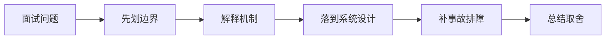

# 如果面试官深挖 AI Release Gate 与 CI/CD 的生产落地和排障，你怎么回答？

## 面试定位

这道题关联 AI Release Gate 与 CI/CD，难度 4/5，出现频率 high。面试官真正想看的是：你能否把概念回答升级成架构、数据流、指标、取舍和真实故障处理。
回答主轴可以从「AI Release Gate 与 CI/CD」切入：AI 发布门禁要同时检查功能测试、RAG 召回、Agent 轨迹、安全、成本、延迟和已知失败样本，防止 demo-only 改动上线。

**第一句话建议**
我会先划清边界，再解释运行机制，最后用一个系统设计案例说明数据流、失败模式、指标和取舍。

**不要只答**
- 只跑单元测试不跑 eval
- 所有 case 用一个总分
- 成本和延迟不上门禁
- 只给定义，不讲机制、数据流、指标和生产失败模式

## 30 秒回答

先给定义和边界：AI Release Gate 与 CI/CD 是 AI 工程生产化能力的一部分，关注 CI/CD gate、eval threshold、safety threshold、cost threshold and regression buckets。；release gate report、eval matrix、rollback checklist 是团队复盘、验收和面试表达的核心证据。；代码构建通过但 AI 质量退化 是这个主题最容易被追问的生产风险。；AI 发布门禁要同时检查功能测试、RAG 召回、Agent 轨迹、安全、成本、延迟和已知失败样本，防止 demo-only 改动上线。；CI/CD gate、eval threshold、safety threshold、cost threshold and regression buckets 要服务生产问题。

回答时必须主动补数据流、关键字段、失败模式、指标和取舍，否则很容易停留在背概念。

## 架构与运行机制

### 标准回答骨架

- 先给定义和边界：AI Release Gate 与 CI/CD 是 AI 工程生产化能力的一部分，关注 CI/CD gate、eval threshold、safety threshold、cost threshold and regression buckets。；release gate report、eval matrix、rollback checklist 是团队复盘、验收和面试表达的核心证据。；代码构建通过但 AI 质量退化 是这个主题最容易被追问的生产风险。；AI 发布门禁要同时检查功能测试、RAG 召回、Agent 轨迹、安全、成本、延迟和已知失败样本，防止 demo-only 改动上线。；CI/CD gate、eval threshold、safety threshold、cost threshold and regression buckets 要服务生产问题。
- 再讲机制：生产 AI 系统要先定义可验证边界，再谈模型效果。；所有关键配置、数据、prompt、模型、工具和评测结果都要可追溯。；质量、延迟、成本、安全和用户体验要一起权衡，不能只优化单一指标。；失败样本要进入回归集，避免同类问题重复发生。；AI Release Gate 与 CI/CD 的面试重点是把 CI/CD gate、eval threshold、safety threshold、cost threshold and regression buckets 拆成输入、处理、状态、输出、指标和失败路径。。
- 工程落地要说清楚：Versioned artifact registry。；Trace and eval pipeline。；Canary release with rollback。；Human review for high-risk cases。；关键字段至少包含 id、version、owner、tenant、input_hash、output_hash、status、error_code、trace_id 和 created_at。；指标看 gate_pass_rate、eval_regression_count、safety_block_count、cost_regression、latency_regression，并按场景、租户、模型版本和发布版本分桶。。
- 最后补指标、失败模式和取舍：gate_pass_rate；eval_regression_count；safety_block_count；cost_regression；latency_regression；只跑单元测试不跑 eval；所有 case 用一个总分；成本和延迟不上门禁。
- AI 发布门禁要同时检查功能测试、RAG 召回、Agent 轨迹、安全、成本、延迟和已知失败样本，防止 demo-only 改动上线。
- AI Release Gate 与 CI/CD 是 AI 工程生产化能力的一部分，关注 CI/CD gate、eval threshold、safety threshold、cost threshold and regression buckets。
- release gate report、eval matrix、rollback checklist 是团队复盘、验收和面试表达的核心证据。
- 代码构建通过但 AI 质量退化 是这个主题最容易被追问的生产风险。
- 生产 AI 系统要先定义可验证边界，再谈模型效果。
- 所有关键配置、数据、prompt、模型、工具和评测结果都要可追溯。
- 质量、延迟、成本、安全和用户体验要一起权衡，不能只优化单一指标。
- 失败样本要进入回归集，避免同类问题重复发生。
- AI Release Gate 与 CI/CD 的面试重点是把 CI/CD gate、eval threshold、safety threshold、cost threshold and regression buckets 拆成输入、处理、状态、输出、指标和失败路径。
- 生产落地时要保留 release gate report、eval matrix、rollback checklist，并能解释它如何支持排障、回归和团队协作。
- 把核心对象、状态变化、执行顺序和异常路径讲出来，避免只说结论。

### 数据流怎么讲

可以按 golden dataset、grader rubric、LLM-as-judge、RAG eval、Agent trajectory eval、线上 shadow、trace 聚类、prompt/model/config registry、CI release gate、安全红队和事故回归来讲。数据流通常是生产样本脱敏后进入数据集，离线 eval 计算质量指标，线上 shadow 和人工抽检发现漂移，失败样本回流成 regression case。

### 落地实现细节

- Versioned artifact registry。
- Trace and eval pipeline。
- Canary release with rollback。
- Human review for high-risk cases。
- 关键字段至少包含 id、version、owner、tenant、input_hash、output_hash、status、error_code、trace_id 和 created_at。
- 指标看 gate_pass_rate、eval_regression_count、safety_block_count、cost_regression、latency_regression，并按场景、租户、模型版本和发布版本分桶。
- 排障时先定位 release gate report、eval matrix、rollback checklist 的版本，再回放 trace、对比 eval、检查最近数据或配置变更。
- 设计时先定义 owner、version、tenant scope、timeout、retry、fallback 和 audit 字段。
- 上线前用 golden cases、trace replay、灰度和 rollback plan 验证 代码构建通过但 AI 质量退化 不会扩散成生产事故。
- 先定义目标、输入、输出、风险和成功指标，再选模型、工具或框架。
- 把 prompt、model、config、data、eval、trace 和 release 都版本化。
- 上线前准备 golden cases、回归门禁、成本预算、降级策略和人工接管路径。
- 关键接口要有 schema、version、timeout、retry、幂等键和审计字段。
- 关键状态要能恢复，关键动作要能回放，关键结果要有验证器或指标证明。

## 可画图

图 1：这类题不要直接背结论，先划清边界，再沿机制、设计、事故和取舍回答。

## 系统设计案例

### 面试可展开的系统设计

典型设计题是让一个 RAG/Agent/AI 助手从 demo 进入可发布系统。架构上要明确 fixture 来源、标注标准、grader 校准、阈值、发布门禁、成本延迟预算、线上观测、人工复核、安全测试和回滚策略。

**答题时建议画出的模块**
- 数据集层：golden set、生产抽样、脱敏、版本、标签、owner 和覆盖维度。
- 评测层：rule-based grader、LLM-as-judge、人工复核、rubric、阈值和置信区间。
- 对象层：RAG 检索、groundedness、Agent trajectory、tool result、safety case 和业务任务成功率。
- 发布层：prompt/model/config registry、CI release gate、shadow eval、canary 和 rollback。
- 闭环层：trace 聚类、失败归因、incident regression、样本回流和成本延迟质量看板。

**数据流**
- 生产 trace 和人工反馈经过脱敏、采样、聚类后形成候选 eval case。
- 标注规范和 rubric 固定通过/失败定义，golden dataset 按版本进入 CI 和离线评测。
- 候选 prompt/model/config 在离线 eval、shadow eval、安全样本和成本延迟门禁中逐层过滤。
- 线上失败回流到 regression case，并更新 rubric、阈值、监控和发布策略。

## 真实问题与排障

真实问题一般从 eval pass 但线上差、judge 漂移、golden set 过旧、RAG 召回下降、Agent 工具成功率下降、shadow 指标冲突、prompt 版本不可追溯、成本飙升和安全样本漏检看起。回答时要把失败 trace 转成可复现 fixture，再区分数据、检索、模型、prompt、工具、评测器和线上分布变化。

**现场排障回答法**
- 先确认是 eval 数据过旧、grader 偏差、线上分布变化、RAG 召回、Agent 工具、prompt/config 还是模型版本问题。
- 对比 offline、shadow、canary 和人工抽检结果，定位指标冲突来源。
- 检查 judge 校准样本、inter-rater agreement、rubric 变更、阈值和置信区间。
- 查看失败 trace，把失败归因为检索、上下文、模型、工具、权限、安全或业务规则。
- 止血可以回滚 prompt/model/config，降低自动化等级，打开 HITL，或阻断高风险工具。

**重点指标**
- gate_pass_rate
- eval_regression_count
- safety_block_count
- cost_regression
- latency_regression

## 多轮追问模拟

### 追问 1：AI Release Gate 与 CI/CD 的核心机制是什么？

**回答要点**：我会先划清边界：AI Release Gate 与 CI/CD 是 AI 工程生产化能力的一部分，关注 CI/CD gate、eval threshold、safety threshold、cost threshold and regression buckets。；release gate report、eval matrix、rollback checklist 是团队复盘、验收和面试表达的核心证据。；代码构建通过但 AI 质量退化 是这个主题最容易被追问的生产风险。；AI 发布门禁要同时检查功能测试、RAG 召回、Agent 轨迹、安全、成本、延迟和已知失败样本，防止 demo-only 改动上线。。然后再解释机制、生产约束和指标，避免只背名词。

**考察点**：边界、机制

### 追问 2：如果把这个点落到真实项目，你会怎么设计？

**回答要点**：我会按输入、配置、运行、失败处理和观测展开：关键字段至少包含 id、version、owner、tenant、input_hash、output_hash、status、error_code、trace_id 和 created_at。；指标看 gate_pass_rate、eval_regression_count、safety_block_count、cost_regression、latency_regression，并按场景、租户、模型版本和发布版本分桶。；排障时先定位 release gate report、eval matrix、rollback checklist 的版本，再回放 trace、对比 eval、检查最近数据或配置变更。；设计时先定义 owner、version、tenant scope、timeout、retry、fallback 和 audit 字段。；上线前用 golden cases、trace replay、灰度和 rollback plan 验证 代码构建通过但 AI 质量退化 不会扩散成生产事故。。项目表达里要说明数据流、配置来源、回滚方式和指标。

**考察点**：项目设计、数据流

### 追问 3：线上出问题时先看什么？

**回答要点**：先确认影响面和最近变更，再看关键指标：gate_pass_rate；eval_regression_count；safety_block_count；cost_regression；latency_regression。排查时按入口、运行态、依赖、配置、资源和发布逐层收敛。

**考察点**：排障、指标

### 延伸追问 1：AI Release Gate 与 CI/CD 的核心机制是什么？

回答时继续沿着边界、架构、数据流、指标、失败模式和取舍展开。可以落到这些项目证据：把回答落到 pe-coding-agent 的工程链路里。；用配置、数据流、指标、失败案例和回滚动作证明不是只会背概念。；补一个错误做法和一次改进动作，可信度会明显更高。

### 延伸追问 2：如果成本、稳定性和安全冲突，你怎么取舍？

回答时继续沿着边界、架构、数据流、指标、失败模式和取舍展开。可以落到这些项目证据：把回答落到 pe-coding-agent 的工程链路里。；用配置、数据流、指标、失败案例和回滚动作证明不是只会背概念。；补一个错误做法和一次改进动作，可信度会明显更高。

### 延伸追问 3：如何把这个知识点讲成项目经验？

回答时继续沿着边界、架构、数据流、指标、失败模式和取舍展开。可以落到这些项目证据：把回答落到 pe-coding-agent 的工程链路里。；用配置、数据流、指标、失败案例和回滚动作证明不是只会背概念。；补一个错误做法和一次改进动作，可信度会明显更高。

## 项目化回答与取舍

**项目证据怎么挂钩**
- 把回答落到 pe-coding-agent 的工程链路里。
- 用配置、数据流、指标、失败案例和回滚动作证明不是只会背概念。
- 补一个错误做法和一次改进动作，可信度会明显更高。

**取舍总结**
LLMOps 的取舍是质量可控和发布信心换来了标注成本、评测延迟、judge 偏差、样本维护和 CI 复杂度。面试追问通常会围绕 golden set、rubric、LLM-as-judge 校准、RAG groundedness、Agent task success、shadow eval、release gate、安全红队和 incident regression 展开。

**收尾句**
这类问题最后要回到可验证结果：设计上有什么边界，线上看什么指标，失败后怎么恢复，哪些场景不该用这个方案。这样回答才经得起连续追问。

## 深挖技术细节

- Versioned artifact registry。
- Trace and eval pipeline。
- Canary release with rollback。
- Human review for high-risk cases。
- 关键字段至少包含 id、version、owner、tenant、input_hash、output_hash、status、error_code、trace_id 和 created_at。
- 指标看 gate_pass_rate、eval_regression_count、safety_block_count、cost_regression、latency_regression，并按场景、租户、模型版本和发布版本分桶。
- 排障时先定位 release gate report、eval matrix、rollback checklist 的版本，再回放 trace、对比 eval、检查最近数据或配置变更。
- 设计时先定义 owner、version、tenant scope、timeout、retry、fallback 和 audit 字段。
- 上线前用 golden cases、trace replay、灰度和 rollback plan 验证 代码构建通过但 AI 质量退化 不会扩散成生产事故。
- 先定义目标、输入、输出、风险和成功指标，再选模型、工具或框架。
- 把 prompt、model、config、data、eval、trace 和 release 都版本化。
- 上线前准备 golden cases、回归门禁、成本预算、降级策略和人工接管路径。
- AI 发布门禁要同时检查功能测试、RAG 召回、Agent 轨迹、安全、成本、延迟和已知失败样本，防止 demo-only 改动上线。
- AI Release Gate 与 CI/CD 是 AI 工程生产化能力的一部分，关注 CI/CD gate、eval threshold、safety threshold、cost threshold and regression buckets。
- release gate report、eval matrix、rollback checklist 是团队复盘、验收和面试表达的核心证据。
- 代码构建通过但 AI 质量退化 是这个主题最容易被追问的生产风险。
- 生产 AI 系统要先定义可验证边界，再谈模型效果。
- 所有关键配置、数据、prompt、模型、工具和评测结果都要可追溯。
- 质量、延迟、成本、安全和用户体验要一起权衡，不能只优化单一指标。
- 失败样本要进入回归集，避免同类问题重复发生。
- AI Release Gate 与 CI/CD 的面试重点是把 CI/CD gate、eval threshold、safety threshold、cost threshold and regression buckets 拆成输入、处理、状态、输出、指标和失败路径。
- 生产落地时要保留 release gate report、eval matrix、rollback checklist，并能解释它如何支持排障、回归和团队协作。
- 面试深挖时要把 eval 讲成工程闭环，不是跑一组 prompt。关键是样本来源、评分标准、线上反馈、发布门禁和事故回归如何持续工作。
- 关键链路要说明同步路径、异步路径、失败路径和补偿路径。

## 边界条件与反例

反例一：如果业务需要强事务一致性，不能只靠缓存、搜索索引或异步读模型承载最终正确性。

反例二：如果没有指标、trace 和回归样例，方案在线上出问题时只能靠猜，不能证明稳定性。

反例三：为了追求低延迟而省略权限、幂等、超时或降级，会把局部性能优化变成系统性风险。

## 深问准备

被追问时优先沿四条线展开：为什么需要这个方案、关键数据结构是什么、失败后如何止血和定位、最终用什么指标证明修复有效。

- 准备一个线上事故：影响面、止血、根因、修复、回归。
- 准备一个系统设计：入口、状态、执行、存储、观测。
- 准备一个取舍：一致性、延迟、吞吐、成本和可维护性。

## 来源与延伸阅读

- [OpenAI API Docs: Evals](https://platform.openai.com/docs/guides/evals)：用于确认官方语义边界、命令行为和工程约束。
- [OpenAI API Docs: Production Best Practices](https://platform.openai.com/docs/guides/production-best-practices)：用于确认官方语义边界、命令行为和工程约束。
