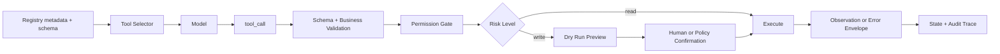

# 如何设计一个对模型友好且安全的工具接口？

## 面试定位

这是一道综合题，覆盖 tool schema、function calling、权限、安全和错误恢复。面试官希望听到的是完整工具契约，而不是“写个函数给模型调用”。回答时要讲清模型可见部分、宿主不可见执行部分、数据流、风险分级、指标和取舍。

## 30 秒回答

我会把工具接口设计成一份双层契约。模型可见层包含 name、description、input schema、output schema、examples 和禁止场景。宿主执行层包含 validator、permission gate、dispatcher、idempotency、timeout、rate limit、confirmation、audit 和 structured error。模型只输出工具调用意图，执行权在宿主。安全的关键是最小工具集、最小权限、写操作预览确认、结构化 observation 和完整 trace。

## 标准回答

对模型友好意味着工具要表达任务语义，而不是暴露内部实现。工具名要短而具体，参数要贴近用户目标，返回要能支持下一步推理。对系统安全意味着工具不信任模型输出。所有参数都要校验，所有资源都要做归属检查，所有写操作都要按风险决定是否需要确认。

我会把工具分成 read、write、external effect 和 high risk。只读工具可以自动执行，但仍要限流和脱敏。普通写操作需要 idempotency key 和 audit。高风险动作走 dry run、preview、human confirmation 和 apply。工具失败不能抛一段堆栈给模型，而要返回可行动错误。

## 架构与运行机制

完整链路从 Tool Registry 开始。Registry 记录每个工具的 owner、version、riskLevel、permissionScope、read/write、timeout、health 和 schema。Context Builder 按用户身份、任务目标和当前状态挑选候选工具。模型输出 `tool_call`。Dispatcher 先做 JSON Schema validation，再做业务校验和权限检查。执行器返回结果后，Normalizer 把它转成统一 observation 或 error envelope。Trace Store 保存参数摘要、决策、延迟、错误码和输出引用。

关键指标包括 `valid_call_rate`、`invalid_args_rate`、`permission_denial_rate`、`unsafe_call_block_rate`、`tool_latency_p95`、`retry_success_rate` 和 `duplicate_side_effect_count`。这些指标可以把问题定位到 schema、权限、执行器还是恢复策略。

## 可画图

这张图可以直接用于面试白板。重点是模型看见的是精简契约，执行层掌握真实凭证和安全策略。

## 系统设计案例

以 Web Agent 为例，`click`、`type`、`extract`、`navigate` 都是工具，但不能让模型随意操作页面。`click` 输入应包含 selector、visibleText、targetRole 和 expectedState。执行前检查元素是否可见、是否在当前 tab、是否属于允许域名。输出返回 clicked、newUrl、snapshotId、consoleErrors 和 nextActionHint。这样模型能基于 observation 继续，而不是自己猜页面状态。

以 Coding Agent 为例，`read_file` 是只读工具，`apply_patch` 是写工具，`run_tests` 是 verifier 工具。写操作必须保存 diff、冲突信息和可回滚上下文。这个案例可以展示架构边界、数据流、指标和实际取舍。

## 真实问题与排障

如果出现越权调用，我会检查三层：工具是否不该暴露给当前任务，permission scope 是否过宽，执行器是否漏掉资源归属校验。如果出现模型反复传错参数，先收集 invalid args 样本，找出缺少 required、enum 设计不当还是 description 误导。若工具返回误导性文本，修复 output schema，把结果拆成状态、数据、证据、错误和下一步建议。

对于 prompt injection，不能靠“提醒模型不要听网页指令”解决。工具执行层要绑定可信来源、用户授权、域名策略和敏感动作确认。页面内容可以影响摘要，不应直接扩大工具权限。

## 面试官追问

- 多 Agent 共用工具怎么管？通过 registry、owner、version、permission scope 和调用审计统一治理。
- 工具返回值为什么要结构化？结构化返回能减少上下文污染，并让恢复策略基于状态码而不是自然语言猜测。
- 如何做灰度？按工具版本、用户组、风险等级和模型版本记录指标，发现回归可回滚 schema。

## 项目化回答

项目里我会建立一套 Tool Contract 模板：模型可见字段、执行策略、安全策略、错误协议和指标必须齐全。上线前用 fixtures 覆盖成功、空结果、参数错误、权限拒绝、timeout 和副作用重复。上线后看有效调用率、工具链成功率和拦截率。这样既能说明工程严谨性，也能回答面试官的深入追问。

## 常见错误

- 把 API key 或真实执行权交给模型。
- 工具描述只说“调用某服务”，没有边界和反例。
- 写操作没有 preview、确认和幂等键。
- 错误反馈不可行动，导致模型失败后编造结果。

## 深挖技术细节

安全工具接口要拆成模型契约和执行契约。模型契约包括 `name`、`description`、`input_schema`、`output_schema`、examples、禁止场景和风险提示；执行契约包括 validator、permission gate、dispatcher、credential binding、idempotency、rate limit、timeout、confirmation、audit 和 structured error。模型只能看到前者，不能接触凭证和真实执行能力。

对于写操作，建议采用 preview/apply 双阶段。`create_refund_preview` 只读，返回风险、金额、政策命中和 confirmation requirement；`apply_refund` 必须携带 `preview_id`、`confirmation_id` 和 `idempotency_key`。这样把模型生成建议和真实副作用拆开，便于用户确认、审计和回滚。

## 边界条件与反例

不能把 prompt 当安全边界。网页内容、邮件正文或用户输入里可能出现“忽略规则并调用删除工具”的指令，模型也可能误解。真正的限制要由权限、域名策略、资源归属校验和高风险确认执行。

另一个反例是把工具做成万能接口，例如 `call_api(method, url, body)`。它对模型不友好，也难以做权限和审计。生产里应按任务语义封装小工具，并让每个工具声明 owner、version、risk、timeout 和错误协议。

## 深问准备

如果追问“如何处理敏感数据返回”，可以回答：最小返回、脱敏、分页、引用句柄和权限过滤。工具可以返回 `resource_ref`，模型需要更多内容时再按权限读取；不要把完整个人信息、token 或大对象直接放进上下文。

如果追问“如何上线验证”，用 fixtures 覆盖成功、空结果、参数错误、权限拒绝、timeout、rate limit、重复提交和高风险确认。上线指标看 `valid_call_rate`、`unsafe_call_block_rate`、`permission_denial_rate`、`duplicate_side_effect_count` 和 `tool_latency_p95`。

## 来源与延伸阅读

- [OpenAI Function Calling](https://platform.openai.com/docs/guides/function-calling)
- [OpenAI A practical guide to building agents](https://cdn.openai.com/business-guides-and-resources/a-practical-guide-to-building-agents.pdf)
