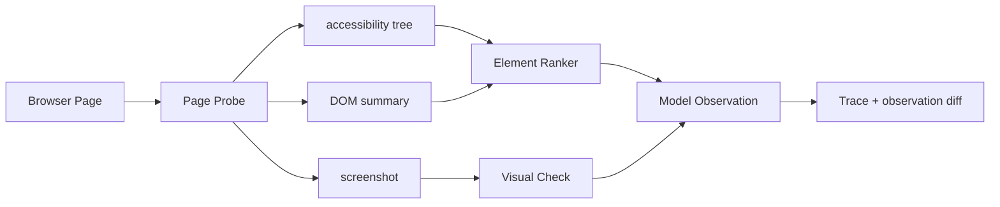

# Browser Agent 如何观察网页状态？

## 面试定位

这题考 Browser Agent 的输入质量。面试官想知道你能否把网页状态转成稳定 observation，而不是把完整 DOM 或截图直接塞给模型。

## 30 秒回答

我会把观察层设计成多源融合：URL、title、accessibility tree、可见文本、interactive_elements、screenshot 和 observation diff。模型只拿压缩后的 observation。原始 DOM、截图和前后状态进入 trace。这样 Agent 能知道当前页面、可点元素和动作变化，也能在失败时 replay。

## 标准回答

Browser Agent 的观察目标不是“信息越多越好”，而是短、稳、可追溯。accessibility tree 提供 role、name、value 和 state，适合按钮和表单。DOM summary 提供结构和 locator 候选。screenshot 处理遮挡、弹窗、canvas 和视觉布局。observation diff 证明动作是否改变了页面。

外部网页内容要标记为 untrusted content。页面文字只能作为 evidence，不能变成 system 指令，也不能扩大工具权限。

## 架构与运行机制

数据流是 Page Probe 采集 URL、title 和 screenshot_ref，Accessibility Extractor 抽取语义节点，DOM Summarizer 保留主内容和可操作元素，Element Ranker 生成 interactive_elements，Diff Engine 比较前后 observation。输出写入 trace，并把精简状态交给模型。

## 可画图

## 系统设计案例

如果 Agent 要取消订阅，观察层不应返回整页 HTML。它应返回页面标题、账户区域摘要、候选按钮、按钮风险等级和截图引用。点击后再生成 after observation。若出现确认弹窗，diff 应告诉模型进入确认步骤，而不是直接认为取消完成。

## 真实问题与排障

点错元素时先看 interactive_elements 是否漏召回。locator 失败时看候选排序。页面没反应时看截图是否有遮挡。模型被页面文案诱导时检查 trust label。核心指标是 `element_hit_rate`、`observation_diff_accuracy`、`dom_screenshot_mismatch_rate` 和 `stale_observation_rate`。

## 面试官追问

- DOM-only 和 screenshot 怎么取舍？默认 DOM 与 accessibility tree，低置信或视觉任务再加 screenshot。
- observation diff 存什么？URL、title、文本 hash、元素状态和截图区域。
- 完整 DOM 为什么不好？token 高、噪声大，还可能混入恶意文本。

## 项目化回答

我会说：我在 Web Agent 里把观察层拆成 Page Probe、DOM Summarizer、Element Ranker 和 Diff Engine。模型只看 observation，工程侧保留 screenshot、DOM 和 trace refs。

## 常见错误

- 把网页 HTML 原样塞给模型。
- 只依赖 CSS selector。
- 动作后不重新 observe。
- 没把网页内容标成 untrusted content。

## 深挖技术细节

Browser Agent observation 是页面状态的压缩视图。推荐结构包括 `page_url`、`title`、`viewport`、`loading_state`、`main_region_text`、`interactive_elements`、`form_fields`、`alerts`、`screenshot_ref`、`dom_hash`、`trust_label` 和 `observation_version`。每个 interactive element 包含 `element_id`、`role`、`name`、`value`、`state`、`locator_candidates`、`bbox`、`risk_level`。模型只拿这些摘要，原始 DOM 和截图进 trace。

Observation Builder 要多源融合。Accessibility tree 提供语义 role/name，DOM summary 提供结构和 locator，screenshot 处理遮挡、canvas、视觉按钮，Diff Engine 比较 before/after。动作后必须重新 observe，否则模型会按旧页面继续点。网页文本属于 untrusted content，只能作为页面 evidence，不能改变系统指令或工具权限。

评估观察质量可以看 `element_hit_rate`、`locator_stability_rate`、`observation_diff_accuracy`、`dom_screenshot_mismatch_rate`、`stale_observation_rate` 和 `wrong_click_rate`。如果按钮常漏召回，查 accessibility 和 element ranker；如果点击成功但状态错，查 verifier 和 observation diff。

## 边界条件与反例

反例一：完整 HTML 太长、噪声大，还可能夹带 prompt injection。反例二：只用 CSS selector，页面改 class 就失效。反例三：只看 DOM 不看 screenshot，modal 遮挡时仍误点。反例四：点击后不重新观察，把 old state 当 current state。

边界在于：不是每步都需要 vision，也不是每步都能只靠 DOM。低风险表单和文本任务用 DOM/accessibility；视觉遮挡、canvas、图标和布局判断再触发 screenshot。高风险动作还要 expected_state 和确认。

## 深问准备

- 问：observation 里最重要的字段？答：URL、title、interactive elements、locator candidates、state、screenshot_ref 和 trust label。
- 问：为什么不用完整 DOM？答：token 高、噪声大、容易过期，也会把恶意页面文案混进上下文。
- 问：动作后如何判断成功？答：重新 observe，比较 URL、DOM hash、元素状态、文本和业务断言。
- 问：如何处理 prompt injection？答：页面内容标 untrusted evidence，不能修改目标、工具权限和输出策略。

## 来源与延伸阅读

- [Playwright Locators](https://playwright.dev/docs/locators)
- [Playwright Actionability](https://playwright.dev/docs/actionability)
- [OpenAI Agents SDK Guardrails](https://openai.github.io/openai-agents-python/guardrails/)
