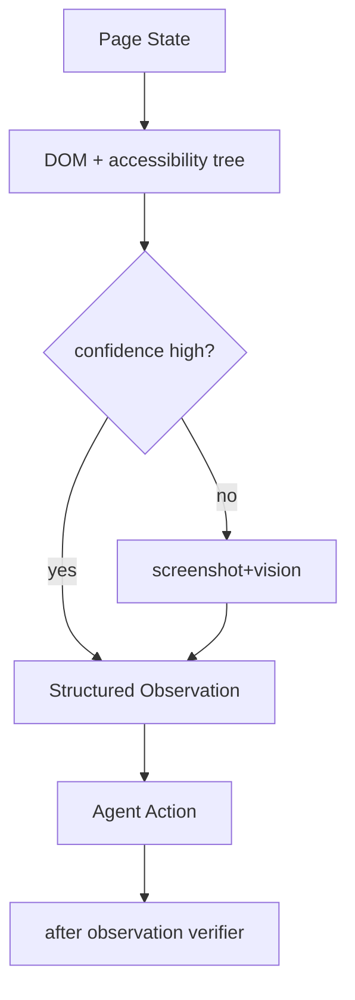

# DOM-only 和 screenshot+vision 的观察方式如何取舍？

## 面试定位

这是 Browser Agent 观察层的深入题。重点不是二选一，而是说明成本、覆盖、可靠性和 verifier 如何组合。

## 30 秒回答

我会默认使用 DOM summary 和 accessibility tree，因为它们便宜、结构化、容易定位。遇到视觉布局、遮挡、canvas、图片按钮、弹窗或 DOM 与视觉不一致时，再触发 screenshot+vision。视觉结果不能直接当最终事实，要通过 after observation 和 verifier 校验。

## 标准回答

DOM-only 的优势是速度快、可解释、token 可控，适合表单、按钮、链接和结构化文本。它的盲区是视觉遮挡、浮层、canvas、图标按钮和 CSS 状态。screenshot+vision 能看到用户真正看到的页面，但成本高，延迟高，还可能产生视觉误读。

生产系统更常用 hybrid。先用 accessibility tree 找候选，再用 DOM summary 补上下文。若候选置信度低或任务带有视觉语义，触发 screenshot。最后用 verifier 检查 expected_state，而不是让视觉模型独自裁决。

## 架构与运行机制

数据流是 observation builder 先生成结构化页面状态，再计算 confidence。如果页面有遮挡、canvas、无语义控件或动作验证失败，就调用 visual check。结果写回 observation，并保留 screenshot_ref 供 Trace Replay 使用。

## 可画图

## 系统设计案例

购物网站的“下一步”按钮可能是图标按钮。DOM 里只有无意义 class，此时 DOM-only 很弱。系统可以截取按钮区域，用 vision 识别视觉标签，再生成 locator candidates。点击后仍要验证 URL 或步骤标题是否变化。

## 真实问题与排障

如果视觉判断和 DOM 冲突，优先看用户可见状态，但执行仍要绑定 locator。若 vision latency 升高，应只对低置信区域截图。若误点图标，检查视觉摘要是否缺 bbox 和 verifier。指标看 `vision_trigger_rate`、`vision_latency`、`wrong_click_rate`、`verifier_pass_rate`。

## 面试官追问

- DOM-only 什么时候足够？语义化表单、按钮、链接和文本任务。
- screenshot 什么时候必须用？遮挡、canvas、布局判断和图像控件。
- 视觉结果如何防误读？用 expected_state verifier 和 trace replay 校准。

## 项目化回答

我会说：我的 Web Agent 使用 hybrid observation。默认走 accessibility tree 与 DOM summary，低置信场景才用 screenshot+vision。动作完成后通过 observation diff 和 verifier 判断是否成功。

## 常见错误

- 一开始就全页截图，成本和延迟失控。
- 完全不用截图，处理不了遮挡和视觉控件。
- 视觉模型说成功就结束。
- 不保存 screenshot_ref，失败无法 replay。

## 深挖技术细节

Browser Agent 的 observation builder 应输出结构化页面状态，而不是只给模型一张图。DOM/accessibility 分支包含 `element_id`、`role`、`name`、`text`、`locator_candidates`、`visible`、`disabled`、`bbox`、`aria_label`、`form_state` 和 `url`。视觉分支包含 `screenshot_ref`、`region_bbox`、`visual_label`、`occlusion_detected`、`canvas_detected` 和 `vision_confidence`。Planner 根据这些字段选择 action，Executor 仍然必须绑定 locator 或坐标策略，并经过 verifier。

触发 screenshot+vision 应有明确条件：DOM 置信度低、元素无语义、视觉遮挡、canvas、图标按钮、CSS disabled 状态不可靠、动作后 verifier 失败。为了控制成本，可以只截取低置信区域，而不是全页截图。视觉结果要写入 trace，方便 replay 时复现误判。

最终成功必须由 after-observation verifier 判断。点击后检查 URL、标题、toast、表格行、按钮状态或业务字段是否变化。视觉模型说“看起来成功”不能作为完成证据。指标包括 `vision_trigger_rate`、`vision_latency_p95`、`wrong_click_rate`、`occlusion_detection_rate`、`verifier_pass_rate`、`replay_artifact_coverage`。

## 边界条件与反例

反例一：DOM 里按钮存在但被 modal 遮挡，DOM-only 仍然选择点击，实际没有效果。反例二：视觉识别出“下一步”文字，但没有可执行 locator，点击坐标在不同 viewport 失效。反例三：canvas 应用没有 DOM 语义，只用 accessibility tree 根本看不到关键对象。

边界在于：DOM 更适合语义化网页和表单，vision 更适合布局、遮挡、图像控件和 canvas。生产系统通常采用 hybrid，而不是二选一。高风险动作如支付、删除、提交表单，即便 vision 置信度高，也要二次确认和 expected_state verifier。

## 深问准备

- 问：DOM-only 什么时候足够？答：语义化按钮、链接、表单、表格和文本抽取任务。
- 问：什么时候必须 vision？答：遮挡、canvas、图标按钮、视觉布局判断、DOM 与用户可见状态冲突时。
- 问：视觉结果如何绑定动作？答：保留 bbox 和 locator candidates，优先用稳定 locator，必要时区域点击并加强 verifier。
- 问：如何排障误点？答：回看 screenshot_ref、bbox、locator、before/after observation 和 verifier verdict。

## 来源与延伸阅读

- [Playwright Locators](https://playwright.dev/docs/locators)
- [Playwright Actionability](https://playwright.dev/docs/actionability)
- [OpenAI Agents SDK Tracing](https://openai.github.io/openai-agents-python/tracing/)
