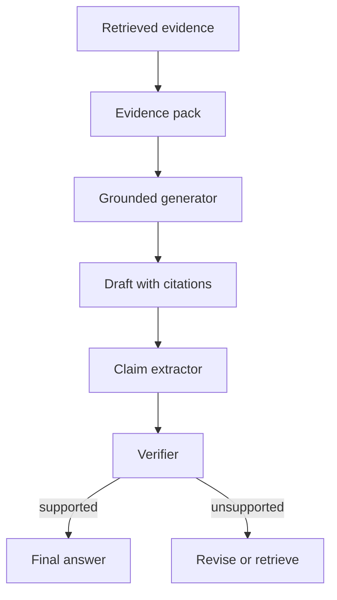

# 如何降低 RAG 或 Agent 回答中的幻觉？

## 30 秒回答

我会从 grounding 链路控制幻觉。检索阶段输出带 citation 和 evidence span 的证据包，生成阶段要求每个关键 claim 引用证据，生成后用 verifier 检查 claim-to-evidence。unsupported claim 要删除、降级或触发补检索。

## 面试定位

这题考的是“有证据的生成”。面试官不会满足于你说“加 RAG”，因为 RAG 也会引用错、过度推断或编造。

回答要覆盖架构、数据流、指标、取舍和追问。重点是从 claim、evidence、citation 和 verifier 四层控制。

## 标准回答

首先要保证检索证据质量。Hybrid search 和 rerank 负责把可回答问题的 evidence 放进上下文，而不是只放主题相关文本。

其次要在生成时强约束。每个关键 claim 都需要 citation，证据不足时要拒答或说明不确定。模型不能引用没有提供的来源。

最后要生成后验证。Claim extractor 抽取事实断言，verifier 判断 evidence span 是否支持。unsupported claim 被删除、改写或触发补检索。这个链路比单纯调 prompt 更可靠。

## 架构与运行机制

图 1：Citation grounding 把检索证据包、带引用生成、claim 抽取和证据验证连成闭环，并把 unsupported claim 送回修订或补检索。

图里的关键边界是 evidence pack 和 citation 的粒度。Retrieved evidence 只说明系统拿到了相关材料，Evidence pack 要进一步携带 evidence_id、span、权限和时间戳；Draft with citations 只是一版草稿，Claim extractor 和 Verifier 才判断每个事实断言是否被证据直接支持。unsupported 路径必须回到 Revise or retrieve，不能静默保留看起来合理的结论。

数据流里，citation 不是装饰。它必须能定位到 evidence span，并且 verifier 能判断 claim 是否被该 span 支持。

## 可画图

可以画“证据包 -> 生成 -> claim 抽取 -> verifier -> 修订”的闭环。图上标出 unsupported claim 的处理路径。

## 系统设计案例

企业内部助手回答政策问题时，答案里每个步骤都引用对应制度条款。如果模型写出“可以延期 30 天”，verifier 会检查证据是否真的包含 30 天规则。没有证据就删掉或提示需要人工确认。

这样能把幻觉从“回答看起来合理”变成“claim 是否被证据支持”的可检测问题。

## 真实问题与排障

如果引用很多但仍然答错，先抽样做 claim-to-evidence 检查。常见原因是检索命中主题相近文档，rerank 没看 answerability，或模型把相邻段落过度推断。

指标包括 citation_precision、claim_support_rate、unsupported_claim_rate、hallucination_rate 和 no_answer_accuracy。

## 多轮追问模拟

追问 1：citation precision 和 answer accuracy 有什么区别？
答：answer accuracy 看最终答案是否正确，citation precision 看被引用证据是否直接支持对应 claim。答案可能碰巧正确但引用错，也可能引用相关文档却不支持具体数字或结论。考察点是证据链粒度；陷阱是把“有引用”当成“有依据”。

追问 2：证据不足时为什么不能让模型“合理推断”？
答：因为 grounding 的目标是把未知事实保持为未知，而不是让模型补全。证据不足时应拒答、说明不确定、请求更多信息或补检索；高风险场景还要优先正确拒答。考察点是拒答边界；陷阱是为了回答覆盖率牺牲可信度。

追问 3：工具调用结果能不能作为 citation？
答：可以，但要把 tool name、参数 hash、返回时间、权限范围和原始结果引用保存下来。否则后续无法判断工具结果是否过期、是否属于当前用户权限、是否被模型误解。考察点是动态证据治理；陷阱是只把静态文档当证据。

## 面试官追问

- citation precision 怎么评测？
- 证据冲突时怎么回答？
- 工具结果如何参与 grounding？
- 如何避免 citation 泄露无权限文档？
- verifier 自己错了怎么办？

## 项目化回答

我会说项目里不是只“加引用”，而是做 claim-to-evidence 验证。证据包带 evidence_id，生成后抽 claim，verifier 检查支持关系，失败样本进入 eval。

## 常见错误

- 以为 RAG 自动解决幻觉。
- citation 指到文档首页，不到证据片段。
- 证据不足时仍然编答案。
- 不处理冲突证据。
- 评测只看答案流畅度。

## 深挖技术细节

降低幻觉要把生成链路拆成可验证对象。检索阶段产出的不是普通文本，而是 evidence pack：`evidence_id`、`document_id`、`chunk_id`、`source_uri`、`span_start`、`span_end`、`retrieval_score`、`rerank_score`、`permission_scope` 和 `retrieved_at`。生成阶段每个关键 claim 要绑定 citation id，不能只在结尾列几个链接。生成后 Claim Extractor 把答案拆成原子断言，再由 Verifier 判断 evidence span 是否支持。

Verifier 的判断要分 supported、partial、unsupported、contradicted。unsupported claim 可以被删除、改写成“不确定”，或触发补检索；contradicted 要优先暴露冲突，不能静默选择对模型有利的证据。工具结果也可以成为 evidence，但要保存 tool name、参数 hash、返回时间和权限范围。这样回答错了可以定位是召回失败、精排错误、生成过度推断，还是 verifier 漏检。

生产指标要覆盖全链路：`retrieval_recall@k`、`answerability_rate`、`citation_precision`、`claim_coverage`、`unsupported_claim_rate`、`contradiction_rate`、`no_answer_accuracy`、`p95_verifier_latency`。如果 citation precision 上升但 claim coverage 下降，说明模型可能只给容易引用的断言加引用，仍然有遗漏风险。

## 边界条件与反例

反例一：答案看起来都有引用，但引用指向文档首页或整个 PDF，无法证明具体 claim。反例二：证据不足时模型为了流畅性补全数字、时间和结论。反例三：只验证答案是否“语义相关”，没有验证引用 span 是否直接支持 claim。

边界在于：Grounding 不能让未知事实变成已知事实。知识库没有证据、权限不允许访问、证据互相冲突或来源过期时，正确行为是拒答、说明不确定、请求更多信息或展示冲突，而不是强行生成。高风险场景要优先正确拒答，而不是追求回答覆盖率。

## 深问准备

- 问：citation precision 怎么算？答：被 citation span 直接支持的 claim 数，占所有带引用 claim 的比例。
- 问：证据冲突怎么办？答：保留冲突来源，按版本、权限、时间和权威性排序；无法裁决时输出冲突而非编结论。
- 问：verifier 也会错怎么办？答：保留人工抽样、verifier agreement、hard negative 和线上回归样本。
- 问：如何避免泄露无权限文档？答：metadata filter 在检索前执行，citation 输出前再做权限复核。

## 来源与延伸阅读

- [Anthropic Claude Citations](https://docs.anthropic.com/en/docs/build-with-claude/citations)：用于支持回答中的关键 claim 应绑定可定位的证据来源，而不是只在末尾列链接。
- [LangChain Context engineering](https://docs.langchain.com/oss/python/langchain/context-engineering)：用于支持 grounding 要从上下文选择、压缩、证据保留和生成约束一起设计。
- [LangSmith Evaluation](https://docs.smith.langchain.com/evaluation)：用于支持 citation precision、claim support 和 hallucination regression 需要进入评测集与实验对比。
