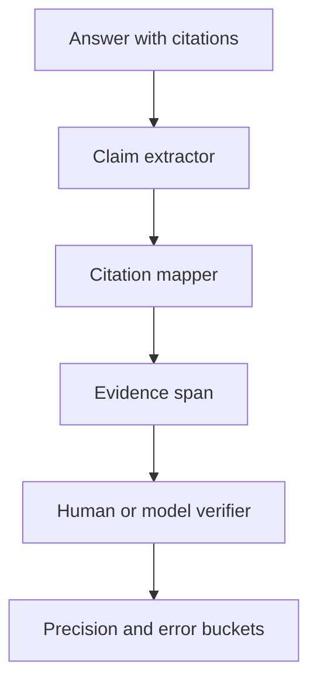

# 如何评测 citation precision？

## 30 秒回答

citation precision 评测的是答案引用是否真的支持对应 claim。做法是抽取答案中的关键 claim，找到它标注的 citation 和 evidence span，由人工或 verifier 判断 supported、unsupported、partial 或 contradicted。precision 等于被支持的引用占所有被引用 claim 的比例。

## 面试定位

这是 grounding 的深入追问。面试官想确认你不会把“引用数量”当成“引用质量”。

回答要覆盖架构、数据流、指标、取舍和追问。关键是 claim-to-evidence 标注，而不是文档级别链接。

## 标准回答

我会先定义评测样本。包含事实问答、比较问题、无答案问题、冲突证据和过期文档。每个答案都需要标注关键 claim 和对应 evidence。

评测流程是：Claim extractor 抽出答案断言，Citation mapper 找到引用片段，Verifier 判断证据是否直接支持 claim。结果可以分四类：supported、partial、unsupported、contradicted。

除了 precision，还要看 citation recall。模型可能只给少数 claim 引用，precision 很高但覆盖不足。还要看 unsupported_claim_rate 和 no_answer_accuracy。

## 架构与运行机制

数据流要保留 claim_id、citation_id、evidence_span、verdict 和 reason。这样错误样本才能回灌到检索、rerank 和生成策略。

## 可画图

可以画评测流水线：答案、claim、citation、evidence span、verdict、指标面板。旁边列出 supported 与 unsupported 的例子。

## 系统设计案例

Paper Agent 生成一句“方法 A 在数据集 X 上超过方法 B”。Citation precision 评测要检查引用片段是否真的包含这个数据集和比较结果。如果引用只是方法介绍，则判 unsupported。

数据流是：答案 claim 指向论文第 5 页表格，verifier 对照表格内容。如果数值或对象不一致，记录为 contradicted，并进入 hard negative。

## 真实问题与排障

如果 citation precision 低，先看错误类型。引用不存在是生成问题，引用存在但不支持是 rerank 或 claim 过度推断，证据本身过期是检索过滤问题。

指标包括 citation_precision、citation_recall、claim_coverage、unsupported_claim_rate、contradiction_rate 和 verifier_agreement。

## 面试官追问

- 人工标注成本高怎么办？
- partial support 如何计分？
- citation recall 和 precision 如何平衡？
- verifier 的一致性怎么评估？
- 无答案问题如何纳入评测？

## 项目化回答

我会把 citation precision 做成离线 eval。每条答案拆 claim，每个 claim 绑定 evidence span，verifier 给 verdict。错误样本会按检索、精排、生成和引用映射分桶，推动迭代。

## 常见错误

- 统计引用数量而不是支持关系。
- 只看文档级链接，不看 span。
- 不评估无答案问题。
- 不区分 partial 和 contradicted。
- 没有人工抽样校验 verifier。

## 深挖技术细节

citation precision 的关键是把“答案文本”拆成可验证的 claim，而不是把整段回答和整篇文档粗略匹配。生产数据结构通常包含 `answer_id`、`claim_id`、`claim_text`、`citation_id`、`document_id`、`span_start`、`span_end`、`cited_text`、`verdict`、`verifier_reason` 和 `labeler_id`。如果是 PDF，要保存页码范围；如果是 plain text，要保存字符偏移；如果是自定义 chunk，要保存 block index。这样才能复现 verifier 的判断。

Verifier 不能只问“这段引用相关吗”，而要判断四类关系：directly supported、partially supported、unsupported、contradicted。比如 claim 说“A 比 B 高 12%”，证据只说明“A 和 B 都被评估过”，这是 unsupported；证据说“A 高 8%”，是 contradicted 或 numeric mismatch；证据支持对象但缺少条件，是 partial。评分时可以用严格 precision，也可以给 partial 0.5，但必须在报告里分桶。

排障链路要从错误类型反推系统模块。引用 span 不存在，通常是 citation formatter 或响应解析问题；span 存在但不支持 claim，可能是 rerank 不准或 generation over-claim；claim 无引用，说明 citation recall 或输出约束失败；过期文档被引用，说明检索过滤、版本控制或缓存策略失败。指标除了 `citation_precision`，还要看 `claim_coverage`、`unsupported_claim_rate`、`contradiction_rate`、`no_answer_accuracy`、`verifier_agreement` 和 `p95_verification_latency`。

## 边界条件与反例

反例一：答案末尾列出 3 个链接，但正文每个 claim 没有绑定 span。这只能说明“有来源”，不能说明“来源支持结论”。反例二：用 LLM verifier 全自动打分但没有人工抽样，一旦 verifier 偏向模型答案，会把 hallucination 评成 supported。反例三：只评估有答案问题，不评估 no-answer 和冲突证据，系统会倾向于强行回答。

边界在于：citation precision 高不代表完整正确。模型可以只给最容易引用的 claim 加引用，遗漏关键结论，所以必须同时看 recall 和 coverage。对金融、医疗、法律、论文解读等场景，最好要求 claim 级引用；对低风险摘要，可以用段落级引用，但要在 UI 中明确粒度。

## 深问准备

- 问：partial support 怎么计分？答：按场景决定，严格评测可记 0，诊断报告可记 0.5，但必须单独展示，不能混入 supported。
- 问：如何降低人工标注成本？答：先用 verifier 预标，再抽样复核；对 contradicted、unsupported、高置信低一致样本优先人工看。
- 问：引用粒度怎么选？答：事实问答用句子或表格单元格，论文和合同可用页码加 span，长 RAG chunk 要拆到能直接支持 claim 的粒度。
- 问：结构化输出和 citation 冲突怎么办？答：可以拆两步，先生成带引用的解释，再由后处理抽取结构；不要为了 JSON schema 丢掉引用链路。

## 来源与延伸阅读

- [Anthropic Claude Citations](https://docs.anthropic.com/en/docs/build-with-claude/citations)
- [LangChain Context engineering](https://docs.langchain.com/oss/python/langchain/context-engineering)
