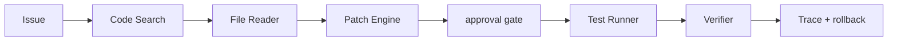

# Coding Agent 的 harness 包含哪些关键能力？

## 面试定位

这题考 Coding Agent 的运行时。不要只说“能读写文件和跑测试”，要讲 workspace sandbox、Patch Engine、Test Runner、权限、approval、rollback 和 trace。

## 30 秒回答

Coding Agent Harness 至少包含代码搜索、受控文件读取、Patch Engine、workspace sandbox、命令 allowlist、Test Runner、Verifier、approval gate、rollback 和 trace。模型负责提出计划和补丁意图，宿主负责执行、权限、测试和证据。测试结果以真实 exit code 为准。

## 标准回答

Harness 的价值是把不确定的模型行为放进可控边界。Code Search 帮模型定位文件。File Reader 控制上下文和敏感文件。Patch Engine 只接受 diff，并保留 before hash。Test Runner 执行 lint、unit tests、build 和目标回归命令。Verifier 读取真实输出。approval gate 控制写文件、shell、依赖升级和外部副作用。

关键取舍是自动化程度和风险控制。开放更多命令能提升排障能力，但会扩大破坏面。限制写入口和命令 allowlist 会慢一点，却更容易审计和 rollback。

如果没有 harness，模型很容易没读代码就改文件，测试失败还声称完成，或者运行危险命令。

## 架构与运行机制

数据流是 issue 进入 Planner，Search Tool 找相关代码，Reader 读取最小上下文，Patch Engine 生成 diff，approval gate 做 preview，Test Runner 执行验证命令，Verifier 决定继续、回滚或完成。

## 可画图

图 1：Coding Agent Harness 的受控执行链路，从 Issue 到搜索、读取、补丁、审批、测试、验证和回滚，每一步都由宿主环境提供证据和权限边界。

这张图的重点是模型不直接“拥有电脑”。`Code Search` 和 `File Reader` 限制上下文来源，`Patch Engine` 把修改收敛为可审阅 diff，`approval gate` 控制高风险操作，`Test Runner` 和 `Verifier` 用真实 exit code 判断结果，`Trace + rollback` 保留失败后的恢复路径。没有这些边界，Coding Agent 很容易把猜测当事实、把自评当验证。

## 系统设计案例

修复一个 React 组件溢出 bug。Agent 先读截图和组件，再搜索样式。Patch Engine 生成最小 diff。Test Runner 跑 `npm run validate:interview-ui` 和 build。若构建失败，Verifier 把错误写回状态，Agent 继续修复。

## 真实问题与排障

如果 Agent 修改无关文件，查搜索和计划阶段。patch apply 失败，看 diff 上下文。测试通过但 bug 仍在，说明回归测试不足。误删文件则查 Patch Engine 是否绕过 preview。指标看 `patch_apply_rate`、`test_pass_rate`、`rollback_success_rate` 和 `unsafe_command_block_count`。

## 面试官追问

- 为什么要 workspace sandbox？隔离文件、网络、进程和凭据。
- Patch Engine 有什么用？让修改可 review、可应用、可回滚。
- 测试通过是否足够？不够，还要看需求、diff 范围和 review。

## 多轮追问模拟

**追问 1：Harness 和普通 IDE 插件最大的区别是什么？**

Harness 不只是给模型一个编辑器，而是给模型一个受控运行时。它明确读写边界、命令权限、patch 应用方式、测试证据、回滚引用和审计日志。普通补全或聊天插件可以辅助写代码，但不一定能证明补丁是最小、可验证、可回滚的。

**追问 2：为什么 Patch Engine 比直接写文件更安全？**

Patch Engine 能在应用前检查 changed_files、hunks、before_hash、用户未提交改动和敏感路径。它还能生成 preview、支持冲突检测和反向应用。直接写文件可能覆盖用户修改，也难以解释某个改动从哪里来。

**追问 3：测试通过但需求没解决怎么办？**

这说明 verifier 只覆盖了技术命令，没有覆盖用户目标。Harness 需要把需求验收也纳入 verdict：diff 范围是否合理、UI 截图或回归 case 是否覆盖原 bug、是否引入未测路径。真实完成不是“命令绿”，而是证据覆盖需求。

## 项目化回答

我会说：我的 Coding Agent 不直接拥有写权限。它通过 Patch Engine 生成 diff，通过 Test Runner 拿真实验证结果，高风险动作要 approval，失败可以 rollback。

## 常见错误

- 让模型直接执行任意 shell。
- 没读相关代码就 patch。
- 用模型自评代替测试输出。
- 没有审计和回滚。

## 深挖技术细节

Coding Agent Harness 可以拆成权限边界和反馈闭环两部分。权限边界包括 `workspace_root`、`read_allowlist`、`write_allowlist`、`command_allowlist`、`network_policy`、`secret_redaction`、`approval_policy`。反馈闭环包括 Search、Reader、PatchEngine、CommandRunner、TestRunner、Verifier 和 TraceStore。模型只能提出计划和 tool_call，真实文件修改、命令执行和验证由 harness 完成。

Patch Engine 是核心。它应保存 `patch_id`、`changed_files`、`hunks`、`before_hash`、`after_hash`、`sensitive_path_hit`、`user_dirty_conflict` 和 `rollback_ref`。如果工作区已有用户修改，不能覆盖；如果 patch 触碰锁文件、配置、权限、迁移或删除路径，要提升 riskLevel。CommandRunner 返回结构化结果：exit code、stdout/stderr 摘要、失败测试名、耗时、超时、截断标记和原始日志引用。

Verifier 不能听模型自评。它根据真实命令、diff scope、用户需求、lint/type/build/test 和 review rubric 判断继续、回滚或完成。指标包括 `search_hit_rate`、`patch_apply_rate`、`test_command_success_rate`、`irrelevant_diff_rate`、`unsafe_command_block_count`、`rollback_success_rate`、`avg_iterations` 和 `cost_per_resolved_issue`。

## 边界条件与反例

反例一：模型没读代码就生成补丁，可能碰巧通过但破坏真实设计。反例二：允许任意 shell，Agent 可能删除文件、读取密钥或安装未知依赖。反例三：测试失败后模型仍然输出“已修复”。反例四：patch 覆盖用户未提交改动。

边界在于：Harness 可以提高自动化，但不能消灭 review。涉及安全、权限、数据迁移、公共 API、依赖升级和大范围重构的补丁，仍要人工确认。最小可行 harness 应先保证可审计、可回滚和真实验证，再追求自治能力。

## 深问准备

- 问：为什么 Patch Engine 很重要？答：它让修改可预览、可审计、可冲突检测、可回滚，保护用户已有改动。
- 问：Command allowlist 如何设计？答：优先项目验证命令，禁止危险删除、凭据读取和不可控网络，必要时 approval。
- 问：测试通过是否完成？答：不是，还要看需求符合、diff 最小、安全、维护性和未测边界。
- 问：如何做 rollback？答：保存 before hash、patch ref、changed files 和外部副作用状态，失败时反向应用或恢复备份。

## 来源与延伸阅读

- [SWE-bench official site](https://www.swebench.com/)：用于支持 Coding Agent 评测应基于真实仓库、真实 issue、patch 和测试结果，而不是模型自评。
- [OpenAI Agents SDK Tools](https://openai.github.io/openai-agents-python/tools/)：官方文档用于支持工具调用需要 schema、权限和结构化结果，不能让模型自由执行任意动作。
- [OpenAI Agents SDK Tracing](https://openai.github.io/openai-agents-python/tracing/)：官方文档用于支持把搜索、补丁、命令、测试和 verifier 结果串成可审计 trace。
