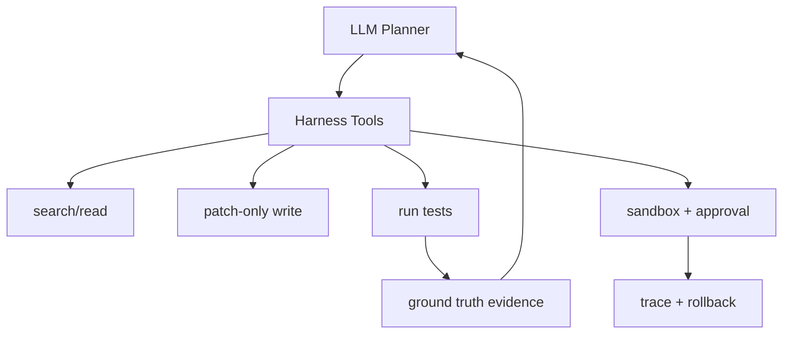

# 为什么说 Agent 能力很大部分来自 harness 而不是模型本身？

## 面试定位

这是 Coding Agent 的深入题。面试官想看你能否把模型能力和工程运行时能力分开。

## 30 秒回答

模型负责推理和生成候选动作，但 harness 决定它能看到什么、能调用什么、如何修改、怎样验证、失败后怎么恢复。没有搜索、Patch Engine、Test Runner、sandbox、approval 和 trace，再强的模型也只能猜。生产级 Coding Agent 的可靠性主要来自受控工具链和验证闭环。

## 标准回答

Coding Agent 不是“模型直接写代码”。真实任务需要定位文件、理解依赖、生成最小 diff、运行测试、处理失败、保留审计和回滚。模型在这些环节里做决策，但执行权在 harness。

核心取舍是模型灵活性和宿主控制权。工具太少会限制模型定位问题，权限太宽会带来误写、泄密和不可回滚风险。生产系统要优先保证可验证和可恢复。

Harness 还能约束风险。比如只允许 patch 工作区文件，不允许读密钥。运行测试时使用 allowlist。高风险命令进入 approval。最终是否完成由 Test Runner 和 Verifier 判断，不由模型文字判断。

## 架构与运行机制

数据流中，模型输出 plan 和 tool_call。Harness 执行搜索、读取、patch、测试和 trace。Verifier 把命令输出转成状态，模型再决定下一步。这个闭环比单次生成代码更重要。

## 可画图

## 系统设计案例

同一个模型在没有 harness 时只能输出补丁文本。在有 harness 时，它可以搜索调用链、读取测试、应用 diff、运行失败测试、根据错误继续修复。最终输出还包含改动范围和验证命令。能力差异来自反馈闭环。

## 真实问题与排障

如果 Agent 看起来“变笨”，不一定是模型退化。先查搜索工具是否漏召回，文件读取是否被截断，测试环境是否坏，patch 是否应用失败，trace 是否缺 observation。指标看 `tool_error_rate`、`search_hit_rate`、`test_command_success_rate` 和 `avg_iterations`。

## 面试官追问

- 模型升级能否替代 harness？不能，执行、权限、验证和回滚仍要宿主管。
- Harness 太强会不会限制模型？会，所以工具要覆盖常见路径，但保留安全边界。
- 如何衡量 harness 贡献？同一模型下做工具消融实验。

## 项目化回答

我会说：我把 Coding Agent 能力拆成模型推理和 harness 执行两层。搜索、patch、测试、权限和 trace 都在 harness 内，模型只在受控工具反馈中迭代。

## 常见错误

- 把所有问题归因于模型。
- 工具返回大段非结构化日志。
- 没有用测试结果驱动下一步。
- 忽略 sandbox 与权限设计。

## 深挖技术细节

Coding Agent harness 的职责是把模型输出变成可控、可验证、可回滚的工程操作。核心模块包括 `RepoScanner`、`SearchTool`、`FileReader`、`PatchEngine`、`CommandRunner`、`TestRunner`、`PolicyGate`、`TraceStore`、`Verifier` 和 `RollbackManager`。模型不能直接写任意文件，而是通过 patch 协议提交 diff；命令执行要经过 allowlist、工作目录限制、超时、输出截断和敏感信息过滤。

PatchEngine 要能保证最小变更和冲突检测。它应记录 changed files、hunk、old hash、新 hash、是否触碰敏感路径、是否修改锁文件。TestRunner 不只是跑命令，还要结构化提取 exit code、失败测试名、错误栈、耗时和 flaky 信号。Verifier 再根据测试结果、lint、类型检查、diff scope 和用户需求判断是否继续，而不是模型说“应该修好了”就结束。

Harness 贡献可以用消融实验衡量：同一模型分别给它 search/read/test/patch/trace 的不同组合，看 `issue_resolution_rate`、`avg_iterations`、`test_pass_rate`、`irrelevant_diff_rate`、`rollback_rate`、`p95_command_latency`。这能证明能力提升来自反馈闭环，而不只是模型参数更大。

## 边界条件与反例

反例一：模型直接输出整文件内容，覆盖用户未提交改动。反例二：工具返回 2 万行日志，模型看不到关键错误。反例三：测试绿了但 patch 改了无关模块，harness 没有 diff analyzer。反例四：允许任意 shell，导致泄密、删文件或网络副作用。

边界在于：Harness 不应该替代工程判断。它能限制权限、跑测试、收集证据，但需求理解、架构取舍和高风险改动仍需要 review。生产级 harness 应默认最小权限，读写范围、网络、环境变量和凭据访问都要可审计。

## 深问准备

- 问：为什么 patch 协议比直接写文件好？答：可审计、可回滚、能检测冲突和最小变更，也保护用户未保存改动。
- 问：工具输出如何设计？答：返回结构化摘要、关键错误、截断原因和原始日志引用，避免上下文污染。
- 问：如何处理测试 flaky？答：重跑有限次数、记录 flaky bucket、不要把不稳定通过当强证据。
- 问：高风险命令怎么办？答：deny、confirm 或 sandbox，并把命令、工作目录、环境和输出写入 trace。

## 来源与延伸阅读

- [SWE-bench](https://www.swebench.com/)
- [OpenAI Agents SDK Tools](https://openai.github.io/openai-agents-python/tools/)
- [OpenTelemetry Traces](https://opentelemetry.io/docs/concepts/signals/traces/)
