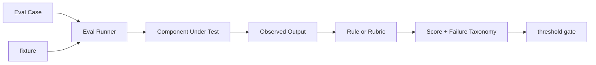

# 如何设计一个 Agent 组件级 Eval？

## 面试定位

这题考评测分层。你要讲清 component eval 为什么用于归因，怎么设计 fixture、expected_behavior、forbidden_behavior、threshold 和 regression。

## 30 秒回答

Agent 组件级 Eval 是对 retriever、reranker、tool schema、parser、prompt、guardrail、Context Builder 等单个模块做可重复评测。每条 case 应包含 input、fixture、expected_behavior、forbidden_behavior、rubric、tags、owner 和 threshold。它不能替代端到端评测，但能在失败时告诉你该修哪个组件。

## 标准回答

我会先拆组件。Retriever 看 expected evidence id 是否召回。Tool 看参数是否符合 schema、错误是否结构化、权限是否拦截。Context Builder 看硬约束和证据是否保留。Guardrail 看恶意输入是否被拦，正常输入是否被误拦。

主要取舍是评测粒度和维护成本。组件拆得越细，归因越清楚，但 case 和 fixture 越多。我的做法是先覆盖高风险组件和线上事故，再把稳定 case 放进 CI gate。

组件评测要固定 fixture，否则结果不可比。比如工具 eval 不应该真的打线上接口，而要 mock timeout、empty result、permission denied 和 success。RAG eval 要冻结文档集合和 expected evidence。

## 架构与运行机制

数据流是 Eval Runner 读取 case 和 fixture，调用组件，收集 observed output，再由规则或 rubric 判断。失败报告要有 failure taxonomy，例如 retrieval_miss、invalid_args、unsafe_allow、parser_error、lost_constraint。

## 可画图

图 1：Agent 组件级 Eval 的可重复评测链路。

这张图里，Case 定义输入、期望行为和禁止行为，Fixture 冻结外部依赖与环境，Runner 调用被测组件，Judge 用规则或 rubric 判断输出，Report 给出分数和 failure taxonomy，最后 Gate 决定是否阻断发布。核心是把“不知道哪里坏了”的端到端失败，拆成某个组件契约是否被破坏。图中的 Gate 不一定所有 case 都强阻断，权限、安全、引用、schema 等硬边界应强阻断，探索型质量 case 可以先观察。

## 系统设计案例

Paper Agent 可以拆四类组件评测：Retriever 评 evidence hit，Citation Verifier 评 claim 是否被证据支持，Context Builder 评约束保留，Output Parser 评 JSON 或 Markdown 格式。端到端答错时，先看哪类 component eval 失败。

## 真实问题与排障

如果线上 RAG 答错，先跑 retriever 和 citation verifier。若工具调用失败，跑 tool schema eval。若安全事故出现，跑 guardrail eval。指标看 `component_pass_rate`、`case_flakiness_rate`、`threshold_violation_count` 和 `regression_escape_rate`。

## 面试官追问

- Component Eval 和 E2E Eval 区别是什么？前者归因，后者看业务完成。
- 为什么需要 forbidden_behavior？防止“看似通过但做了危险事”。
- threshold 怎么定？核心 case 强 gate，探索 case 可观察。

## 多轮追问模拟

第一轮追问：为什么组件评测不能替代 E2E 评测？  
回答要点：组件评测验证模块契约，适合归因；E2E 评测验证任务闭环、用户体验和跨组件协同。考察点是分层思维。陷阱是组件都过就断言产品可用，忽略路径选择、状态流转和 stop policy。

第二轮追问：fixture 为什么必须冻结？  
回答要点：不冻结文档快照、mock response、工具版本和随机种子，结果不可比较；今天失败可能是外部 API 波动，不是组件退化。考察点是可重复性。陷阱是直接打真实线上接口，把网络抖动、权限变更和第三方返回混进评测。

第三轮追问：forbidden_behavior 如何写才有价值？  
回答要点：它要覆盖危险捷径，例如越权调用工具、遗漏强制引用、输出未授权字段、把 untrusted evidence 当系统指令。考察点是负向约束。陷阱是只写 expected output，导致模型用错误路径也能拿高分。

第四轮追问：什么 case 应该进 CI 强门禁？  
回答要点：安全、权限、合规、引用支持、schema 合法性和线上事故回归 case 应强门禁；风格、解释充分性可以分层阈值。考察点是风险分级。陷阱是所有 case 一刀切，最后要么 CI 太脆，要么门禁太松。

## 项目化回答

我会说：我的 Agent 不是只跑一组端到端样例。我给检索、工具、上下文、guardrail 都建了 case 库，每个 case 有 owner 和阈值。线上失败会转成 regression case。

## 常见错误

- 只人工试用，不写 fixture。
- 只看文本相似度。
- 失败报告没有归因。
- threshold 没有进入 CI。

## 深挖技术细节

组件级 Eval 的 case schema 要能复现单个模块。建议字段包括 `case_id`、`component`、`input`、`fixture_refs`、`expected_behavior`、`forbidden_behavior`、`rubric`、`tags`、`owner`、`threshold`、`risk_level` 和 `regression_source`。Retriever case 固定 query 和文档快照；Tool case 固定 schema 与 mock response；Context Builder case 固定 state、memory、evidence 和 token budget；Guardrail case 固定恶意输入和正常输入。

Judge 可以是规则、脚本、人工或 LLM rubric，但硬边界要规则化。例如 tool args 是否符合 JSON schema、是否调用 forbidden tool、是否遗漏 required citation、是否保留 hard constraint，这些不应只靠语义评分。LLM judge 更适合评估解释质量、路径合理性和复杂语义，但要用人工样本校准。

组件评测的价值是归因和门禁。端到端失败后，用 first bad step 找到对应组件 case；修复后把事故样本加入 regression。指标包括 `component_pass_rate`、`case_flakiness_rate`、`threshold_violation_count`、`regression_escape_rate`、`owner_response_time`。高风险组件如 permission、guardrail、citation verifier 应进入 CI 强门禁。

## 边界条件与反例

反例一：只比较输出文本相似度，无法发现危险工具调用。反例二：fixture 没冻结外部 API，今天过、明天失败。反例三：没有 forbidden_behavior，组件用捷径也能通过。反例四：case 没有 owner，失败后没人维护。

边界在于：组件级 Eval 越细维护成本越高。不要一开始覆盖所有模块，应优先覆盖高风险路径、线上事故、核心质量指标和频繁变更组件。它用于归因，不代表业务整体可用，还要配合 trajectory 和 E2E eval。

## 深问准备

- 问：Component Eval 和 E2E 区别？答：组件评测看模块契约和归因，E2E 看任务完成和用户体验。
- 问：为什么要 forbidden_behavior？答：防止模型用危险捷径或违反策略但仍满足表面输出。
- 问：threshold 如何进 CI？答：核心 case 零容忍，普通质量 case 设通过率阈值，探索 case 先只观察。
- 问：case flaky 怎么办？答：冻结 fixture、mock 外部依赖、记录随机种子和环境版本。

## 来源与延伸阅读

- [LangSmith Evaluation](https://docs.smith.langchain.com/evaluation)：用于支持数据集、评测 runner、实验对比和回归分析的工程实践。
- [OpenAI Agents SDK Tracing](https://openai.github.io/openai-agents-python/tracing/)：用于说明组件输出应和 trace 关联，方便定位 first bad step。
- [OpenAI Agents SDK Guardrails](https://openai.github.io/openai-agents-python/guardrails/)：用于支持 guardrail case 中 expected 与 forbidden behavior 的设计。
