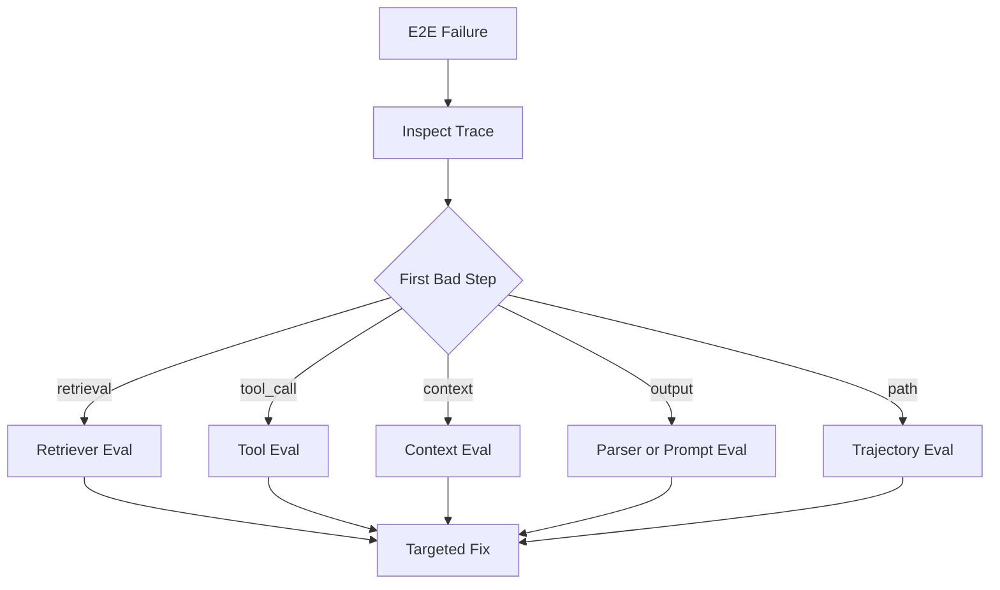

# 如何从 Agent Eval 结果定位到底是检索、工具还是 Prompt 出问题？

## 面试定位

这是组件评测的排障题。面试官想看你是否能从指标和 trace 出发定位问题，而不是一上来调 prompt。

## 30 秒回答

我会先按链路分层：retriever、reranker、Context Builder、tool schema、tool runtime、output parser、guardrail、trajectory。端到端失败后，先看 trace 的第一处偏差，再跑相关 component eval。检索问题看 expected evidence 命中率，工具问题看 valid_call_rate 和 error_code，Prompt 问题看约束保留、输出契约和 unsupported claim。

## 标准回答

定位时不要只看最终答案。RAG 答错先看 evidence 是否召回。召回错是 retriever 或 filter，召回对但没用是 context packing 或 generation。工具失败先看模型参数是否合法。参数错是 schema 或 prompt，工具返回错是 runtime 或外部依赖。

Prompt 问题通常表现为约束遗漏、格式不稳、证据未引用或拒答边界错误。它要用固定 input 和 fixture 复现，而不是凭一次线上输出判断。

## 架构与运行机制

数据流是 End-to-end failure 进入 Failure Triage。Triage 读取 trace，找到 first bad step。然后根据 step 类型触发对应 component eval。若组件都通过，再看 trajectory eval 的路径质量。

## 可画图

## 系统设计案例

用户问论文结论，系统答错。trace 显示 expected evidence 没被召回，先修 chunk、metadata filter 或 query rewrite。如果 evidence 被召回但没进入 prompt manifest，修 Context Builder。如果进入了上下文但答案仍 unsupported，修 generation prompt 或 citation verifier。

## 真实问题与排障

指标要分层看。`retrieval_recall@k` 低，不要调输出 prompt。`invalid_args_rate` 高，先看 tool schema。`parser_error_rate` 高，看 output contract。`unsafe_allow_rate` 高，看 guardrail fixture。这样取舍是前期要建 eval 体系，但后期定位速度快很多。

## 面试官追问

- 如果所有 component eval 都过但任务失败？看 trajectory eval，可能路径选择错。
- 线上失败如何沉淀？生成 candidate case，人工确认后进入 regression。
- LLM judge 可以直接定位吗？只能辅助，关键边界要用规则和 trace。

## 项目化回答

我会说：我们把失败从 trace 中归类，按组件触发对应 eval。每次修复都新增 regression case。这样迭代不是“调一调 prompt”，而是把问题定位到检索、上下文、工具或路径。

## 常见错误

- 端到端失败就改 prompt。
- 没有 first bad step 概念。
- Eval 指标混在一起看。
- 线上事故没有进入 regression。

## 深挖技术细节

定位问题要把 Agent run 拆成 first bad step。Trace 中每个 step 都应有 `span_type`、`input_refs`、`output`、`verdict`、`error_code` 和 `upstream_refs`。如果 expected evidence 没进候选，是 retriever/filter 问题；候选进了但没进 prompt manifest，是 Context Builder 或预算问题；tool_call 参数不合法，是 schema、prompt 或 tool selector 问题；工具返回失败，是 runtime 或外部依赖问题；最终输出格式错，是 parser 或 output contract 问题。

Component eval 的 fixture 要冻结输入和依赖。Retriever eval 固定文档快照、query、metadata filter 和 expected evidence。Tool eval mock success、timeout、permission_denied、empty result 和 malformed output。Context eval 固定 state、memory、evidence 和 tools，断言 hard constraints、source、trustLevel 和 token budget。Guardrail eval 同时包含恶意样本和正常样本，防止只看 block rate。

排障报告最好输出 `failure_bucket`、`first_bad_step`、`component_owner`、`suggested_fix` 和 `regression_case_id`。指标包括 `component_pass_rate`、`retrieval_recall@k`、`invalid_args_rate`、`parser_error_rate`、`unsafe_allow_rate`、`threshold_violation_count`、`regression_escape_rate`。这样改动会落到具体组件，而不是反复调 prompt。

## 边界条件与反例

反例一：RAG 答错后改生成 prompt，但正确证据根本没被召回。反例二：工具返回 500，却归因给模型不会用工具。反例三：所有指标合成一个“准确率”，无法看出是检索、工具还是输出解析坏了。

边界在于：组件评测能提高归因速度，但不能替代端到端体验。组件都过而任务失败时，通常是 trajectory、状态流转、跨组件接口或 stop policy 问题。线上低频事故也要转成 candidate case，人工确认后进入回归。

## 深问准备

- 问：所有 component eval 都过但 E2E 失败怎么办？答：看 trajectory eval、接口契约、状态更新和 stop condition。
- 问：LLM judge 能否直接定位？答：只能辅助，first bad step 和硬边界要靠 trace 与规则。
- 问：threshold 怎么定？答：安全和权限类强 gate，质量类按风险分层，探索样本先观察。
- 问：如何沉淀线上失败？答：从 trace 抽 fixture、人工标注 expected/forbidden behavior，加入 regression。

## 来源与延伸阅读

- [LangSmith Evaluation](https://docs.smith.langchain.com/evaluation)
- [OpenAI Agents SDK Tracing](https://openai.github.io/openai-agents-python/tracing/)
- [OpenTelemetry Traces](https://opentelemetry.io/docs/concepts/signals/traces/)
