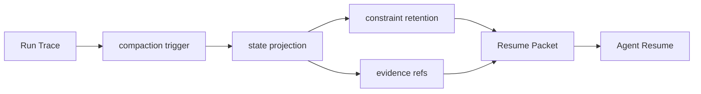

# Coding Agent 如何处理上下文压缩？

## 面试定位

这题考长任务恢复能力。回答要讲 compaction trigger、state projection、constraint retention、evidence refs、resume 和 lost constraint。

## 30 秒回答

我会把上下文压缩设计成结构化 Resume Packet，而不是普通聊天总结。触发 compaction trigger 后，系统从 trace 中抽取 goal、hard_constraints、current_plan、changed_files、test_results、decisions、open_risks、evidence refs 和 next_actions。恢复时先校验 constraint retention，再继续执行。

## 标准回答

Coding Agent 长任务会积累大量日志、diff、测试输出和讨论。直接摘要容易丢约束，例如“不要改公开 API”或“只能改前端”。所以压缩要做 state projection。完整证据放 artifact store，摘要只保存引用、hash 和关键结论。

关键取舍是摘要可读性和恢复可靠性。自由文本摘要易读但不可检查。结构化 state projection 成本更高，但能验证约束、证据和下一步动作。

恢复时不能立刻继续写代码。Agent 应先加载 Resume Packet，确认目标、未完成任务、失败测试和风险。如果 evidence refs 缺失，应补读 artifact，而不是凭记忆猜。

## 架构与运行机制

数据流是 Trace 进入 Compaction Trigger，Projector 生成 state projection，Constraint Checker 检查硬约束，Artifact Linker 写入 evidence refs，Resume Loader 在新上下文中恢复状态。

## 可画图

## 系统设计案例

修复 bug 时，压缩包保存用户目标、禁止改 API、已改文件、失败测试、已排除方案和下一步要读的模块。恢复后，Agent 先读取失败测试 artifact，再继续 patch。若丢了禁止改 API 这个约束，lost constraint eval 应失败。

## 真实问题与排障

恢复后重复旧步骤，检查 completed_steps。恢复后违反约束，检查 constraint retention。无法复现测试失败，检查 evidence refs。摘要越来越长，说明没有把原始日志放到 artifact store。指标看 `resume_success_rate`、`lost_constraint_rate` 和 `artifact_ref_missing_rate`。

## 面试官追问

- 什么时候触发压缩？token 水位、阶段完成、测试结果、用户确认或长任务切换。
- state projection 存什么？目标、约束、计划、文件、测试、风险和证据引用。
- 摘要和 trace 谁可信？trace 与 artifact 是事实源，摘要是可恢复索引。

## 项目化回答

我会说：我的 Coding Agent 压缩结果是 Resume Packet。它包含 state_version、constraint retention、changed_files、test_results 和 evidence refs，恢复后先校验再继续。

## 常见错误

- 把压缩等同于自然语言总结。
- 只保留结论，不保存证据引用。
- 忘记用户硬约束。
- resume 后不校验测试和状态。

## 深挖技术细节

Coding Agent 的 Resume Packet 应该是结构化状态投影。核心字段包括 `state_version`、`goal`、`hard_constraints`、`allowed_paths`、`forbidden_paths`、`current_plan`、`completed_steps`、`changed_files`、`test_results`、`failed_commands`、`decisions`、`open_risks`、`artifact_refs`、`next_actions`。每个 hard constraint 保存 source turn、适用范围和验证规则，例如“不要改 public API”要能被 Patch Gate 检查。

Compaction Trigger 可以由 token 水位、阶段完成、测试失败、用户确认或长时间运行触发。Projector 从 trace 中抽取事实，Artifact Linker 把大日志、diff、截图和测试输出转成引用。恢复时 Resume Loader 先验证文件 hash、测试环境、失败命令和约束完整性，再允许模型继续。若 artifact 缺失或约束冲突，应该补读或暂停。

压缩质量要可测。`constraint_retention_rate` 检查硬约束是否保留，`artifact_ref_missing_rate` 检查证据引用是否可用，`resume_success_rate` 检查恢复后任务是否继续正确，`post_resume_regression_rate` 看恢复后是否重复旧错。自由文本摘要可以保留，但只能作为可读说明，不是事实源。

## 边界条件与反例

反例一：摘要写“修复登录问题”，丢掉“只能改前端”和“不要动 schema”，恢复后越界修改。反例二：只保存“测试失败了”，不保存命令、错误和日志引用，恢复后无法继续。反例三：压缩包没有 changed_files 和 file hash，用户中途改文件后 Agent 仍按旧状态执行。

边界在于：短任务不需要复杂 compaction；长任务、多人协作、代码修改、外部副作用和高风险约束需要结构化恢复。压缩率和安全性要取舍，硬约束和证据引用优先于省 token。

## 深问准备

- 问：什么时候触发压缩？答：token 水位、阶段完成、关键测试结果、用户确认、上下文切换或长任务保存点。
- 问：Resume Packet 和摘要区别？答：Resume Packet 是结构化可验证状态，摘要只是给模型读的解释。
- 问：恢复后第一步？答：校验 hard constraints、artifact refs、changed files、测试状态和外部事实。
- 问：如何避免重复旧步骤？答：保存 completed_steps、failed_attempts、decision log 和 next_action candidates。

## 来源与延伸阅读

- [LangGraph Persistence](https://docs.langchain.com/oss/python/langgraph/persistence)
- [LangChain Short-term memory](https://docs.langchain.com/oss/python/langchain/short-term-memory)
- [OpenAI Agents SDK Tracing](https://openai.github.io/openai-agents-python/tracing/)
