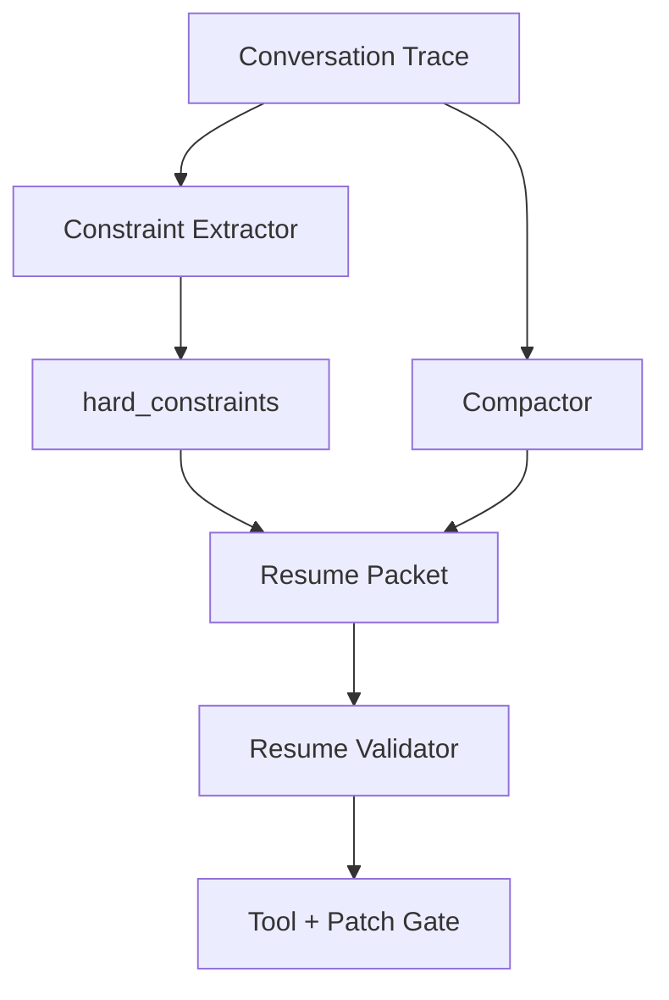

# 如果压缩后恢复任务，如何确认没有丢失用户约束？

## 面试定位

这是上下文压缩的深入题。面试官想看你如何验证恢复状态，而不是只相信摘要。

## 30 秒回答

我会把用户约束结构化成 hard_constraints，并在压缩前后做 constraint retention check。Resume Packet 要包含约束原文、来源、state_version、适用范围和 evidence refs。恢复后先运行 lost constraint eval：检查新计划、工具调用和 patch 是否仍满足这些约束，再允许继续执行。

## 标准回答

约束丢失通常发生在自由文本摘要里。比如用户说“不要改数据库 schema”，摘要可能只写“修复登录 bug”。恢复后 Agent 就可能改迁移文件。解决方法是把约束从对话中抽成结构化字段，并把它们放在恢复流程的第一优先级。

这里的取舍是压缩率和安全性。压得越狠，越容易丢掉低频但关键的约束。高风险任务宁可保留更多 hard_constraints 和 evidence refs。

验证不能只靠模型自查。可以用规则检查路径、文件范围、工具权限和测试计划。复杂语义约束再用 reviewer rubric。任何高风险约束缺失都应该暂停并追问用户。

## 架构与运行机制

数据流是 Conversation Trace 进入 Constraint Extractor，生成 hard_constraints。Compactor 产出 Resume Packet。Resume Validator 比较原始约束和恢复状态。Tool Gate 在后续执行时继续检查约束。

## 可画图

## 系统设计案例

用户要求“只改移动端样式，不动业务逻辑”。压缩包必须保存这个约束。恢复后 Patch Gate 检查 changed_files 是否只在 CSS 或组件样式范围内。若 Agent 准备改数据请求逻辑，Gate 应阻断并要求重新确认。

## 真实问题与排障

如果恢复后出现越界改动，先看 hard_constraints 是否缺失。若约束存在但没生效，查 Tool Gate 和 Patch Gate。若约束语义模糊，要看是否应该在压缩前追问。指标包括 `constraint_retention_rate`、`lost_constraint_rate`、`policy_gate_block_count` 和 `post_resume_regression_rate`。

## 面试官追问

- 什么是 hard constraint？用户明确禁止或必须遵守的边界。
- 模型自查够吗？不够，高风险要规则和 gate。
- 约束冲突怎么办？暂停，列出冲突并请用户裁决。

## 项目化回答

我会说：我会把用户约束抽成 hard_constraints，随 Resume Packet 一起保存。恢复后先跑 lost constraint eval，再让 Patch Engine 或 Tool Gate 执行动作。

## 常见错误

- 摘要里只写任务目标，丢掉限制条件。
- 恢复后直接继续 patch。
- 约束没有 source 和适用范围。
- 只靠模型说“我记得”。

## 深挖技术细节

恢复任务时，Resume Packet 应该是结构化 artifact，而不是一段自然语言摘要。它至少包含 `task_goal`、`hard_constraints`、`soft_preferences`、`open_questions`、`state_version`、`artifact_refs`、`tool_policy_version`、`last_successful_step`、`known_failures` 和 `next_action_candidates`。其中 hard constraint 要保存 `constraint_id`、原文、来源 turn、scope、risk_level 和验证规则。

压缩前后要做 retention check。Compactor 负责从 trace 中抽取用户明确禁止、必须遵守、路径限制、文件范围、预算、时间、权限和输出格式。Resume Validator 则比较原 trace 与 resume packet：每条 hard constraint 是否仍存在，是否有 source，是否被降级成软偏好，是否与新的计划冲突。高风险缺失直接暂停，而不是让模型继续执行。

后续执行也要把约束接到工具层。Patch Gate 检查文件范围、命令范围和 diff scope；Tool Gate 检查外部副作用和权限；Verifier 检查输出是否满足格式和验收条件。指标包括 `constraint_retention_rate`、`lost_constraint_rate`、`post_resume_policy_block_rate`、`resume_success_rate`、`p95_resume_validation_latency`。

## 边界条件与反例

反例一：用户说“不要改数据库 schema”，摘要只保留“修登录 bug”，恢复后 Agent 改了迁移文件。反例二：约束保留在摘要里，但 Patch Gate 不读取，所以仍然会越界。反例三：为了追求高压缩率，把 source 和 artifact ref 删除，恢复后无法复核。

边界在于：低风险长对话可以用轻量摘要，高风险代码修改、权限操作、外部发送和付费动作必须保留结构化约束。压缩不是越短越好，而是关键状态可恢复、可验证、可审计。约束冲突时应该追问用户，而不是自行合并。

## 深问准备

- 问：hard constraint 怎么识别？答：包含禁止、必须、范围、权限、不可逆动作、验收标准和用户显式偏好的句子。
- 问：恢复后第一步做什么？答：运行 resume validation 和 lost constraint eval，再允许工具或 patch 执行。
- 问：如何处理语义约束？答：规则能覆盖路径和文件范围，复杂语义用 reviewer rubric 或 LLM judge，但高风险要人工确认。
- 问：如何存储大 artifact？答：保存引用、hash、版本和必要摘要，不把大文件原文都塞进上下文。

## 来源与延伸阅读

- [LangGraph Persistence](https://docs.langchain.com/oss/python/langgraph/persistence)
- [LangChain Context engineering](https://docs.langchain.com/oss/python/langchain/context-engineering)
- [OpenAI Agents SDK Tracing](https://openai.github.io/openai-agents-python/tracing/)
