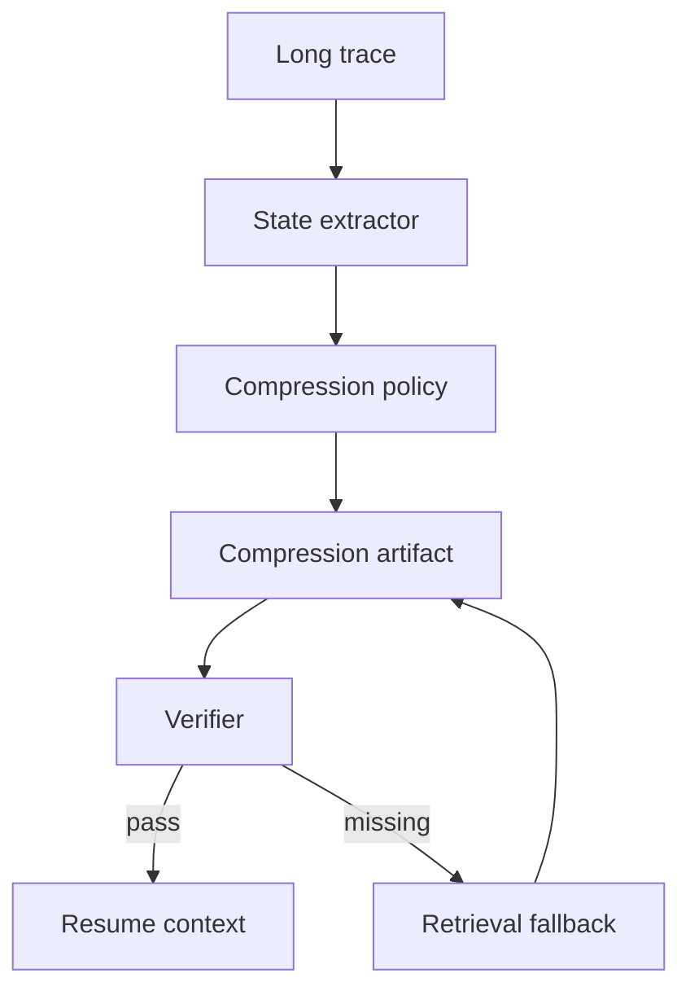

# 长任务上下文过长时如何压缩？

## 30 秒回答

我不会简单把历史聊天摘要一下，而是生成结构化 compression artifact。它保留目标、约束、当前状态、关键证据、artifact refs、风险和 next actions。长文本可以有损，用户约束、工具结果和证据引用要尽量无损。压缩后还要用 verifier 检查保真度，并保留 retrieval fallback。

## 面试定位

这题考的是长任务 Agent 的状态管理。面试官想听到你能区分 context window、短期状态、长期记忆和 trace，而不是只说“让模型总结”。

回答要自然讲到架构、数据流、指标、取舍和追问。关键点是：压缩不是为了变短，而是为了可恢复执行。

## 标准回答

我会先定义哪些信息必须保留。用户目标、禁止事项、安全策略、已确认事实、当前任务状态和外部证据引用属于高保真信息。模型推理草稿、重复对话和已经被证据替代的中间文本可以压缩或丢弃。

压缩产物最好是结构化 schema。字段包括 goal、constraints、state_projection、completed_steps、open_questions、evidence_refs、artifact_refs、risk_notes 和 next_actions。这样后续 Agent 可以稳定恢复，而不是靠自然语言摘要猜测。

压缩后需要验证。Verifier 检查目标是否保留、约束是否完整、证据是否能回溯、下一步是否明确。缺失内容通过 retrieval fallback 从原始 trace 或 artifact store 取回。

## 架构与运行机制

图 1：长任务上下文压缩的恢复链路。图中 `Long trace` 是原始对话、工具调用和产物记录；`State extractor` 只抽取可恢复执行需要的状态；`Compression policy` 决定哪些字段无损保留、哪些字段可摘要；`Verifier` 检查目标、约束、证据和下一步是否仍可恢复；`Retrieval fallback` 负责在缺字段时回到原 trace 或 artifact store 补读。

这张图说明压缩不是单向“越短越好”。真正的边界在 `Compression artifact`：它必须是一个可验证、可追溯、带版本的状态投影，而不是一段漂亮摘要。只要 verifier 发现硬约束、证据引用或待办动作缺失，就应该回退补读，而不是让后续 Agent 猜。

数据流是先从 trace 和工具结果抽状态，再按 loss budget 生成压缩产物。Context Builder 只注入压缩结果和必要引用，模型需要细节时再取 artifact。

## 可画图

可以画“长 trace -> state projection -> verifier -> resume”的流程图。图上标出哪些内容无损保存，哪些内容允许摘要，哪些内容通过 artifact refs 延迟读取。

## 系统设计案例

Coding Agent 连续修改多个文件时，压缩产物要记录用户目标、已改文件、当前 diff、测试命令、失败日志、未解决错误和禁止改动范围。测试日志不必全文进入上下文，但要保留 artifact ref。

恢复时，Agent 读取 state_projection，知道下一步该修哪个失败测试。若要查看完整日志，再通过 retrieval fallback 读取 artifact。

## 真实问题与排障

如果恢复后 Agent 忘记用户限制，先检查 compression artifact 是否保留该约束。若保留了但模型没遵守，要看 Context Builder 是否把它放在低优先级位置。

指标包括 compression_ratio、constraint_retention_rate、resume_success_rate、lost_state_rate 和 retrieval_fallback_rate。只看 token 节省没有意义，因为压缩丢状态会让任务失败。

线上排障建议按 incident playbook 做：影响面先确认是单个 run 恢复失败，还是某个压缩版本普遍丢字段；止血可以暂停自动 resume，改为注入原始 trace 摘要和关键 artifact refs；根因重点查 source_trace_range、retained_fields、dropped_fields、hard_constraints 和 verifier_verdict；回归要构造带禁止事项、失败日志、未提交 diff、外部证据和 next action 的样本集，验证压缩后仍能接着执行。

## 面试官追问

- 什么内容可以有损压缩？
- 压缩产物和长期记忆有什么区别？
- 如何证明压缩后没有丢关键状态？
- 如果 verifier 发现缺失怎么办？
- context window 很大时还需要压缩吗？

## 多轮追问模拟

**追问 1：为什么大上下文窗口下仍然需要压缩？**  
答题要点：大窗口缓解 token 上限，但不能解决噪声、旧假设、优先级混乱和恢复不可追溯的问题；压缩的目标是形成可验证 state projection。考察点是把容量问题和状态管理问题分开。陷阱是回答“窗口够大就不用压缩”。

**追问 2：压缩 artifact 中哪些字段必须无损？**  
答题要点：用户目标、硬约束、安全策略、当前状态、已完成步骤、待办动作、工具结果、证据引用、产物引用和禁止路径必须高保真保留。考察点是风险分级。陷阱是把测试日志和硬约束都当成普通摘要。

**追问 3：如何验证压缩没有丢关键状态？**  
答题要点：用 schema 校验字段完整性，用 verifier 对比原 trace 的目标和约束，用恢复任务评估 resume_success_rate、lost_state_rate 和 post_resume_regression_rate。考察点是验证闭环。陷阱是只看 compression_ratio。

## 项目化回答

我会说项目里把压缩做成 state projection。每次压缩都有 version、source trace range、evidence refs 和 verifier verdict。恢复时只加载必要状态，细节通过 artifact refs 延迟读取。

## 常见错误

- 把上下文压缩当成普通摘要。
- 丢掉证据引用和工具结果。
- 没有 verifier，压缩后直接继续执行。
- 不记录 trace range，无法排查丢失位置。
- 只追求更短，不看恢复成功率。

## 深挖技术细节

上下文压缩要先把信息分成三类：必须无损保存、可以有损摘要、可以丢弃。无损字段包括 `goal`、`hard_constraints`、`policy_version`、`state_version`、`completed_steps`、`pending_actions`、`evidence_refs`、`artifact_refs`、`tool_results` 和 `risk_notes`。有损字段包括推理草稿、重复解释和长日志摘要。可丢弃的是寒暄、已被工具结果替代的假设和重复 observation。

Compression Artifact 应该带 `artifact_id`、`source_trace_range`、`schema_version`、`loss_budget`、`retained_fields`、`dropped_fields`、`verifier_verdict`。Coding Agent 场景还应保留 `changed_files`、`diff_refs`、`test_commands`、`failed_tests` 和 `forbidden_paths`；RAG 场景保留 `query_history`、`evidence_ids`、`unsupported_claims`；Web Agent 场景保留 `current_url`、`screenshot_ref`、`expected_state` 和 `forbidden_actions`。

恢复时不应直接把压缩文本塞给模型继续执行。Resume Loader 先读取 artifact，State Verifier 检查字段保真，Context Builder 再按优先级生成模型输入。指标包括 `compression_ratio`、`constraint_retention_rate`、`artifact_ref_missing_rate`、`resume_success_rate`、`lost_state_rate`、`retrieval_fallback_rate` 和 `post_resume_regression_rate`。如果 verifier 判定 unsafe_to_resume，应补读原 trace 或重新压缩。

## 边界条件与反例

反例一：摘要写“继续修测试”，但丢掉“不要改 public API”，恢复后就可能越界。反例二：只保存“测试失败”，不保存命令、exit code、日志引用和失败测试名，后续无法接着排障。反例三：压缩产物没有 source trace range，出了问题无法定位是哪一段被丢弃。

边界在于：压缩不是越短越好。短任务或低风险问答可以用轻量摘要；长任务、代码修改、权限操作、对外发送和多轮 RAG 必须结构化压缩。大 context window 也仍然需要压缩，因为问题不是只缺 token，还包括噪声、旧假设和不可恢复状态。

## 深问准备

- 问：什么内容可以有损压缩？答：重复对话、推理草稿、长日志正文、已经被工具结果确认或否定的中间假设。
- 问：长期记忆和压缩产物区别？答：长期记忆跨任务复用，压缩产物绑定当前 run 和 trace range。
- 问：verifier 发现缺失怎么办？答：从原 trace 或 artifact store 补齐，重新生成 artifact，必要时暂停并追问用户。
- 问：如何证明压缩有效？答：看恢复成功率、约束保留率、丢状态率，而不是只看 token 节省。

## 来源与延伸阅读

- [LangGraph Persistence](https://docs.langchain.com/oss/python/langgraph/persistence)：官方文档用于说明 thread state、checkpoint 和恢复执行如何把长期任务状态落到可追溯存储。
- [LangChain Short-term memory](https://docs.langchain.com/oss/python/langchain/short-term-memory)：官方文档用于支持“短期状态需要被结构化管理，而不是只依赖聊天历史”的判断。
- [OpenAI Agents SDK Tracing](https://openai.github.io/openai-agents-python/tracing/)：官方文档用于说明 trace/span 能支撑 source_trace_range、工具结果引用和恢复排障。
