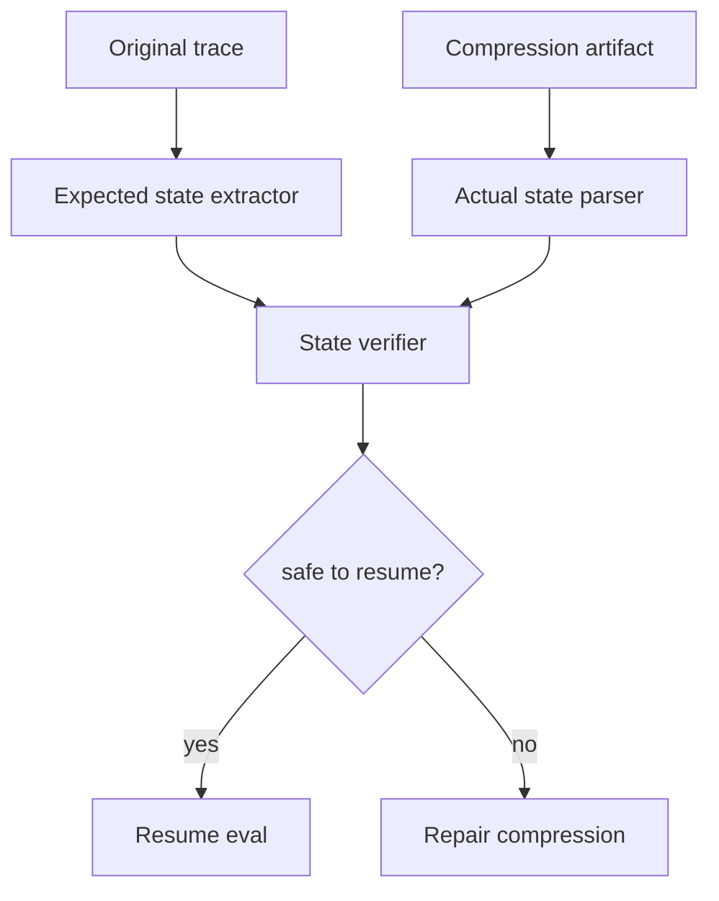

# 如何证明压缩后 Agent 没有丢失关键状态？

## 30 秒回答

要用压缩前后的状态对账证明，而不是相信摘要质量。做法是定义关键字段清单，压缩后由 verifier 检查 goal、constraints、open tasks、evidence refs、artifact refs、risk notes 和 next actions 是否完整。再用 resume eval 验证 Agent 能否从压缩产物继续完成任务。

## 面试定位

这是上下文压缩的深入追问。面试官想看你是否有可验证机制，而不是只让模型自评“摘要完整”。

回答要覆盖架构、数据流、指标、取舍和追问。核心是把保真度变成可检查对象。

## 标准回答

第一步是定义 critical state schema。不同任务的关键字段不同，coding agent 要保留 diff、测试状态和用户限制，RAG agent 要保留证据引用和未支持 claim，web agent 要保留页面状态和下一步动作。

第二步是压缩前后对账。系统从原始 trace 抽取 expected_state，再从 compression artifact 抽取 actual_state。Verifier 比较二者，输出 missing、changed、ambiguous 和 safe_to_resume。

第三步是运行恢复评测。给模型只提供压缩产物，看它能否继续执行，是否违反约束，是否需要频繁 fallback。真实证明来自 resume_success_rate 和 lost_state_rate。

## 架构与运行机制

数据流里要把 expected_state 和 actual_state 分开。这样 verifier 才能判断丢失，而不是对同一份摘要做自我解释。

## 可画图

可以画“双输入对账图”：左边原始 trace 抽 expected state，右边压缩产物抽 actual state，中间 verifier 输出缺失列表和恢复结论。

## 系统设计案例

长时间修 bug 时，压缩前 trace 中有一个用户限制：“不要改数据库 schema”。如果 compression artifact 缺少该限制，verifier 应判定 unsafe_to_resume。系统需要重新生成压缩结果，或者把缺失约束从 trace 中补回。

对恢复评测，可以准备历史长任务样本。只给压缩产物，让 Agent 继续完成后续步骤，统计是否保持约束、是否找到正确文件、是否重复做已完成工作。

## 真实问题与排障

如果 resume eval 失败，先看失败类型。违反约束多半是 constraints 缺失或优先级太低。重复执行通常是 completed_steps 不完整。找不到证据常常是 evidence_refs 丢失。

指标包括 field_retention_rate、constraint_violation_after_resume、duplicate_work_rate、fallback_frequency 和 resume_success_rate。

## 面试官追问

- verifier 应该是规则还是模型？
- 哪些状态必须进入 schema？
- 压缩损失无法避免时怎么提示用户？
- fallback 太频繁说明什么？
- 如何把失败样本沉淀成回归集？

## 项目化回答

我会把压缩质量做成可评测 contract。每个任务类型都有 critical state schema，压缩后跑 state verifier 和 resume eval。只要丢了关键约束或证据引用，就不允许继续执行。

## 常见错误

- 让同一个模型压缩后再自评。
- 没有按任务类型定义关键字段。
- 只检查摘要长度，不检查信息保真。
- 不做恢复评测。
- verifier 发现缺失后仍然继续执行。

## 深挖技术细节

压缩保真要先定义 critical state schema。Coding 任务看 `goal`、`hard_constraints`、`changed_files`、`test_results`、`failed_attempts`、`artifact_refs`；RAG 任务看 `evidence_ids`、`unsupported_claims`、`query_history`、`citation_policy`；Web 任务看 `current_url`、`page_state`、`pending_action`、`forbidden_actions`、`screenshot_ref`。没有 schema，就无法证明关键状态没丢。

State Verifier 应该有两个独立输入：从原始 trace 抽出的 expected_state，以及从 compression artifact 解析出的 actual_state。比较结果包括 `missing_fields`、`changed_fields`、`ambiguous_fields`、`unsafe_to_resume_reason` 和 `repair_suggestions`。规则适合检查硬字段和路径，模型 judge 可以辅助判断语义约束，但高风险缺失必须规则拦截。

Resume Eval 是更强证据。拿历史长任务，把模型上下文替换成压缩产物，观察是否能继续完成、是否违反约束、是否重复旧步骤、是否需要频繁 fallback。指标包括 `field_retention_rate`、`constraint_violation_after_resume`、`duplicate_work_rate`、`artifact_ref_missing_rate`、`fallback_frequency`、`resume_success_rate`。

## 边界条件与反例

反例一：摘要很流畅，但漏掉“不要改数据库 schema”，恢复后直接越界修改。反例二：压缩产物保留结论却丢掉 evidence refs，后续 verifier 无法复查。反例三：同一个模型先压缩再自评，容易确认自己的遗漏。

边界在于：压缩无法零损保留所有信息，所以要区分 critical、useful 和 discardable。硬约束、证据引用、外部副作用状态和下一步动作属于 critical；聊天寒暄和重复日志可丢弃。Verifier 判定 unsafe_to_resume 时，系统应重新压缩、补读 artifact 或追问用户。

## 深问准备

- 问：verifier 是规则还是模型？答：硬字段用规则，语义约束可用模型辅助，但高风险结论必须可解释。
- 问：哪些状态必须进 schema？答：目标、硬约束、证据引用、未完成动作、风险、版本和外部副作用状态。
- 问：压缩损失不可避免怎么办？答：把缺失显式暴露，降级为追问、补读 artifact 或不允许恢复。
- 问：失败样本如何回归？答：保存原 trace、压缩产物、缺失字段和恢复结果，加入 resume eval set。

## 来源与延伸阅读

- [LangGraph Persistence](https://docs.langchain.com/oss/python/langgraph/persistence)
- [LangChain Short-term memory](https://docs.langchain.com/oss/python/langchain/short-term-memory)
- [LangSmith Evaluation](https://docs.smith.langchain.com/evaluation)
