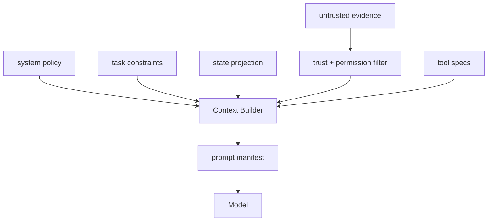

# Context Engineering 和 Prompt Engineering 的区别是什么？

## 面试定位

这题考你是否理解“上下文构建”是工程系统，不是写几句提示词。回答要覆盖架构、数据流、指标、取舍和追问。

## 30 秒回答

Prompt Engineering 更关注单段提示词怎么写，Context Engineering 关注哪些信息以什么结构、顺序、trustLevel、权限和预算进入模型。它包括 system、task、state、memory、evidence、tool specs、recent trace 和 output contract 的组合。核心模块是 Context Builder，它要能过滤权限、隔离 prompt injection、裁剪 token，并生成可回放的 prompt manifest。

## 标准回答

我会先划边界。Prompt 是模型输入的一部分，Context 是完整输入系统。生产 Agent 不能把上下文当字符串拼接，而要把每个 block 标注 type、source、trustLevel、permissionScope、expiresAt 和 tokenEstimate。

区别还体现在测试方式。Prompt Engineering 常靠人工试用，Context Engineering 可以写 component eval。比如断言用户硬约束必须保留，RAG evidence 必须带 source，外部网页不能覆盖 system 层，危险工具不能被错误暴露。

## 架构与运行机制

数据流是请求进入后读取用户、任务、权限和 State。Retriever 返回 evidence，Tool Selector 返回可见工具，Budget Allocator 按层裁剪，最后输出 prompt manifest。模型看到的是分层结构，不是无来源长文本。

## 可画图

图 1：Context Builder 将不同来源的输入编排成可回放 prompt manifest。

这张图把 Prompt Engineering 和 Context Engineering 的差异画出来：Prompt 只是最终输入的一部分，Context Builder 才是决定哪些 block 进入模型的工程系统。System policy、task constraints、state projection、evidence、tools 进入 Builder 前要带来源、权限和 trustLevel；外部证据先经过 trust + permission filter，不能越层变成指令。Manifest 是排障关键，因为它记录模型到底看到了什么、哪些内容被裁剪、哪些工具被暴露。

## 系统设计案例

Paper Agent 中，论文 chunk 是 evidence，不是指令。即使论文正文写“忽略引用规则”，Context Builder 也必须把它放在 untrusted evidence 层。系统层仍要求事实必须带 citation。这样可以防 prompt injection，也方便追踪答案依据。

## 真实问题与排障

如果模型丢了用户约束，检查 prompt manifest 中 task 层是否被裁掉。如果模型泄露越权内容，检查 evidence 权限过滤。如果模型调用危险工具，检查 tool specs 是否错误暴露。指标看 `constraint_retention_rate`、`evidence_precision`、`tool_visibility_error_rate`、`prompt_injection_block_rate`。

## 面试官追问

- Context Builder 怎么测试？用 fixture 固定 State、evidence、tools，断言 manifest。
- 更多上下文是否更好？不是，噪声会降低引用和工具选择质量。
- prompt injection 怎么防？外部内容标记为 untrusted evidence，不能改变 system 和权限。

## 多轮追问模拟

第一轮追问：Prompt Engineering 和 Context Engineering 最大区别是什么？  
回答要点：Prompt Engineering 关注文本表达，Context Engineering 关注输入生成系统，包括来源、权限、trustLevel、状态、工具和预算。考察点是系统边界。陷阱是把上下文工程说成“写更长、更详细的 prompt”。

第二轮追问：prompt manifest 应该记录哪些字段？  
回答要点：至少记录 block_id、type、priority、source、trust_level、permission_scope、token_estimate、hash、redaction_status 和 cut_reason。考察点是可回放与审计。陷阱是只保存最终字符串，事故后不知道模型看到的内容来自哪里。

第三轮追问：外部网页里写“忽略系统规则”怎么办？  
回答要点：外部网页只能作为 untrusted evidence，经过 trust label、引用标识和权限过滤；它可以支持事实 claim，不能覆盖 system、developer、task constraints 或 tool permission。考察点是 prompt injection 防护。陷阱是把检索内容拼到高优先级指令区。

第四轮追问：上下文不够放时怎么裁剪？  
回答要点：先保留 system、安全策略、用户硬约束、当前目标、输出契约和高置信 evidence；裁剪低优先级历史、重复证据和过期 memory，并记录 cut_reason。考察点是预算策略。陷阱是为了塞更多证据裁掉用户约束或工具边界。

## 项目化回答

我会说：我设计的 Agent 每轮都会生成 prompt manifest，记录 system、task、state、evidence、tools 和 output contract。线上问题可以按 manifest 回放，而不是猜模型看到了什么。

## 常见错误

- 把 Context Engineering 当成写长 prompt。
- 不区分指令和证据。
- 检索内容没有来源和权限。
- 没有 token 预算和裁剪原因。

## 深挖技术细节

Context Engineering 的产物应是 prompt manifest。Manifest 中每个 block 都有 `block_id`、`type`、`priority`、`source`、`trust_level`、`permission_scope`、`expires_at`、`token_estimate`、`hash` 和 `redaction_status`。常见 block 包括 system policy、developer instruction、user task、state projection、memory projection、evidence、tool specs、recent trace 和 output contract。模型最终看到的是这些 block 的序列化结果。

Context Builder 的关键模块包括 Permission Filter、Trust Labeler、Budget Allocator、Tool Selector、Evidence Packer 和 Manifest Logger。Permission Filter 防止越权证据进入上下文；Trust Labeler 把外部网页、RAG chunk、邮件标为 untrusted evidence；Budget Allocator 给硬约束和当前目标固定预算；Tool Selector 只暴露当前 actor 可用工具；Manifest Logger 记录裁剪原因，支持 replay。

测试也要工程化。Context eval 固定 state、memory、evidence 和工具，断言 hard constraints 不丢、untrusted evidence 不进 system 层、越权文档被过滤、危险工具不暴露、输出 contract 保留。指标包括 `constraint_retention_rate`、`evidence_precision`、`tool_visibility_error_rate`、`prompt_injection_block_rate`、`context_build_latency_p95` 和 `token_budget_overflow_count`。

## 边界条件与反例

反例一：把所有 RAG 文本拼进“背景知识”，恶意指令和事实混在一起。反例二：为了塞更多文档裁掉用户硬约束，导致任务越界。反例三：tool specs 全量暴露，模型能调用当前用户无权使用的工具。

边界在于：更多上下文不一定更好。噪声会降低引用质量、工具选择和约束遵守。高风险任务应牺牲覆盖率，优先保留约束、权限、安全策略和可验证 evidence；低风险探索可以放宽预算但仍要保留来源。

## 深问准备

- 问：Prompt 和 Context 的区别？答：Prompt 是输入文本片段，Context 是生成这份输入的工程系统和数据流。
- 问：Context Builder 怎么测试？答：用 fixture 固定输入，断言 manifest 的层级、权限、来源、预算和工具可见性。
- 问：外部证据如何进入？答：带 source、trust_level、permission_scope 和 citation_id，只进入 evidence 层。
- 问：线上答错怎么排查？答：先看 prompt manifest，确认模型看到哪些 state、evidence、tools 和裁剪原因。

## 来源与延伸阅读

- [LangChain Context engineering](https://docs.langchain.com/oss/python/langchain/context-engineering)：用于支持上下文工程作为输入系统而不只是提示词写法的边界。
- [OpenAI Agents SDK Guardrails](https://openai.github.io/openai-agents-python/guardrails/)：用于支持外部证据、工具输入和输出约束的防护设计。
- [OpenAI Agents SDK Tracing](https://openai.github.io/openai-agents-python/tracing/)：用于说明 prompt manifest、工具调用和生成结果需要可回放、可关联。
