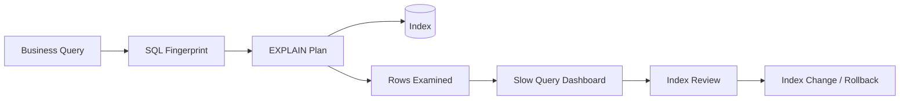

# 如何设计数据库索引并通过执行计划定位慢查询？

## 面试定位

这道题考的是数据库查询治理能力，不是单纯背最左前缀。回答要覆盖架构、数据流、指标、取舍和追问：业务查询如何映射到索引，执行计划如何验证，慢查询如何止血，索引上线如何回滚。

## 30 秒回答

我会先从业务查询模式开始：where 条件、排序、分页、返回列、QPS、数据量和选择性决定索引。B+ 树索引适合等值、范围和排序，联合索引要结合等值字段、范围字段、排序字段和覆盖索引，而不是看到字段就建索引。

执行计划要看 `type`、`key`、`rows`、`filtered`、`Extra`，尤其是是否回表、filesort、temporary、扫描行数是否可控。慢查询排障要同时看 SQL、索引、数据倾斜、锁等待、连接池、深分页和业务参数。

上线后用 `query_latency_p95`、`rows_examined`、`slow_query_count`、`index_hit_rate` 和 DB CPU 证明优化有效。如果只是临时止血，可以限制时间范围、降级排序、切只读副本或加缓存，但最终要回到执行计划证据。

## 架构与运行机制

图 1 的回答主线是：业务查询进入 SQL 指纹和执行计划，执行成本进入慢查询看板，索引变更通过评审和发布管线管理。图中 Release 表示索引也要灰度、观察和回滚，不是本地改完就结束。

这张图用于说明 MySQL 官方索引文档提供结构语义，工程答案还要补充执行计划、数据流、指标和发布治理。

## 深挖技术细节

联合索引字段顺序要结合查询模式。等值条件通常放前面，范围条件和排序字段要谨慎处理；如果范围条件放在中间，后续字段未必还能用于有序扫描。覆盖索引能减少回表，但会增加索引宽度和写入成本。低选择性字段并非完全没用，但要和组合条件、数据分布一起判断。

执行计划不是截图，而是证据。`rows` 是估算，要结合真实参数、统计信息和慢查询日志判断。测试库数据少时，优化器可能选出和生产完全不同的 plan。生产上要记录 SQL fingerprint、sample params、plan hash、rows examined、index name 和 release id，便于回归。

慢查询止血和根因要分开。止血可以关导出、限制时间范围、降级排序、临时缓存或切只读副本；根因要查是否缺索引、索引字段顺序不对、隐式转换、函数包列、深分页、锁等待或数据倾斜。

还要区分“读慢”和“系统慢”。如果慢查询同时伴随连接池耗尽、锁等待、复制延迟或 buffer pool miss，上线新索引未必是第一动作。更稳妥的做法是先把 SQL fingerprint 和实例指标对齐：同一类 SQL 的 p95 是否上升，`rows_examined` 是否扩大，锁等待是否集中在某张表，写入峰值是否刚好叠加索引维护成本。这样回答会比“建一个联合索引”更接近真实排障。

## 关键数据结构与协议

| 字段 | 用途 | 追问点 |
| --- | --- | --- |
| `sql_fingerprint` | 聚合同类 SQL | 如何避免参数噪声 |
| `sample_params` | 复现执行计划 | 参数是否典型 |
| `plan_hash` | 识别计划变化 | plan regression |
| `rows_examined` | 实际扫描行数 | 慢查询证据 |
| `index_name` | 命中索引 | 是否符合预期 |
| `extra_flags` | filesort/temporary | 额外成本来源 |
| `lock_wait_ms` | 锁等待 | 区分锁慢和 SQL 慢 |

## 系统设计案例

订单后台按商家、状态、时间分页查询。架构上，API 生成 SQL fingerprint，数据库执行查询，Slow Query Collector 聚合指标，Index Review 评估联合索引，Index Change Pipeline 灰度上线。数据流是 request -> SQL -> explain -> index scan -> result -> metrics -> review。

取舍是：联合索引能降低扫描，但增加写入维护；覆盖索引减少回表，但索引变宽；keyset pagination 降低深分页成本，但前端要支持游标。面试追问如果问“为什么不用 Redis”，要回答缓存可止血，但事实源查询和后台导出仍要治理 SQL 根因。

## 真实问题与排障

线上慢查询先看影响面：哪些接口、SQL fingerprint、租户、参数、数据量、是否刚发布、DB CPU、锁等待和连接池。止血可以限制导出、缩短时间范围、关闭新筛选项、切只读副本或临时缓存。根因定位按执行计划走：索引是否命中、rows 是否异常、是否 filesort、是否回表、是否深分页、是否隐式转换。

回滚策略包括回滚 SQL、删除或禁用新索引、恢复旧查询条件、关闭新功能入口。回归要保存事故 SQL、参数、执行计划和压测脚本。

## 边界条件与反例

反例一：所有字段都建索引。写入成本、存储和 buffer pool 压力会增加。

反例二：只看最左前缀，不看数据分布和排序。

反例三：用小数据 explain 当生产证据。

反例四：用缓存掩盖必须治理的后台慢查询。

## 多轮追问模拟

**追问 1：联合索引字段顺序到底怎么定？**
回答要点：先把查询按等值过滤、范围过滤、排序、返回列和选择性拆开。常见做法是把高频等值条件放前面，再考虑范围字段和排序字段是否能复用同一棵 B+ 树的有序性；如果范围字段放在中间，后续字段对排序和过滤的帮助可能下降。考察点是候选人是否理解索引不是字段集合，而是有序结构。陷阱是机械背“选择性最高一定放最前”，忽略查询频率、排序和覆盖索引。

**追问 2：EXPLAIN 里 `rows` 很小就代表优化成功吗？**
回答要点：`rows` 是优化器估算值，要结合真实参数、统计信息、慢查询日志和 `rows_examined` 判断。测试库、抽样统计过旧、租户数据倾斜都可能让执行计划失真。考察点是能否把 explain 当成证据链的一环，而不是唯一裁判。陷阱是只看 `key` 命中，却不看 `Extra` 里的 filesort、temporary 和回表成本。

**追问 3：慢查询事故里你先做索引还是先止血？**
回答要点：先确认影响面和风险，再止血；例如限制导出范围、关闭新筛选项、切只读副本、临时缓存或降级排序。随后用 SQL fingerprint、样本参数、执行计划和慢日志定位根因。考察点是生产处理顺序。陷阱是直接在线上建大索引，导致复制延迟、锁等待或写入抖动扩大事故。

**追问 4：索引上线怎么证明没有副作用？**
回答要点：除了读查询 p95、rows examined、slow query count，还要观察写入 p95、buffer pool 命中、复制延迟、索引空间和 plan_hash。考察点是读写取舍。陷阱是只证明单条 SQL 变快，却没有验证写路径和其他查询是否退化。

## 项目表达

项目里可以说：我为订单查询建立 SQL Review，核心 SQL 上线前必须有 explain、样本参数和索引命中证据。一次慢查询事故中，新增筛选导致 rows examined 爆炸，我们先限制导出止血，再调整联合索引和分页方式，最后用 `query_latency_p95`、`rows_examined` 和 `slow_query_count` 证明改进。

如果要更像真实项目，可以补一句：索引上线后我同时观察写入 p95、复制延迟和 plan_hash，确认读性能提升没有换来写入退化。这个细节能接住“索引是不是越多越好”的追问。

## 深问准备

1. 联合索引字段顺序怎么排？
2. EXPLAIN rows 为什么不一定准？
3. 覆盖索引有什么代价？
4. 深分页怎么优化？
5. 索引上线如何观察和回滚？

补一句面试收束：索引优化最终要用指标闭环，不是 explain 看起来更漂亮就结束。要能说清上线前后的 p95、rows examined、写入延迟和回滚预案。

如果面试官继续压项目细节，可以主动补充灰度方案：先在预发用生产抽样参数回放，再在低峰期上线索引，观察慢查询、写入延迟和复制延迟，最后才扩大使用新查询形态。这个表达能把“会写 SQL”升级成“会治理数据库变更”。

## 来源与延伸阅读

- [MySQL InnoDB indexes 官方文档](https://docs.oracle.com/cd/E17952_01/mysql-8.4-en/innodb-index-types.html)：用于确认 B+ 树索引、聚簇索引和二级索引的结构语义，支撑“索引会影响读写成本”的结论。
- [MySQL EXPLAIN output 官方文档](https://docs.oracle.com/cd/E17952_01/mysql-8.4-en/explain-output.html)：用于说明 `type`、`key`、`rows`、`filtered` 和 `Extra` 等字段如何构成执行计划证据。
- [PostgreSQL EXPLAIN 官方文档](https://www.postgresql.org/docs/current/using-explain.html)：用于对照理解执行计划估算、扫描方式和真实执行成本，不把单一数据库的字段名误当成通用答案。
