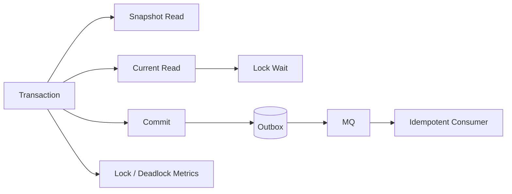

# MVCC 和事务隔离级别如何影响并发一致性？

## 面试定位

这道题考的是本地事务边界和并发控制能力。回答要覆盖 MVCC 机制、隔离级别取舍、当前读和锁、死锁排障、Outbox 最终一致性，以及项目里如何用指标证明事务链路可靠。

## 30 秒回答

MVCC 通过多版本和快照读减少读写阻塞，但它不等于没有锁。普通快照读可以读取某个一致视图，`select for update`、`update`、`delete`、唯一约束和范围更新仍然会产生锁等待。

隔离级别定义并发事务能看到哪些变化，选择时要在正确性、吞吐、锁等待和死锁风险之间取舍。展示查询、库存扣减、余额更新和权限变更的要求不同，不能所有场景都上最高隔离。

工程上事务要短，不要在事务里发 MQ 或调用远程服务。跨系统一致性用 Outbox、事务消息、补偿和幂等消费者。指标看 `transaction_duration_p95`、`lock_wait_time`、`deadlock_count`、`retry_success_rate` 和 `outbox_pending_count`。

## 架构与运行机制

图 1 的主线是：数据库事务内部用 MVCC 和锁保护本地状态，提交后通过 Outbox 把事件发布出去。图中 Metrics 用于发现事务时长、锁等待和死锁，Outbox 用于解决数据库事务和远程消息之间不能原子化的问题。

这张图用于说明 PostgreSQL MVCC 官方文档定义的是本地多版本语义，工程系统还要把 MQ、幂等和补偿接上。

## 深挖技术细节

MVCC 的关键是可见性。一个事务读取时，不一定读取最新物理行，而是读取对自己可见的版本。这样普通读不会轻易阻塞写。但当前读要读最新可修改版本，必须参与锁竞争。缺索引时，当前读可能扫描更多范围，锁冲突也会扩大。

隔离级别不是越高越好。更高隔离能减少并发异常，但会增加锁等待、死锁和吞吐损失。真实项目要按业务风险选择：商品展示可以接受短暂不一致，库存扣减必须防超卖，支付状态要有幂等和状态机保护。

事务边界不能跨远程系统。事务里发 MQ 或调用 HTTP，会拉长锁持有时间，还会出现消息发出但事务回滚、事务成功但消息失败的交叉状态。Outbox 把业务表和事件表放在同一个本地事务里，Relay 后续发布消息，消费者按 `event_id` 幂等处理。

## 关键数据结构与协议

| 字段 | 用途 | 追问点 |
| --- | --- | --- |
| `transaction_id` | 串联事务日志 | 哪个事务持锁 |
| `isolation_level` | 说明可见性 | 为什么选这个级别 |
| `lock_object` | 锁住的表/行/范围 | 死锁根因 |
| `lock_wait_ms` | 锁等待时间 | 是否影响 SLA |
| `deadlock_count` | 死锁次数 | 是否需要重试和修 SQL |
| `retry_count` | 事务重试次数 | 防止重试风暴 |
| `event_id` | Outbox 幂等键 | 消费者去重 |
| `outbox_status` | pending/sent/failed | 补偿和告警 |

## 系统设计案例

订单创建需要扣库存、创建订单、发布发券和 ES 同步事件。架构上，Order Service 在事务内扣库存、写订单、写 outbox，提交后 Relay 发布 MQ，消费者幂等处理后置流程。数据流是 idempotency check -> inventory update -> order insert -> outbox insert -> commit -> MQ -> consumers。

取舍是：悲观锁正确性强但吞吐低，乐观锁吞吐好但冲突高时重试多；Outbox 缩短主事务，但引入异步延迟和补偿治理。面试追问如果问“为什么不直接在事务里发 MQ”，要强调本地事务和远程消息不是一个原子资源。

## 真实问题与排障

库存接口 p95 飙升时，先看影响面：是否热点 SKU、是否锁等待、是否死锁、事务时长是否增长、SQL 是否缺索引、是否事务内调用远程服务。止血可以限流热点商品、启用排队、降级后置流程、暂停批量任务或回滚新库存策略。

根因定位看死锁日志、锁对象、访问顺序、执行计划、事务时长和重试结果。回滚可能是恢复旧索引、关闭新消费者、缩短事务范围或回滚访问顺序。回归要模拟并发扣减、死锁重试、MQ 发布失败和重复消费。

## 边界条件与反例

反例一：MVCC 等于没有锁。当前读和写仍然需要锁。

反例二：事务里调用远程服务。远程超时会拉长锁持有时间。

反例三：死锁只无限重试。重试要有限、退避、幂等，还要修访问顺序和索引。

反例四：Outbox 不需要消费者幂等。Relay 发布成功但标记失败会重复发布。

## 项目表达

项目里可以说：我把订单链路拆成本地事务和异步事件。本地事务只扣库存、写订单、写 outbox，后置发券、通知、ES 同步通过 MQ 处理。线上监控事务时长、锁等待、死锁、outbox pending 和补偿成功率。一次死锁事故中，我们根据死锁日志发现访问顺序不一致，统一排序后死锁清零。

再补一个生产细节会更稳：死锁重试必须带幂等键和最大次数，失败后要给用户明确状态，而不是在服务端无限重试。这样能把 MVCC、锁冲突、用户体验和最终一致性连起来。

## 深问准备

1. MVCC 快照读和当前读区别是什么？
2. 隔离级别如何选择？
3. 死锁怎么定位和修复？
4. 为什么事务里不应该发 MQ？
5. Outbox 重复发布怎么办？

收束时可以强调：事务题不是追求一个“最强隔离级别”，而是把本地正确性、跨系统最终一致性、用户可见状态和补偿指标一起设计出来。

## 来源与延伸阅读

- PostgreSQL MVCC 官方文档：用于确认多版本并发控制语义。
- MySQL InnoDB Index Types 官方文档：用于说明索引和锁范围关系。
- RocketMQ Transaction Message 官方文档：用于对比事务消息和 Outbox。
