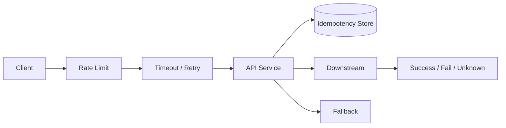

# 分布式系统里幂等、重试和超时怎么设计？

## 面试定位

这道题考失败模型。回答要说明超时不等于失败、重试会放大故障、写操作必须幂等、限流降级保护核心链路。它连接 API、MQ、Redis、线程池和 Agent 工具调用。

## 30 秒回答

我会先定义失败模型：网络超时、重复请求、部分成功、下游过载和结果未知。写操作必须有幂等键，幂等记录保存 `processing/succeeded/failed`、`request_hash` 和结果摘要。

重试只针对可恢复错误，必须有指数退避、jitter、最大次数和错误分类。超时要按端到端 SLA 分解，不能层层相加。限流、熔断和降级用于保护下游和核心链路。指标看 `retry_rate`、`timeout_rate`、`idempotency_conflict_count`、`rate_limited_count` 和 `degrade_count`。

## 架构与运行机制

图 1 的核心是 Idempotency Store 和 Unknown 状态。超时后不能直接认为失败，可能下游已经成功但响应丢失。

## 深挖技术细节

幂等键要对应一次业务意图。支付创建可以用订单号和操作类型，Agent 工具执行可以用 run_id + tool_call_id。服务端要校验 request_hash，避免同一 key 被不同请求体复用。

重试要按错误码分类。timeout、rate_limited、temporary_5xx 可重试；validation_error、permission_denied、insufficient_balance 不应重试。退避要加 jitter，避免所有客户端同步重试。

超时预算要从用户 SLA 倒推。用户接口 2 秒，内部多个依赖不能各自 2 秒。超时后要提供查询、幂等重试或补偿。

## 关键数据结构与协议

| 字段 | 作用 | 追问 |
| --- | --- | --- |
| `idempotency_key` | 防重复副作用 | 粒度 |
| `request_hash` | 防 key 误用 | 冲突处理 |
| `status` | 处理状态 | unknown |
| `retry_count` | 重试次数 | 风暴 |
| `timeout_ms` | 超时预算 | SLA |
| `error_code` | 错误分类 | retryable |

## 系统设计案例

支付创建 API：Gateway 限流，服务端检查 Idempotency-Key，写幂等记录，调用支付渠道设置超时和重试，结果写状态机。数据流是 request -> idempotency -> business tx -> downstream -> result/query/fallback。

取舍是：幂等存储增加成本但保护资金；短超时保护体验但增加 unknown；重试提升成功率但可能放大下游故障。

## 真实问题与排障

支付渠道超时升高时，先看影响面、timeout_rate、retry_rate、渠道 p95、幂等冲突和线程池队列。止血可以降低重试、熔断渠道、切备用渠道、返回处理中。

根因定位看错误码、网络、下游状态和客户端重试策略。回归要模拟超时、重复请求、同 key 不同参数和 rate limit。

## 边界条件与反例

反例：没有幂等就重试写操作；所有错误都重试；超时时间层层相加；降级没有用户状态。

## 项目表达

项目里可以说：我在支付创建和 Agent 工具执行中都使用业务幂等键，记录 request_hash、status 和 result_hash。一次渠道超时事故中，我们用处理中状态止血，查询渠道结果后补偿，并把 retry_rate 和 idempotency_conflict_count 加入告警。

如果追问为什么不能简单重试，可以补充：写操作的副作用通常发生在远端，调用方超时只代表没拿到响应，不代表远端没有执行。没有查询和幂等，重试就是用另一次副作用赌结果。

再补一个项目证据：幂等表里保存 status 和 result_hash 后，客户端超时重试可以直接拿到上一次结果；如果仍在 processing，就返回处理中并让前端轮询。这样用户体验、服务端状态和下游副作用是一致的，不会因为网络抖动产生重复业务。

如果面试官追问限流和降级，可以说限流是在入口控制请求量，熔断是在依赖异常时快速失败，降级是在功能层返回低成本结果。三者目标都是保护核心链路，但触发条件和用户体验不同。

最后可以用一句话总结：分布式可靠性不是让每次调用都成功，而是在失败不可避免时，让副作用不重复、状态可查询、压力不扩散、用户能理解。

这句话能很好地收束幂等、重试、超时和降级四个关键词。

## 多轮追问模拟

1. 追问：幂等键应该由客户端生成还是服务端生成？
   - 回答要点：要看业务入口。客户端重试同一次业务意图时，客户端或上游应携带稳定 key，例如订单号 + 操作类型，服务端负责校验 `request_hash`、状态机和过期策略；如果服务端生成但客户端超时前拿不到 key，后续重试就无法和原请求关联。服务端仍要把 key 绑定业务实体，不能只信任随机字符串。
   - 考察点：是否理解幂等键是业务意图标识，不是普通 request_id。
   - 常见坑：每次重试都生成新 key，导致幂等完全失效。

2. 追问：调用超时后，结果未知时怎么处理？
   - 回答要点：超时只表示调用方没拿到响应，不代表下游没执行。处理方式包括查询下游状态、幂等重试返回同一结果、把本地状态标记为 processing、后台补偿确认、用户侧展示处理中。对资金、权益、工具执行这类副作用，不能直接当失败再发一次无幂等写操作。
   - 考察点：是否理解 unknown 状态是分布式系统的常态。
   - 常见坑：超时就本地回滚，同时下游已经成功，造成双边状态不一致。

3. 追问：如何避免重试风暴？
   - 回答要点：重试要有错误分类、指数退避、jitter、最大次数、总超时预算和 retry budget；限流、熔断和降级要能在下游慢时快速减少压力。还要避免网关、客户端、服务端、MQ 消费者多层同时重试，生产里应记录 `retry_source` 和 `retry_count`，统一策略。
   - 考察点：能否把“重试提升成功率”和“重试放大故障”同时讲清楚。
   - 常见坑：对所有 4xx/5xx、权限错误和参数错误都重试。

4. 追问：MQ 消费为什么也要做幂等？
   - 回答要点：消息系统通常会出现重复投递、消费者失败重启、确认丢失或再均衡后重复处理。消费者应基于业务 key 或 message id 做去重，副作用写入要有唯一约束、状态机版本或幂等记录。确认消息前后都要考虑失败窗口：先 ack 再写可能丢消息，先写再 ack 可能重复处理。
   - 考察点：是否能把 API 幂等扩展到异步链路。
   - 常见坑：认为 MQ 保证“只消费一次”，所以业务层不做去重。

## 深问准备

1. 幂等键怎么设计？
2. 超时后结果未知怎么办？
3. 如何避免重试风暴？
4. 限流、熔断、降级怎么配合？
5. Agent 工具如何保证幂等？

## 来源与延伸阅读

- [IETF Idempotency-Key Draft](https://datatracker.ietf.org/doc/draft-ietf-httpapi-idempotency-key-header/)：用于支撑非幂等 HTTP 写请求通过 key 识别重试意图、服务端管理 key 生命周期和请求 fingerprint 的设计。
- [RabbitMQ Confirms and Acknowledgements](https://www.rabbitmq.com/docs/confirms)：用于说明确认、失败窗口和重复处理边界，支撑“消费者仍需业务幂等”的结论。
- [Apache Kafka Delivery Semantics](https://kafka.apache.org/documentation/#semantics)：用于理解 at-least-once、重复处理和端到端语义不能只靠消息系统解决。
- [Apache Kafka Producer Configs: `enable.idempotence`](https://kafka.apache.org/documentation/#producerconfigs_enable.idempotence)：用于区分生产者幂等和业务幂等，避免把底层去重误认为业务副作用安全。
- [Prometheus Alerting Rules](https://prometheus.io/docs/prometheus/latest/configuration/alerting_rules/)：用于支持 `retry_rate`、`timeout_rate`、`idempotency_conflict_count`、`degrade_count` 的告警和回归验证。
