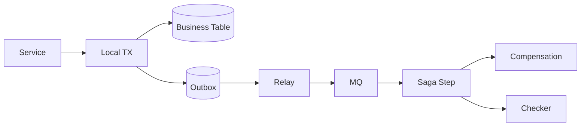

# 分布式事务里 Saga、Outbox 和事务消息怎么选？

## 面试定位

这道题考跨系统一致性边界。回答要区分数据库本地事务、远程消息、Saga 补偿、事务消息和用户可见状态。不能把 MQ 当成事务，也不能只说失败后补偿。

## 30 秒回答

我会先划边界：本地事务只能保护本地数据库，跨服务一致性通常用最终一致性。Outbox 把业务表和事件表放在同一个本地事务里，再由 Relay/CDC 发布，通用且生产常用。

事务消息依赖 MQ 的半消息和事务回查；Saga 把长事务拆成多个本地事务和补偿动作；TCC 需要业务实现 try/confirm/cancel，语义强但侵入高。选择要看一致性要求、补偿是否可逆、用户状态、幂等和观测能力。

## 架构与运行机制

图 1 展示 Outbox + Saga 数据流：本地事务写业务和事件，Relay 发布，Saga 推进步骤，失败进入补偿和对账。图中 Checker 用于发现悬挂状态。

## 深挖技术细节

Outbox 的关键是把“状态变化”和“待发布事件”放进同一个本地事务。Relay 发布成功但标记 sent 失败会重复发布，所以消费者必须幂等。

Saga 每一步都要有状态、重试、补偿和审计。补偿不是万能，外部扣款、短信、不可逆权益要谨慎处理。不可逆步骤尽量靠后，或使用人工确认。

事务消息适合 MQ 支持半消息和回查的场景，回查接口必须根据本地事务最终状态返回，而不能依赖内存。

## 关键数据结构与协议

| 字段 | 作用 | 追问 |
| --- | --- | --- |
| `event_id` | 事件幂等 | 重复发布 |
| `outbox_status` | pending/sent/failed | 发布延迟 |
| `saga_id` | 跨服务事务 | 步骤串联 |
| `step_status` | 步骤状态 | 悬挂定位 |
| `compensation_id` | 补偿幂等 | 重复补偿 |
| `last_error` | 错误上下文 | 人工处理 |

## 系统设计案例

支付成功发券：支付服务本地事务更新订单并写 outbox，Relay 发布事件，Saga 推进发券、通知、ES 同步。数据流是 payment tx -> outbox -> MQ -> saga step -> idempotent consumer -> checker。

取舍是：Outbox 通用但多组件；事务消息省表但绑定 MQ；Saga 灵活但补偿复杂；TCC 强一致但侵入高。

## 真实问题与排障

用户支付成功但权益未到账，先看 outbox pending、MQ lag、Saga step、消费者错误和补偿队列。止血可以手动补发、暂停异常消费者、限速 replay、给用户显示处理中。

根因定位看本地事务、Relay、MQ、消费者幂等和补偿任务。回归要模拟重复事件、发布失败、补偿失败和消费者超时。

## 边界条件与反例

反例：MQ 发送成功等于事务成功；补偿不可逆仍使用 Saga；没有对账；用户没有处理中状态。

## 项目表达

项目里可以说：我用 Outbox 保证订单状态和事件发布最终一致，用 Saga 状态机推进发券、通知和 ES 同步。指标看 outbox_pending_count、event_publish_lag、saga_pending_count、compensation_success_rate 和 inconsistent_count。

如果面试官追问“补偿是不是万能”，要明确不是。补偿要看业务是否可逆，发券可以撤销，短信不可撤回，外部支付要走退款或冲正。不可逆步骤要尽量靠后，或者使用人工确认和对账任务兜底。这样回答能体现你不是把 Saga 当魔法回滚。

还可以补充用户状态：最终一致性系统必须让用户知道核心动作是否成功、后置任务是否处理中、超过 SLA 后如何补救。后台则用 checker 扫描 pending、failed、sent-but-not-consumed 等状态，避免不一致长期沉默。

如果追问如何对账，可以回答：按业务事实源、outbox 状态、MQ 消费结果和下游业务表做差异扫描，例如 paid 订单必须有 PaymentSucceeded 事件，sent 事件必须有消费者处理结果。对账任务要限速、幂等、可审计。

再补一句选型收束：如果只是单服务写库，用本地事务；如果要可靠发事件，用 Outbox；如果 MQ 原生能力成熟，可考虑事务消息；如果跨多个业务步骤且可补偿，用 Saga；如果需要强预留确认且能改造业务，用 TCC。

最后强调所有方案都必须有幂等、补偿、对账和用户可见状态。

否则所谓最终一致性只是“出了问题以后人工查库”的另一种说法。

这也是面试里最需要避免的空话。

## 深问准备

1. Outbox 为什么需要消费者幂等？
2. Saga 补偿失败怎么办？
3. 事务消息和 Outbox 怎么选？
4. TCC 适合什么场景？
5. 如何做一致性对账？

## 来源与延伸阅读

- RocketMQ Transaction Message 官方文档：用于说明事务消息。
- Kafka 官方文档：用于说明事件发布边界。
- PostgreSQL MVCC 官方文档：用于区分本地事务。
