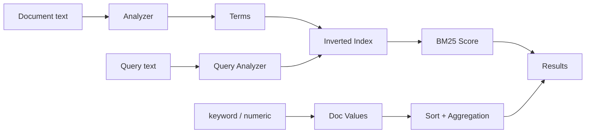

# ES 为什么适合全文检索？倒排索引和 B+ 树索引有什么区别？

## 面试定位

这道题考搜索底层。不要只说“ES 用倒排索引所以快”，要讲 analyzer、term、postings list、BM25、mapping、keyword/text、doc values 和设计取舍。

## 30 秒回答

ES 适合全文检索，是因为它把文本经过 analyzer 切成 term，再建立从 term 到 document 的倒排索引。查询时可以快速找到包含关键词的文档，并用 BM25 做相关性排序。

B+ 树是从 key 到 row 或范围的有序索引，适合主键、范围和排序。倒排索引是从词到文档集合，更适合“包含哪些词”和“相关性如何”。

## 标准回答

写入时，text 字段会经过 analyzer，生成 token，写入倒排索引。keyword 字段不分词，适合精确过滤、聚合和排序。doc values 是列式结构，支撑排序和聚合。

查询时，match query 会对查询文本做分析，再查 term 对应的 postings list。多个 term 的候选文档合并后计算相关性。filter context 不参与评分，更适合精确过滤和缓存。

Mapping 决定字段如何索引。mapping 错了，召回和性能都会出问题。

## 架构与运行机制

数据流是 document 进入 mapping，text 字段经过 analyzer 变成 terms，terms 写入倒排索引；查询也经过 analyzer，查 postings list，计算 score，再结合 doc values 做排序和聚合。

## 可画图

图 1：Elasticsearch 从文本分析到相关性排序、过滤聚合的索引链路。Document 的 text 字段先经过 Analyzer 变成 terms 并写入倒排索引，Query 也经过查询分析后访问 postings list；keyword、numeric 等结构化字段通过 doc values 支撑排序和聚合，最终和 BM25 score 一起影响结果。

这张图的边界是：倒排索引解决“词到文档集合”和相关性排序，不负责数据库事务；doc values 解决“文档到字段值”的列式访问，不替代倒排索引；B+ 树适合有序 key 的点查和范围查，与 ES 的全文相关性模型是互补关系。

## 系统设计案例

商品搜索中，`title` 做 text 支持分词检索，`brand` 和 `category_id` 做 keyword 支持过滤聚合，`price` 做 numeric 支持范围和排序。`title.keyword` 可以作为 multi-field 支持精确匹配。

## 真实问题与排障

搜索结果不准先看 `_analyze`，确认索引和查询分词是否一致。精确查询不命中时看字段是不是 text/keyword 用错。聚合慢时看高基数字段、doc values、fielddata、分片和查询范围。

指标包括 `query_latency_p95`、`segment_count`、`heap_usage`、`fielddata_evictions`、`refresh_time` 和 `merge_time`。

事故复盘可以按影响面、止血、根因和回归四步展开。影响面先看是某个字段、某类 query、某个索引模板，还是全部搜索质量下降；止血可以回滚 alias、临时降级 boost、关闭错误字段聚合或恢复旧 mapping；根因常见于 analyzer 改动、dynamic mapping 误判、text/keyword 用错、同义词版本不一致或 fielddata 被误开；回归要固定 `_analyze` 样本、profile 样本、慢查询样本和 relevance query set。

## 面试官追问

下面把倒排索引、mapping 和查询语义按多轮追问模拟展开。

## 多轮追问模拟

追问 1：term query 查 text 字段为什么可能不符合预期？
答：term query 不分析输入，而 text 字段索引时已经经过 analyzer 分词和归一化。查询输入如果没有变成相同 term，就匹配不到。排查要用 `_analyze` 比较索引侧和查询侧 token。考察点是 analyzer 边界；陷阱是把 term query 当成“精确查原文”。

追问 2：text 和 keyword 怎么选？
答：需要全文检索、相关性排序、分词匹配时用 text；需要精确过滤、聚合、排序、去重时用 keyword。商品 title 常用 multi-field：`title` 做 text，`title.keyword` 做精确匹配或聚合。考察点是 mapping 设计；陷阱是所有字符串都 dynamic 成一种类型。

追问 3：doc values 和倒排索引有什么不同？
答：倒排索引是从 term 到 doc，服务全文召回和相关性；doc values 是从 doc 到字段值的列式结构，服务排序、聚合和脚本访问。两者解决的问题不同。考察点是底层数据结构；陷阱是把 ES 的所有查询能力都归因于倒排索引。

## 项目化回答

在 RAG hybrid search 中，BM25 可以处理错误码、函数名、专有名词和精确词，补足向量检索的不足。项目里可以讲 mapping 模板、alias、profile 和慢查询治理。

## 常见错误

- 把 ES 当事务数据库。
- 不区分 text 和 keyword。
- 所有字符串都 dynamic mapping。
- 在 text 字段上随意做聚合。

## 深挖技术细节

倒排索引的核心数据结构是 term dictionary 和 postings list。文档写入时，`text` 字段经过 character filter、tokenizer、token filter 变成 term；每个 term 指向包含它的 doc_id 列表，并可保存 term frequency、position、offset 等信息。查询 `match` 时，查询文本也走 analyzer，得到 term 后查 postings，再根据 BM25 的 term frequency、inverse document frequency 和 field length norm 算 score。

B+ 树索引适合从有序 key 到 row 的点查、范围查和排序，例如 `id between 10 and 20`。倒排索引适合从 term 到文档集合，例如“哪些商品 title 包含 java 并且相关性高”。ES 还用 doc values 支持排序、聚合和脚本访问；`keyword`、numeric、date 字段适合 filter 和 aggregation，`text` 字段适合全文检索。mapping 错误会直接影响召回、评分、heap 和 latency。

排障要看 analyzer 和 mapping。`term query` 查 text 字段不命中，通常是因为 term query 不分析输入；聚合慢可能是高基数字段、doc values、分片过多或查询范围大；结果不准可能是 analyzer 不一致、同义词、boost 或 BM25 参数问题。指标包括 `query_latency_p95`、`segment_count`、`refresh_time`、`merge_time`、`heap_usage`、`fielddata_evictions`、`slow_query_count`。

## 边界条件与反例

反例一：把订单写入 ES 后立即要求强一致读，并用它代替数据库事务。ES 默认更适合搜索和分析，强一致交易状态仍应由数据库负责。反例二：把所有字符串都设成 text，结果品牌过滤、聚合和排序都很痛苦。反例三：把长文本字段打开 fielddata 做聚合，造成 heap 压力。

边界在于：ES 适合全文检索、过滤聚合、日志分析和 RAG hybrid search 的 lexical 通道；不适合做强事务主库、复杂 join 和高频小事务更新。面试时要主动说出这个边界，避免“ES 什么都能做”的误区。

## 深问准备

- 问：term query 和 match query 区别？答：term 不分析输入，match 会分析查询文本，适合 text 字段。
- 问：text 和 keyword 怎么组合？答：用 multi-field，例如 `title` 做 text，`title.keyword` 做精确匹配或聚合。
- 问：doc values 和倒排索引区别？答：倒排从 term 到 doc，doc values 是列式从 doc 到字段值，服务排序聚合。
- 问：ES 和 B+ 树数据库如何互补？答：数据库做事务和强一致，ES 做搜索、排序、聚合和相关性。

## 来源与延伸阅读

- [Elastic Elasticsearch Guide](https://www.elastic.co/guide/en/elasticsearch/reference/index.html)：用于支持 ES 的索引、mapping、查询和聚合能力要按官方数据模型理解，不能只用“倒排索引快”概括。
- [Elastic Search API](https://www.elastic.co/guide/en/elasticsearch/reference/current/search-search.html)：用于支持 match、filter、sort、aggregation 等查询语义需要区分 query context 和 filter context。
