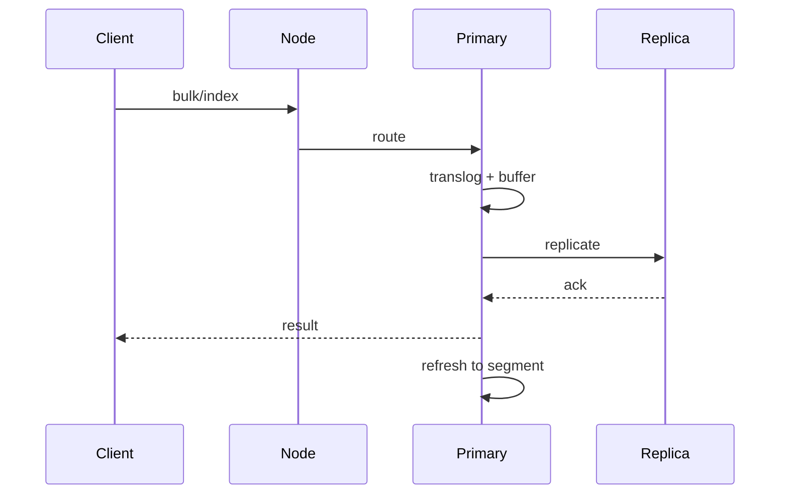

# ES 一次写入从 primary 到可搜索大概经历哪些步骤？

## 30 秒回答

写请求先按 routing 找到 primary shard，primary 校验 mapping，写入 buffer 和 translog，再复制到 replica。达到要求的 in-sync copies 后返回写入结果。文档要等 refresh 生成可搜索 segment 后，才会被 search 请求看到。

## 面试定位

这题考 ES 写入链路。面试官想确认你知道写入成功和可搜索之间有 refresh 边界。

## 标准回答

Client 发 index 或 bulk 请求到 coordinating node。节点根据 _id 或 routing 定位 primary shard。primary 执行写入、写 translog，并把操作复制给 replica。副本 ack 后，客户端拿到 item result。

新文档不是立刻可搜。refresh 会打开新的 segment，使文档进入 searcher 视图。flush 则和 translog 持久化检查点相关，不等同于 refresh。

## 架构与运行机制

图 1 里要把 primary write、replica ack、translog 和 refresh 分开。数据流要强调 item 级结果：bulk 请求 HTTP 成功，不代表每条文档都成功；写入被接受，也不代表 searcher 已经能看到新 segment。

## 可画图

画 primary、replica、translog、refresh、segment 的时序图。面试时最好把“可搜索”单独标出来。

## 系统设计案例

商品同步到 ES 时，数据库变更通过 MQ 触发索引更新。写入成功后，前台搜索可能要等 refresh。对强实时要求高的后台查询，可以明确等待 refresh，但会牺牲吞吐。

## 真实问题与排障

查不到新数据时，先看 bulk item result，再看 refresh、alias、routing 和查询时间范围。写入慢时检查 refresh_interval、merge、磁盘 IO、线程池 rejected 和 mapping。

指标要同时看写入和可搜索两侧，包括 bulk_item_failure_rate、indexing_latency_p95、refresh_time、segment_count、merge_time、translog_size、replica_ack_latency 和 search_visibility_lag。核心取舍是实时可见性和写入吞吐：refresh 越频繁，新数据越快可搜，但 segment 和 merge 压力越大；批量写入越大吞吐越好，但单批失败重试和内存占用也更难控制。

一个真实排障回答可以这样讲：如果运营反馈新商品搜不到，先定影响面，确认是单个索引、单个 routing 还是某个时间段。止血上可以让后台详情读主库或重放失败 item。根因排查先看 bulk item error，再看写入 alias、refresh、routing、旧事件 version 和 mapping conflict。修复后把“HTTP 200 但 item 失败”“旧 MQ 事件覆盖新文档”“alias 指错”放进回归用例。

## 面试官追问

- refresh 和 flush 区别是什么？
- translog 的作用是什么？
- replica 写失败怎么办？
- bulk 部分失败如何处理？
- 为什么 refresh 太频繁会影响写入？

## 项目化回答

我会说 ES 写入是近实时搜索视图同步。primary 处理写入，replica 复制，translog 用于恢复，refresh 决定何时可搜索。线上排障按 bulk、routing、refresh、merge 分段看。

## 常见错误

- 写入成功就认为立刻可搜索。
- bulk 不看 item failure。
- refresh_interval 配得过短。
- 不处理重试幂等。
- 忽略 alias 指向错误。

## 深挖技术细节

写入链路可以按状态拆：coordinating node 接收请求，按 routing 定位 primary shard，primary 做 mapping 解析和版本冲突检查，写入内存 buffer 和 translog，再把操作复制给 in-sync replica。成功返回后，新文档仍可能只在写入视图里，不在 searcher 视图里。refresh 打开新的 segment 后，search 才能看到它。

`seq_no` 和 `primary_term` 用来处理并发和主分片切换后的版本语义。bulk 请求要看每个 item 的 status、error type、reason，不能只看 HTTP 200。写入链路真正的难点通常是“成功但不可搜”“部分失败未重试”“旧事件覆盖新文档”“refresh 太频繁拖慢写入”。

关键状态字段包括 `_index`、`_id`、`routing`、`op_type`、`if_seq_no`、`if_primary_term`、bulk item status、translog generation、global checkpoint 和 refresh policy。业务同步事件还应带 `entity_id`、`entity_version`、`source_updated_at` 和 `idempotency_key`，否则无法防止旧事件覆盖新状态。

## 边界条件与反例

如果业务要求写后立刻强一致查询，优先读主库或明确等待 refresh，而不是默认 ES 实时可见。若同步来自 MQ，旧消息乱序到达时必须用业务 version 或更新时间比较，不能盲目覆盖。若索引通过 alias 切换，写入 alias 和读取 alias 指错也会造成“写了但查不到”的假象。

## 深问准备

- 追问 translog：用于崩溃恢复和持久化写入历史，不等于搜索 segment。
- 追问 refresh：让新 segment 对搜索可见，但会增加小 segment 和 merge 压力。
- 追问 replica 失败：讲 in-sync copies、重试、分片健康和副本重新分配。
- 追问 bulk 重试：只重试失败 item，保留 idempotency key，避免重复写副作用。

## 多轮追问模拟

**追问 1：Bulk API 返回 HTTP 200，为什么还要看每个 item？**

- 回答要点：Bulk 是批量 envelope，HTTP 成功只说明请求被 ES 接收并处理，不代表每条 index/update/delete 都成功。每个 item 可能因为 mapping conflict、version conflict、routing 错误、文档过大或 shard 不可用失败。生产重试只能针对失败 item，且要保留业务版本和幂等键。
- 考察点：是否知道 ES 写入结果是 item 级语义。
- 常见陷阱：只看 HTTP status，导致部分失败长期静默丢数据。

**追问 2：为什么写入成功后立刻搜索可能查不到？**

- 回答要点：ES 是 near real-time search。primary/replica 写入和 refresh 是不同阶段；写入成功表示操作进入写入链路和 translog，refresh 后新 segment 才进入 searcher 视图。若业务需要写后强一致读，优先读主库，或显式使用 refresh policy，但要承担吞吐和小 segment 成本。
- 考察点：是否能区分 write acknowledgement、refresh、flush 和 search visibility。
- 常见陷阱：把 refresh、flush、translog 混成同一个概念。

**追问 3：旧 MQ 事件覆盖了新文档，怎么防？**

- 回答要点：事件应带业务版本、更新时间或单调递增序号，写 ES 时用外部版本或在应用层比较 `source_updated_at`。重放、补偿和 DLQ 处理也要保留版本语义，不能盲目按到达顺序覆盖。
- 考察点：是否理解 ES 作为搜索视图时必须处理乱序同步。
- 常见陷阱：认为 MQ 顺序天然可靠，忽略重试、分区、补偿和回放。

**追问 4：refresh_interval 配得越短是不是越好？**

- 回答要点：不是。更短 refresh 能降低 search visibility lag，但会产生更多小 segment，增加 merge、IO 和 CPU 压力，影响写入吞吐。要按业务 SLA 选择，后台强实时查询可以局部等待 refresh，普通搜索页接受近实时延迟。
- 考察点：是否能讲清实时可见性和写入吞吐的取舍。
- 常见陷阱：为了解决个别后台查询，把全索引 refresh_interval 调得过短。

## 来源与延伸阅读

- [Elasticsearch Index API](https://www.elastic.co/guide/en/elasticsearch/reference/current/docs-index_.html)：用于说明写入请求、refresh policy、routing、version control 和 optimistic concurrency control。
- [Elasticsearch Bulk API](https://www.elastic.co/guide/en/elasticsearch/reference/current/docs-bulk.html)：用于支持 bulk 请求必须逐 item 检查 status 和 error，而不能只看 HTTP 结果。
- [Elasticsearch Near real-time search](https://www.elastic.co/guide/en/elasticsearch/reference/current/near-real-time.html)：用于确认 refresh 决定新文档何时进入可搜索视图。
- [Elasticsearch Translog](https://www.elastic.co/guide/en/elasticsearch/reference/current/index-modules-translog.html)：用于说明 translog、flush 和崩溃恢复边界。
- [Elasticsearch Optimistic concurrency control](https://www.elastic.co/guide/en/elasticsearch/reference/current/optimistic-concurrency-control.html)：用于支持 `seq_no`、`primary_term` 和并发写入语义。
