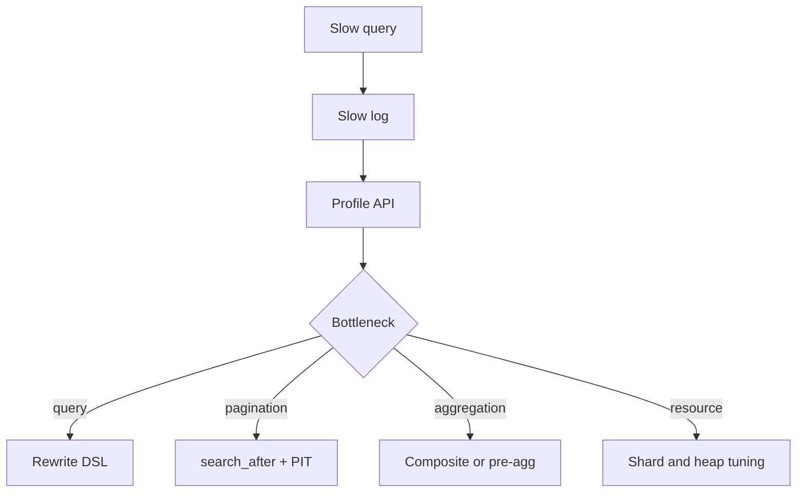

# ES 查询突然变慢，你会如何定位和优化？

## 30 秒回答

我会先确认是 query phase、fetch phase、aggregation 还是集群资源问题。看 slow log、profile API、shard/segment、heap、GC、thread pool rejected、circuit breaker 和最近 mapping/数据变化。优化从 query DSL、filter context、分页、聚合、字段和索引设计入手。

## 面试定位

这题考线上排障。面试官想看你是否能分层定位，而不是只说加机器或加索引。

## 标准回答

第一步看影响面。是所有查询慢，还是某个 query hash 慢。第二步拆阶段。query phase 慢可能是 DSL 或 shard 问题，fetch 慢可能是字段过大，aggregation 慢可能是高基数字段。

第三步看资源。heap、GC、磁盘、CPU、search thread pool 和 circuit breaker 都会影响查询。第四步才是优化：filter context、减少 script、限制 size、深分页改 search_after + PIT，大聚合改 composite aggregation 或异步预聚合。

## 架构与运行机制

数据流从用户 Search API 参数到 DSL，再到 shard 执行和结果合并。每层都可能慢。

## 可画图

可以画查询生命周期：参数校验、query phase、aggregation、fetch phase、merge response、metrics。

## 系统设计案例

后台订单搜索支持用户自定义排序和聚合。某天 p95 飙升，slow log 显示高基数 terms aggregation。修复是限制聚合字段白名单，改用 composite aggregation 分页拉取，并对高频统计做预聚合。

## 真实问题与排障

如果深分页导致慢，from/size 会让 shard 维护大量候选。改用 PIT + search_after。若脚本排序慢，改成预计算字段。若 heap 抖动，看 fielddata、聚合和 segment。

指标包括 search_latency_p95、query_time、fetch_time、aggregation_time、heap_usage、rejected_requests 和 circuit_breaker_tripped。

优化取舍要看读写比例和业务 SLA。给所有字段加索引会提升查询自由度，但会增加写入和存储成本；预聚合能降低查询延迟，但会牺牲实时性和灵活性；限制用户 DSL 能保护集群，却会降低高级搜索能力。面试里要把“快”和“可维护”一起讲。

## 面试官追问

- filter context 为什么更适合过滤？
- search_after 和 from/size 区别是什么？
- PIT 解决什么问题？
- 聚合为什么容易吃内存？
- profile API 线上怎么用？

## 项目化回答

我会说排查 ES 慢查询要先定位阶段，再改 DSL 或索引。项目里 Search API 会限制字段、分页和聚合，慢查询进入样本库，后续变更要回归。

## 常见错误

- 直接加节点。
- 任意 from/size 深分页。
- 用户参数直接拼 DSL。
- 对高基数字段做大 terms 聚合。
- 只看平均延迟。

## 深挖技术细节

慢查询要先用 slow log 和 profile API 拆阶段。query phase 慢通常是 DSL 本身、低选择性过滤、script、wildcard 或 shard fan-out。fetch phase 慢通常是返回字段太大、highlight 或 `_source` 读取重。aggregation 慢要看高基数字段、bucket 数量、fielddata、heap 和 circuit breaker。资源层要看 GC、磁盘 IO、search thread pool rejected、segment count。

优化时先降低工作量，再考虑扩容。过滤条件放 filter context，限制时间范围和 size，字段白名单防止任意 DSL，深分页用 PIT + search_after，大基数聚合用 composite aggregation 分页，频繁统计做预聚合或缓存。每个优化都要有指标对比，例如 p95、p99、heap_used_percent、request_cache_hit_rate 和 aggregation_time。

## 边界条件与反例

不是所有慢查询都该加索引。给所有字段建索引会拖慢写入并增加存储。不是所有聚合都该实时算，高频大范围报表可能应该走离线预聚合。不是所有深分页都该支持，用户翻到第几万页往往是产品需求要改，而不是技术要硬扛。

## 深问准备

- 追问 filter context：不评分，适合缓存和过滤，能先缩小候选。
- 追问 search_after：要求稳定排序，常配 PIT 保持一致视图。
- 追问 circuit breaker：防止单次查询占用过多内存拖垮节点。
- 追问 profile API：用于定位 query tree 耗时，线上采样使用，不能全量常开。

## 参考资料

- [Elasticsearch Query DSL](https://www.elastic.co/guide/en/elasticsearch/reference/current/query-dsl.html)
- [Elasticsearch Search profile API](https://www.elastic.co/guide/en/elasticsearch/reference/current/search-profile.html)
