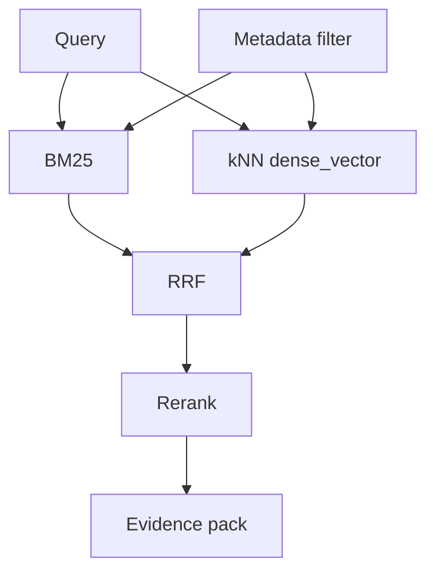

# RAG 为什么不应该只用向量检索？ES 在 Hybrid Search 里能发挥什么作用？

## 30 秒回答

向量检索擅长语义相似，但对错误码、函数名、版本号和精确术语不稳定。RAG 应结合 BM25、metadata filter、dense_vector、kNN 和 RRF。ES 可以统一管理 text、keyword、metadata 和向量字段，做 lexical + semantic 召回，再交给 rerank 和 grounding。

## 面试定位

这题考 ES 与 RAG 的结合。面试官想听到传统搜索和向量搜索的职责边界。

## 标准回答

只用向量检索容易漏掉精确词，且相似不等于可回答。企业知识库里，权限、版本、时间和文档类型也很重要。ES 可以先用 metadata filter 限定范围，再并行跑 BM25 与 kNN。

候选用 RRF 融合，保留 retriever_type、rank 和 evidence_id。融合后还要 rerank 判断 answerability，最终答案用 citation verifier 检查。

## 架构与运行机制

图 1：ES Hybrid Search 在 RAG 召回层的双路融合链路。Query 先经过 metadata filter 做租户、权限、版本和时间范围约束，再分别进入 BM25 与 kNN dense_vector 两路召回；RRF 用排名融合把两路候选合成一个候选集，Rerank 再对小候选集做精排，最后生成 evidence pack 交给回答层。图中最关键的数据流边界是 Metadata filter：无权限或错误版本的证据不能先进入模型上下文再补救。

## 可画图

画双路召回图：BM25 处理 lexical，kNN 处理 semantic，RRF 融合，rerank 精排。

## 系统设计案例

Paper Agent 或企业知识库问答中，用户既可能问自然语言，也可能输入 API 名、论文术语或错误码。ES 的 BM25 兜住精确词，dense_vector 处理语义，metadata filter 控制权限。

## 真实问题与排障

如果精确错误码召回失败，检查 analyzer 和 keyword 字段。若语义噪声高，检查 chunk、embedding 和 kNN top_k。若引用错误，检查 rerank 和 citation grounding。

指标包括 recall@k、precision@k、citation_precision、rerank_lift、query_latency 和 permission_leak_count。

Hybrid Search 的取舍是召回质量、延迟和成本。BM25 对精确词友好且成本低，但语义泛化有限；向量召回能覆盖同义表达，却依赖 embedding 质量和向量索引参数；rerank 提升证据排序，但会增加模型调用或交叉编码器开销。真实系统通常先用轻量融合保证召回，再只对小候选集做重排。

排障要按影响面、止血、根因、回归来讲。影响面先看低召回 query 类型、受影响知识库、租户和权限范围；止血可以临时提高 BM25 权重、扩大 `rank_window_size`、回退到 keyword query 或关闭风险召回；根因从 analyzer、chunk 边界、embedding_model_version、kNN 参数、RRF 窗口和 rerank prompt 里定位；回归要保存 query、gold evidence、权限上下文和期望 citation，比较 BM25 only、vector only、hybrid、hybrid+rerank 的差异。

## 面试官追问

- RRF 为什么适合融合？
- ES 和独立向量库怎么选？
- dense_vector 模型升级怎么办？
- metadata filter 应该在哪一层？
- 如何做 hybrid search 消融？

## 多轮追问模拟

### 追问 1：为什么不直接用向量库做 RAG？

回答要点：向量库擅长语义近邻，但企业问答还需要精确词、权限过滤、版本过滤、聚合排障和 lexical recall；ES 的价值在于把 text、keyword、metadata 和 vector 放在同一召回控制面里。  
考察点：是否能区分语义检索和可回答证据召回。  
常见陷阱：把“语义相似”当成“答案可信”，忽略错误码、API 名、版本号和权限。

### 追问 2：RRF 比手写加权分数好在哪里？

回答要点：BM25 分数和向量相似度尺度不可比，RRF 用排名融合降低分数归一化难度；但要控制 `rank_window_size`，否则相关候选被截断或延迟上升。  
考察点：是否理解融合算法的工程动机。  
常见陷阱：把两路原始分数简单相加，线上排序不可解释且不稳定。

### 追问 3：模型升级后如何避免召回抖动？

回答要点：新旧 embedding 字段双写，记录 `embedding_model_version`，离线回放 gold queries，比对 recall、citation_precision、latency 和权限泄漏，再灰度切流。  
考察点：是否把向量模型当成可版本化依赖。  
常见陷阱：直接覆盖向量字段，导致历史评测不可复现。

## 项目化回答

我会说 RAG 召回要 lexical 和 semantic 结合。ES 负责 BM25、metadata filter 和 kNN，RRF 负责融合，rerank 负责证据质量，grounding 负责答案可信。

项目里还要补一句“怎么证明它有效”。我会保存 BM25-only、vector-only、hybrid、hybrid+rerank 四组检索结果，并对每条 query 记录 gold evidence、retriever_type、rank、rrf_score、rerank_score、citation 是否命中。这样不是凭感觉说 hybrid 更好，而是能说明它在哪些 query 类型上提升 recall，在哪些场景增加了噪声或延迟。

## 常见错误

- 只用向量检索。
- 权限过滤太晚。
- dense_vector 不记录模型版本。
- 融合后不保留来源。
- 没有 rerank 和 citation eval。

## 深挖技术细节

Hybrid Search 要把召回链路拆成 query understanding、metadata filter、BM25 retriever、vector retriever、fusion、rerank、evidence pack。BM25 对精确词、代码符号、错误码、专有名词更稳；kNN 对同义表达和语义邻近更强；metadata filter 必须在召回前约束 tenant、部门、文档版本和时间范围。融合后还要保留每条候选来自哪一路，否则无法做消融和排障。

RRF 的优势是用 rank 而不是原始分数融合，降低 BM25 分数和向量相似度不可比的问题。Rerank 可以用 cross-encoder、LLM judge 或规则特征，但只应该作用在小候选集上，否则 latency 和 cost 会失控。最终 answer 必须通过 citation verifier 检查 claim 是否被 evidence 支撑。

## 边界条件与反例

只用向量的反例是“ERR_CONN_RESET”“NullPointerException”“search_after”这类精确术语，embedding 可能把语义相近但实体不同的片段排在前面。只用 BM25 的反例是用户用自然语言描述问题，不出现文档原词。权限过滤放到生成后也是反例，因为无权限证据已经进入模型上下文。

还有一个常见反例是把 rerank 当成万能补救。如果 chunk 切得过粗、metadata 丢失、embedding 模型版本混杂或 BM25 analyzer 不适合技术词，rerank 只能在错误候选里重新排序，无法凭空找回缺失证据。因此 RAG 质量治理要从入库、字段、权限、召回、融合、重排到引用全链路做，而不是只调最后一个 prompt。

## 公开阅读校验

公开文章需要把“RAG 可信”落到可审计证据上。读者应该能看到：ES 在 Hybrid Search 中不是单纯替代向量库，而是把关键词、权限、版本、时间和向量召回放进同一个检索治理面；RRF 解决多路召回分数不可比；rerank 控制候选质量；citation verifier 限制答案外推。把这几层讲清楚，文章才不会停留在工具拼装层。

## 深问准备

- 追问 RRF：讲排名融合、分数不可比和多路召回稳定性。
- 追问向量模型升级：双写新字段、记录 embedding_model_version、离线回放后切流。
- 追问评测：比较 BM25 only、vector only、hybrid、hybrid+rerank 的 recall、citation_precision、latency。
- 追问 ES vs 向量库：ES 胜在过滤、聚合、BM25 和向量一体化，专用向量库胜在超大规模向量能力。

## 来源与延伸阅读

- [Elasticsearch kNN search](https://www.elastic.co/docs/solutions/search/vector/knn)：用于说明 ES 中 dense vector/kNN 检索的参数、过滤和语义召回能力边界。
- [Elasticsearch Reciprocal Rank Fusion](https://www.elastic.co/docs/reference/elasticsearch/rest-apis/reciprocal-rank-fusion)：用于支持 RRF 通过多个 child retriever 的排名融合合并 BM25、kNN 或 sparse_vector 结果。
- [Elasticsearch Semantic search](https://www.elastic.co/docs/solutions/search/semantic-search)：用于延伸理解 semantic_text、sparse/dense 检索与传统 lexical search 在 RAG 中的组合方式。
- [OpenAI Cookbook: Elasticsearch RAG](https://developers.openai.com/cookbook/examples/vector_databases/elasticsearch/elasticsearch-retrieval-augmented-generation)：用于补充 ES 作为 RAG 检索后端时，索引、检索和生成链路如何衔接。
