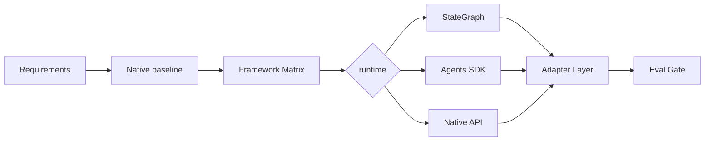

# 你用过哪些 Agent 框架？选型是如何选的？

## 面试定位

这题考框架选型能力。不要背框架名，要讲 baseline、StateGraph、Agents SDK、Adapter Layer、lock-in、eval 和团队维护成本。

## 30 秒回答

我会先做 Native API baseline，验证任务是否真的需要框架。若流程有显式状态、checkpoint、人机协同和恢复，考虑 LangGraph StateGraph。若重点是 OpenAI 生态的 tools、handoffs、guardrails 和 tracing，考虑 Agents SDK。无论用什么，都通过 Adapter Layer 降低 lock-in，并用 eval 对比收益。

## 标准回答

选型先看问题结构。简单线性任务用原生 API 更透明。复杂状态机、长期执行和 human-in-the-loop 适合 StateGraph。多 Agent handoff、guardrails、tracing 集成强的场景适合 Agents SDK。数据密集 RAG 可以引入检索框架。

核心取舍是开发效率和长期可控性。框架能减少样板并提供治理能力，但会引入抽象、依赖和 lock-in。原生 baseline 更透明，但很多治理能力要自己补。

选型不能只看流行度。要比较 task_success_rate、p95_latency、cost_per_success、trace_coverage、debug_time、eval_integration_cost 和团队熟悉度。业务代码最好依赖内部 AgentRuntime，而不是直接散落框架 API。

## 架构与运行机制

数据流是 Requirement Profiler 收集状态复杂度、工具数量、恢复需求和安全等级。Baseline Runner 先跑原生实现。Framework Matrix 对比候选方案。Adapter Layer 统一 ModelClient、ToolDispatcher、StateStore、TraceStore 和 EvalRunner。

## 可画图

## 系统设计案例

Paper Agent 以检索和 citation 为核心，可以先用原生 API 加 RAG stack。Travel Agent 有偏好收集、规划、约束验证和确认，适合 StateGraph。客服 Agent 有 handoff 和 guardrails，可以考虑 Agents SDK。

## 真实问题与排障

如果引入框架后调试变慢，查 trace 是否覆盖工具和状态。若延迟上涨，拆解框架 overhead 和模型耗时。若迁移困难，说明 Adapter Layer 不够。指标看 `debug_time`、`framework_error_rate`、`direct_framework_dependency_ratio` 和 `migration_risk`。

## 面试官追问

- 什么时候不用框架？任务简单、状态少、团队需要透明控制时。
- 如何防 lock-in？Adapter Layer、contract tests 和数据格式隔离。
- 如何证明框架有收益？同一批 golden case 对比 baseline。

## 项目化回答

我会说：我先用 Native API 做 baseline，再按状态复杂度和治理能力选择框架。业务层只依赖 Adapter Layer，最终用 eval 和 trace 指标证明选型。

## 常见错误

- 只背框架名字。
- 没有 baseline。
- 为简单任务引入重框架。
- 业务逻辑深度绑定框架 API。

## 深挖技术细节

Agent 框架选型要先拆运行时能力，而不是先选品牌。核心维度包括：模型调用抽象、tool schema 与参数校验、状态管理、checkpoint、human-in-the-loop、handoff、guardrails、tracing、eval 接入、部署形态和权限边界。简单问答或单步工具调用只需要 Native API 加少量封装；如果有可恢复状态、分支图、长任务和人工介入，就要考虑 StateGraph 或 durable execution；如果重点是 OpenAI tools、handoffs、guardrails 和 tracing 的组合，Agents SDK 更贴近。

落地时建议做一层内部 `AgentRuntime`，把框架 API 隔离在 adapter 里。业务代码只调用 `runTask`、`dispatchTool`、`loadState`、`appendTrace`、`runEval` 这类稳定接口。每个候选框架都跑同一批 golden cases，记录 `task_success_rate`、`cost_per_success`、`p95_latency`、`tool_error_rate`、`resume_success_rate`、`trace_coverage`、`debug_time` 和 `direct_framework_dependency_ratio`。如果某框架把 20 行 baseline 变成 200 行配置，或 trace 难以定位，就不该只因为流行而引入。

选型还要考虑团队和生产约束。框架升级是否频繁破坏 API？能否导出 trace？状态数据是否可迁移？是否支持本地和云端同构？是否能做权限审计和回滚？这些问题比“有没有多 Agent demo”更重要。面试中说清这些指标，会比罗列 LangGraph、AutoGen、CrewAI、Agents SDK 更有工程判断力。

## 边界条件与反例

反例一：为了展示技术栈，把单轮文本生成包装成复杂 graph，导致延迟、排障和测试成本上升。反例二：所有业务逻辑直接写在框架 node 或 decorator 里，后来迁移模型、切换存储或替换工具层时成本巨大。反例三：只看 GitHub star，不看生产能力、trace、eval 和权限模型。

边界是：框架不能替代系统设计。它能提供运行时和抽象，但不会自动解决 prompt injection、数据权限、citation precision、成本控制和任务验收。越靠近业务核心，越要用 adapter 和 contract tests 降低 lock-in；越靠近原型验证，越可以接受框架带来的开发效率。

## 深问准备

- 问：什么时候用 LangGraph？答：状态复杂、需要 checkpoint、恢复、人机协同、分支控制和可视化 trace 时。
- 问：什么时候用 Native API？答：任务简单、团队需要完全控制上下文和工具协议、框架收益无法覆盖抽象成本时。
- 问：如何证明选型正确？答：用同一批 golden cases 对比 baseline 和框架实现，看成功率、延迟、成本、调试时间和恢复能力。
- 问：如何防 lock-in？答：内部 runtime adapter、统一 trace schema、工具契约测试、状态格式版本化，以及迁移演练。

## 来源与延伸阅读

- [LangChain Frameworks, runtimes, and harnesses](https://docs.langchain.com/oss/python/concepts/products)
- [LangGraph Overview](https://docs.langchain.com/oss/python/langgraph/overview)
- [OpenAI Agents SDK Guardrails](https://openai.github.io/openai-agents-python/guardrails/)
