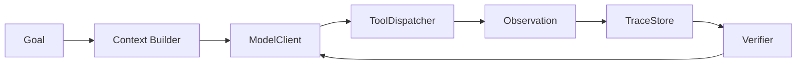

# 什么时候原生 API 比框架更合适？

## 面试定位

这是框架选型的深入题。面试官想看你是否知道“少用框架”有时是更成熟的工程选择。

## 30 秒回答

当任务路径简单、状态少、团队需要完全控制、延迟敏感或框架抽象会遮住调试信息时，原生 API 更合适。原生实现能快速做 baseline，也方便理解 tool loop、trace、权限和 eval。等状态图、handoff、checkpoint 或团队协作复杂后，再考虑框架。

## 标准回答

框架的价值是减少样板并提供治理能力，但它也带来依赖、抽象泄漏、版本变化和 lock-in。简单任务如果直接上框架，可能让团队看不清模型调用、工具 dispatch、状态更新和错误恢复。

这里的取舍是透明控制和内建能力。原生 API 更容易调试和裁剪，框架更容易获得 checkpoint、handoff、guardrails 和 tracing，但代价是学习曲线和迁移风险。

原生 API 适合早期验证。你可以用几十行代码实现 model call、tool dispatcher、trace 和 eval case。这样 baseline 清楚，之后引入 LangGraph 或 Agents SDK 时才能证明收益，而不是凭感觉迁移。

## 架构与运行机制

数据流是原生 loop 接收 goal，Context Builder 构造输入，ModelClient 返回 tool_call，ToolDispatcher 执行工具，TraceStore 记录 observation，Verifier 决定继续或停止。这个最小闭环是理解任何框架的基础。

## 可画图

## 系统设计案例

一个内部文档问答助手只需要 RAG、工具调用和 citation verifier。原生 API 足够透明。若后续加入多角色 handoff、长任务 checkpoint 和人工审批，再把 StateStore 和 ToolDispatcher 接到框架。

## 真实问题与排障

如果原生实现后来变复杂，观察信号是大量手写状态机、重复恢复逻辑、trace 不统一和人机协同困难。此时可以迁移到框架。若框架实现反而难排障，应回到 baseline 对比。

## 面试官追问

- 原生 API 会不会重复造轮子？会，所以要保留迁移条件。
- 怎么避免后期迁移痛苦？一开始就设计 Adapter Layer。
- 原生 baseline 看哪些指标？成功率、延迟、成本、trace coverage 和代码复杂度。

## 项目化回答

我会说：我不默认上框架。先用原生 API 建最小 AgentRuntime，把 ModelClient、ToolDispatcher、StateStore 和 TraceStore 抽象出来。框架是后续替换实现，不是业务边界。

## 常见错误

- 为了简历堆框架。
- 没有 baseline 就比较选型。
- 原生代码不抽象边界，后续无法迁移。
- 忽略 tracing 和 eval。

## 深挖技术细节

原生 API 适合做最小可解释闭环：`ModelClient` 负责模型调用，`ToolDispatcher` 负责工具路由和参数校验，`StateStore` 保存可信状态，`TraceStore` 保存 step 事件，`Verifier` 决定继续、停止或回退。这个闭环越透明，越容易发现问题到底来自上下文、工具、状态还是模型。框架引入前，应先用它跑出 baseline 指标。

是否引入框架可以用阈值判断：是否需要 checkpoint resume，是否有多分支状态图，是否需要 human interrupt，是否有多 Agent handoff，是否需要跨团队复用 node，是否已有大量手写恢复逻辑。如果这些需求不存在，框架可能只是增加抽象层。若需求存在，则框架提供的 graph、checkpoint、trace、guardrail 和 eval 接入可以减少自研成本。

Adapter Layer 是面试官很爱追的点。业务层不要直接散落 `graph.invoke`、`agent.run` 或框架 decorator，而要通过内部接口调用。状态 schema、tool schema、trace schema 也要版本化。这样从原生 API 迁到 LangGraph 或 Agents SDK 时，主要替换 adapter，而不是重写业务逻辑。

## 边界条件与反例

反例一：原生 API 写到后期变成巨型 while loop，状态合并、重试、人工确认都藏在 if/else 里，这时继续坚持原生不是成熟，而是欠债。反例二：框架引入后所有错误都被抽象吞掉，trace 无法定位，这说明选型或接入方式不合适。反例三：没有同一批 eval case，只凭主观感受比较框架。

边界是：原生和框架不是二选一。更稳的做法是先原生 baseline，再让框架承接复杂运行时；业务协议、工具权限、eval 和 trace 仍由自己的工程边界定义。

## 深问准备

- 问：原生 API 如何避免重复造轮子？答：只自研业务边界和最小 runtime，复杂 checkpoint、graph、observability 达到阈值后接框架。
- 问：迁移时最难的是什么？答：状态格式、工具契约、trace schema 和错误语义；所以一开始要做 adapter。
- 问：如何比较框架收益？答：用同一批 golden cases，看成功率、恢复率、延迟、成本、debug time 和代码复杂度。
- 问：什么时候框架不适合？答：任务线性、低状态、强延迟约束、团队需要完全控制或框架 trace 不透明时。

## 来源与延伸阅读

- [OpenAI Agents SDK](https://openai.github.io/openai-agents-python/)
- [LangGraph Overview](https://docs.langchain.com/oss/python/langgraph/overview)
- [LangGraph Persistence](https://docs.langchain.com/oss/python/langgraph/persistence)
