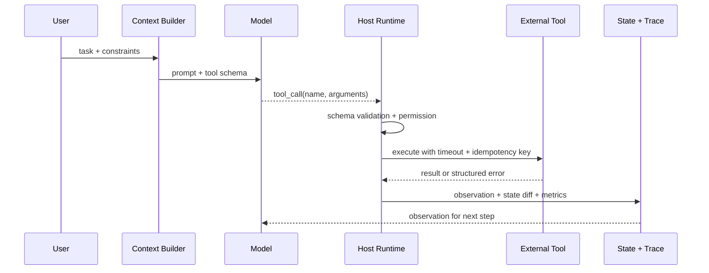
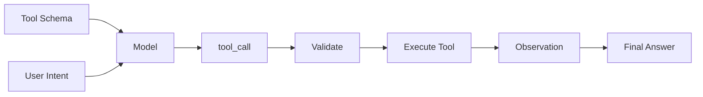

# LLM 是如何学会调用外部 API 或工具的？

## 面试定位

这道题表面在问“模型怎么会调用工具”，实际考察三层能力：你是否理解模型训练中的工具调用样式，是否理解运行时 tool schema 如何约束输出，是否知道真实 API 执行必须由宿主系统控制。

回答不能说成“模型自己连上外部 API”。更准确的说法是：模型在训练和对齐阶段学会了根据上下文生成符合工具协议的结构化调用；线上推理时，应用把工具 schema 放入上下文，模型输出 `tool_call`，宿主校验和执行，结果再以 `observation` 回传给模型。

## 30 秒回答

LLM 不是直接学会“连接 API”，而是学会在给定工具描述和上下文时，生成一个结构化调用意图。这个意图通常包含工具名和 arguments。真正的 API key、数据库连接、权限判断和业务执行都在宿主系统里。

所以我会把这件事拆成两部分：模型侧负责选择工具和填参数，系统侧负责 schema validation、permission gate、执行、幂等、错误恢复和 trace。这个边界讲清楚，才不会把 Function Calling 误说成完整 Agent。

## 标准回答

### 1. 先划边界

模型输出的是 `tool_call`，不是实际 HTTP 请求。它没有直接持有 API key，也不应该拥有数据库连接或支付、退款、发券这类真实执行权。

Function Calling 的接口可以理解成模型和宿主之间的一种协议。模型按 schema 生成调用意图，宿主把它当成不可信输入处理。这个设计让 AI 可以驱动外部能力，但执行权仍留在后端系统。

### 2. 再解释模型为什么能生成工具调用

模型在训练语料和对齐数据中见过大量“用户意图 -> 工具描述 -> 参数填充 -> 工具结果 -> 最终回答”的模式。上线时，应用把工具名称、描述、参数 schema 和边界放进模型可见上下文，模型就能根据当前任务选择一个工具并生成 arguments。

这里的“学会”不是写死某个 API，而是学会一种条件生成模式。换一个工具 schema，模型仍然可以根据描述推断何时调用、怎么填参数。这也是为什么工具命名、字段描述、enum、required 和 examples 会显著影响调用质量。

### 3. 补工程细节

宿主拿到 `tool_call` 后至少要做这些动作：

- JSON schema validation：检查类型、required、enum、format 和范围。
- Runtime validation：检查对象是否存在，用户是否能访问，业务状态是否允许动作。
- Permission gate：按 risk level 判断是否拒绝、放行或要求用户确认。
- Execution wrapper：统一 timeout、retry、rate limit、circuit breaker 和 structured error。
- State and trace：记录 run id、step id、arguments hash、observation、latency、cost 和 verdict。

格式正确不等于业务正确。比如 `amount` 是合法数字，不代表可以退款；`file_path` 是字符串，不代表可以写这个文件。

### 4. 讲指标与故障

可以用指标证明工具调用是否可靠：`valid_call_rate`、`invalid_args_rate`、`tool_chain_success_rate`、`permission_denial_rate`、`retry_success_rate`、`unsafe_call_block_rate` 和 `p95_latency`。

如果线上工具调用失败，我会先看模型有没有选错工具，再看参数是否 invalid，再看宿主是否因为权限拒绝，再看真实工具是否超时或返回业务错误。最后确认 observation 是否正确回写到上下文和 trace。

### 5. 最后讲取舍

Function Calling 提高了自然语言到 API 的桥接能力，但也引入了不确定性。工具越细，权限和 trace 越清晰，但调用轮次会变多。工具越粗，调用简单，但风险边界和错误恢复更难做。面试里要强调：复杂度必须用成功率、延迟、成本和风险降低来证明。

## 架构与运行机制

图 1 里的关键是 Host Runtime。它把模型输出当成待审核的动作，而不是直接执行的命令。真实系统必须把 schema、permission、幂等和 trace 放在这一层。

这条数据流的面试表达可以压缩成一句话：用户意图进入 Context Builder，模型产出 tool call，宿主完成校验和执行，工具结果再作为 observation 回到状态与上下文。

## 可画图

面试时可以画一个简化版：

讲图时补一句：schema 帮模型“说清楚要什么”，validator 和 permission gate 帮系统“决定能不能做”。

## 系统设计案例

以订单查询和退款为例，不应该只暴露一个 `handle_order_request`。更合理的工具拆分是：

| 工具 | 类型 | 权限 | 失败处理 |
| --- | --- | --- | --- |
| `get_order_status` | 只读 | 用户必须拥有订单 | 空结果返回 `ORDER_NOT_FOUND` |
| `create_refund_preview` | 只读预览 | 校验可退金额和状态 | 返回不可退款原因 |
| `apply_refund` | 写操作 | 需要确认和幂等键 | 支持补偿和审计 |

这样模型可以先查询和生成预览，用户确认后再提交写操作。这个设计比“让模型直接退款”更符合生产系统边界。

## 真实问题与排障

常见问题包括工具选错、参数缺字段、权限误拒、下游超时、重复调用和 observation 没写回。排查顺序是：

1. 看 `tool_name` 是否符合用户意图。
2. 看 arguments 是否通过 schema 和 runtime validation。
3. 看 permission denial 是否符合用户 scope 和对象归属。
4. 看外部工具 latency、error code 和 retry 结果。
5. 看最终答案是否引用了真实 observation。

如果 trace 里没有 `run_id`、`step_id`、`tool_name`、`arguments_hash`、`status` 和 `error_code`，这类问题很难复盘。

## 面试官追问

下面这些追问可以按多轮面试展开。回答时不要只背结论，要主动补“考察点”和“陷阱”，让面试官看到你理解模型协议、宿主执行和生产安全边界。

## 多轮追问模拟

### 追问 1：Function Calling 和普通 JSON 输出有什么区别？

普通 JSON 只是文本格式，Function Calling 会进入受控执行链路。宿主会识别工具名、校验 arguments、执行工具并把 observation 写回模型上下文。

考察点是你是否能区分“结构化文本”和“受控动作协议”。陷阱是只说 Function Calling 输出更稳定，却忽略工具名、schema、executor、observation 和 trace 这些运行时约束。

### 追问 2：模型参数已经满足 schema，还需要后端校验吗？

必须需要。schema 只能验证格式，不能验证用户权限、对象归属、业务状态、金额上限和动作风险。生产系统必须把模型输出当成不可信输入。

考察点是安全边界和业务校验。陷阱是把 JSON schema 当成权限系统，或者把模型输出当成可信后端参数。更好的补充是举退款、发券、文件写入、SQL 查询这类有副作用或数据权限的例子。

### 追问 3：工具调用失败后模型应该怎么办？

工具应返回 structured error，例如 code、retryable、message、hint 和 partial data。模型基于这个 observation 决定重试、换工具、追问用户、降级或停止。

考察点是错误恢复和状态机。陷阱是让模型在没有 observation 的情况下继续编答案。生产回答要补 `retryable=false` 时停止、`permission_denied` 时解释边界、`rate_limited` 时返回 retry_after、`timeout` 时按幂等键重试或降级。

### 追问 4：工具 schema 应该设计得粗一点还是细一点？

要看风险、任务粒度和可观测性。只读查询工具可以相对聚合，但写操作应该拆成 preview、confirmation 和 commit；高风险工具要有更窄的参数、枚举、权限 scope 和审计字段。工具太粗，模型容易把多个意图混在一次调用里；工具太细，调用轮次、延迟和成本会上升。

考察点是工具设计取舍。陷阱是为了减少调用次数暴露 `execute_anything` 这类万能工具，最后权限、审计和错误恢复都不可控。

## 项目化回答

如果落到 Coding Agent，我会把 `read_file`、`search_code`、`apply_patch`、`run_tests` 作为工具。读工具只需要工作区权限，写工具要 diff preview 和确认，shell 工具要限制命令和目录。每次调用都进入 trace，并把测试结果作为 observation 回传。

如果落到 Travel Agent，我会把搜索、预览和提交拆开。模型可以调用搜索工具和改签预览工具，但提交改签必须依赖 preview id、用户确认和幂等键。

## 常见错误

- 说模型直接调用 API，忽略宿主执行边界。
- 只讲 schema，不讲 permission、幂等和 trace。
- 把 Function Calling 等同于完整 Agent。
- 不区分只读工具和写操作工具。
- 工具失败后让模型凭空补答案。

## 深挖技术细节

Function Calling 的本质是模型输出结构化调用意图，宿主运行时负责执行。链路应包含 tool schema、model tool call、schema validation、business validation、permission gate、executor、observation normalizer 和 trace。模型不能直接持有 API key，也不能绕过后端权限。

工具返回应是 observation，而不是随意文本。成功返回 `status`、`data`、`source`、`summary`；失败返回 `error_code`、`retryable`、`message`、`hint` 和 `partial_data`。这样模型才能基于真实结果继续，而不是在失败后编造。

## 边界条件与反例

Function Calling 不等于 Agent。一次订单查询工具调用只是工具协议；完整 Agent 还需要 Goal、State、Loop、Guardrails、Eval 和 Trace。若任务路径固定，Function Calling 可以放在 workflow 节点里，不必升级成 Agent。

另一个反例是把写操作直接暴露为 `refund(orderId)`。生产里应拆成查询、预览和确认提交，写操作必须带 confirmation、idempotency key、权限校验和审计。

## 深问准备

被问“JSON 输出和 Function Calling 区别”时，回答：JSON 是文本格式，Function Calling 进入宿主识别和执行链路，能够校验工具名、参数、权限、执行结果和 trace。

被问“schema 通过还要校验吗”，回答必须要。schema 只管格式，业务状态、用户权限、对象归属、金额上限和副作用风险都要 runtime validation。

## 来源与延伸阅读

- [OpenAI Function Calling](https://platform.openai.com/docs/guides/function-calling)：用于说明 tool call 的 API 语义。
- [OpenAI Agents SDK](https://platform.openai.com/docs/guides/agents-sdk)：用于说明 tools、guardrails 和 tracing 的组合。
- [Anthropic Building effective agents](https://www.anthropic.com/engineering/building-effective-agents)：用于支持工具设计和 workflow/agent 边界。
