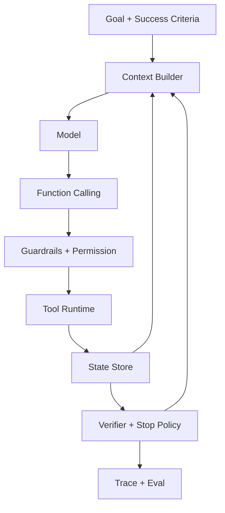
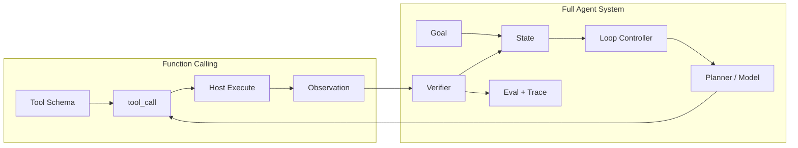

# Function calling 和完整 Agent 系统之间差了哪些工程层？

## 面试定位

这是一道边界题。面试官想确认你不会把“模型能输出工具调用”直接说成“已经有了 Agent”。Function Calling 是 Agent 的重要能力，但完整 Agent 还需要目标、状态、循环、规划、评测、安全、可观测性和停止条件。

这题最好的回答方式是分层：先承认 Function Calling 解决了模型到工具的结构化接口，再指出它没有解决执行控制、状态连续性、任务闭环和生产治理。

## 30 秒回答

Function Calling 只是工具调用协议层。它让模型输出 `tool_call(name, arguments)`，由宿主执行工具并返回 observation。

完整 Agent 系统比它多了几层：Goal 管理、State Store、Context Builder、Loop Controller、Planner、Verifier、Guardrails、Trace 和 Eval。没有这些层，系统只能完成一次或几次工具调用，很难稳定处理开放任务，也无法证明成功率、失败恢复和安全边界。

## 标准回答

### 1. 先划边界

Function Calling 回答的是“模型如何表达要调用哪个工具”。完整 Agent 回答的是“系统如何围绕目标持续观察、决策、行动、验证和停止”。

因此 Function Calling 可以存在于非 Agent 系统里。例如客服机器人根据用户问题调用一次订单查询工具，然后回答用户，这可能只是 workflow 中的一个工具节点。只有当模型参与多步控制流，并根据环境反馈动态选择下一步动作时，才更接近 Agent。

### 2. 再画分层

这张图里，Function Calling 只是 `Model -> ToolCall -> Runtime` 这一段。Agent 的难点在循环外壳：状态怎么恢复，下一步怎么选，什么时候停止，失败怎么重试，风险动作怎么拦截，最终结果怎么评测。

### 3. 补工程细节

完整 Agent 至少需要六个 Function Calling 之外的工程层：

| 工程层 | 解决的问题 | 缺失后的表现 |
| --- | --- | --- |
| Goal 层 | 定义任务成功标准和约束 | 模型忙了很多步但不知道何时完成 |
| State 层 | 保存计划、工具结果、用户约束和恢复点 | 上下文压缩或重试后丢失任务线索 |
| Loop 层 | 控制 observe -> decide -> act -> verify | 工具调用只能单步执行，无法处理开放任务 |
| Guardrails 层 | 管输入、输出、工具权限和人工确认 | 模型可能越权或执行高风险动作 |
| Eval 层 | 用 fixture、golden case 和轨迹评分证明有效 | 只能展示 demo，不能证明稳定性 |
| Trace 层 | 记录 step、tool、arguments、observation 和 verdict | 线上失败后无法复盘 |

Function Calling 能让工具调用更结构化，但不会自动给你这些层。

### 4. 讲指标与故障

如果只是 Function Calling，可以重点看 `valid_call_rate`、`invalid_args_rate`、`tool_latency` 和 `permission_denial_rate`。

如果是完整 Agent，还要看 `task_success_rate`、`avg_steps`、`recovery_rate`、`loop_stop_reason`、`unsafe_action_block_rate`、`handoff_rate`、`cost_per_task` 和 `trajectory_quality`。这些指标证明系统是否真的能完成开放任务，而不是只会调用工具。

### 5. 最后讲取舍

不是所有工具调用都要升级成 Agent。固定路径、规则清楚、风险高的流程更适合 workflow。任务步骤不可预知、需要探索、多轮工具结果会改变下一步决策时，才值得引入 Agent loop。面试里主动讲这个取舍，会比一味强调“Agent 更智能”更可信。

## 架构与运行机制

Function Calling 的运行机制通常是单步或局部多步：模型选工具，宿主执行，模型基于 observation 继续回答。完整 Agent 的运行机制是闭环：系统先建立目标和状态，再循环执行计划、工具调用、验证和停止策略。

关键差异在状态和验证。Function Calling 可以只依赖当前上下文，Agent 必须把任务状态持久化。Function Calling 可以只看工具是否成功，Agent 必须判断任务是否达成、是否需要重规划、是否触发安全停止。

因此这道题的数据流不能只画 tool call。要从 Goal 和 State 开始，经过 Context Builder、Model、Tool Runtime、Verifier，再回到 State 和 Eval。

## 可画图

面试时可以画一张“协议层 vs 系统层”的对比图：

讲图时强调：Function Calling 是可复用的能力模块，Agent 是把这个模块放进目标、状态、循环和治理框架后的系统。

## 系统设计案例

以 Coding Agent 为例，只做 Function Calling 时，模型可能调用 `read_file`、`apply_patch` 和 `run_tests`。这还不够，因为长任务会遇到测试失败、文件冲突、上下文压缩、用户约束变化和需要回滚的情况。

完整 Coding Agent Harness 需要：

- Goal：记录用户要修什么 bug，哪些文件不能碰，成功标准是什么。
- State：保存当前计划、已读文件、补丁、测试结果和 open risks。
- Loop：根据测试结果决定继续搜索、修改、回滚或停止。
- Guardrails：限制 shell、网络、文件写入和发布动作。
- Verifier：用测试、diff 范围、lint 和用户要求判断是否完成。
- Trace：保存每一步 tool call、observation、state diff 和最终 verdict。

这就是 Function Calling 到 Agent 的工程差距。

## 真实问题与排障

如果一个系统“能调用工具但不稳定”，我会按层排查：

1. 工具层：schema 是否清楚，参数是否 invalid，工具是否超时。
2. 权限层：是否正确拦截高风险动作，是否误拒合法用户。
3. 状态层：上下文压缩或多轮调用后是否丢失目标和约束。
4. Loop 层：是否有 max steps、timeout、stop reason 和重规划策略。
5. Eval 层：失败样本是否进入回归集，是否只看端到端成功率。
6. Trace 层：是否能复盘每一步为什么发生。

如果只看 Function Calling 的成功率，很可能会漏掉 Agent 层的问题。例如工具每次都成功，但 Agent 仍然因为目标漂移或停止条件错误而失败。

## 面试官追问

### 追问 1：Function Calling 是不是 Agent 的必要条件？

不是绝对必要，但在现代工具型 Agent 中非常常见。Agent 可以通过文本协议调用工具，但结构化 tool call 更容易校验、审计和恢复。

### 追问 2：什么时候不该用 Agent？

固定流程、强合规、强事务、路径稳定的任务优先 workflow。可以把模型放在分类、提取或解释节点，但不要让它控制整条执行路径。

### 追问 3：如何证明从工具调用升级到 Agent 是值得的？

用 baseline 对比。比较 workflow 和 Agent 在 task_success_rate、avg_steps、latency、cost、recovery_rate 和人工接管率上的差异。如果收益不能覆盖复杂度，就不要升级。

## 项目化回答

在 Travel Agent 项目中，Function Calling 可以实现查航班、查酒店、生成改签预览。完整 Agent 还要维护用户预算、时间偏好、已确认选择、风险提示和人工确认状态。它需要在多轮工具结果之间更新计划，而不是每次独立调用一个工具。

在 Paper Agent 项目中，Function Calling 可以调用检索和 PDF 解析工具。完整 Agent 还要维护 claim-to-evidence、citation、unsupported claims、重检索策略和答案验证器。否则工具调用成功了，答案仍可能引用错误证据。

## 深挖技术细节

Function Calling 与完整 Agent 的差异可以从 control plane 看。Function Calling 只定义模型如何表达工具调用；完整 Agent 还要维护 goal、state、loop、budget、stop policy、guardrails、eval 和 trace。也就是说，Function Calling 是动作接口，Agent 是围绕动作接口运行的闭环系统。

宿主运行时应把每个 tool call 当成 untrusted request：先做 JSON/schema 校验，再做业务校验、权限校验、资源归属、风险分级、幂等和审计。执行结果被 normalize 成 observation 后，才能进入 State 和下一轮 Context。

## 边界条件与反例

如果任务是固定流程，比如订单查询、发票状态同步、审批状态机，Function Calling 可以作为 workflow 的一个节点，不需要让模型控制全流程。只有当中间 observation 会改变下一步路径，且可用 eval 证明收益时，才升级成 Agent loop。

并行工具调用也有边界。只读查询可以并行，写操作必须考虑顺序、事务、幂等和补偿。并行提交两个外部副作用工具，可能造成状态不一致。

## 深问准备

被问“strict schema 是否足够安全”，回答不够。strict schema 降低格式错误，但不能证明用户有权限、对象状态允许修改、金额安全或动作可逆。安全边界在 Tool Runtime 和后端策略。

被问“工具结果很长怎么办”，返回摘要、关键字段、source/evidence id 和 cursor/ref，大对象放 artifact store。直接把长结果塞回上下文会污染模型输入，也增加成本。

## 常见错误

- 把一次 tool call 当成 Agent。
- 只讲工具 schema，不讲 state、loop、eval 和 guardrails。
- 认为模型可以直接持有执行权。
- 没有说明 workflow 与 Agent 的取舍。
- 只用 demo 展示效果，没有指标和失败样本。

## 来源与延伸阅读

- [OpenAI Function Calling](https://platform.openai.com/docs/guides/function-calling)：用于理解 Function Calling 的协议边界。
- [OpenAI Agents SDK](https://platform.openai.com/docs/guides/agents-sdk)：用于理解 Agent、tools、handoff、guardrails 和 tracing。
- [Anthropic Building effective agents](https://www.anthropic.com/engineering/building-effective-agents)：用于 workflow 与 agent 的选择原则。
