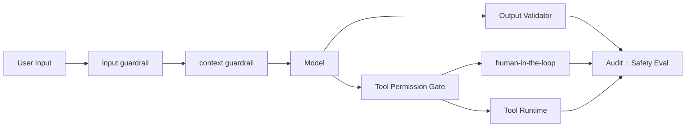

# 如何确保 Agent 行为安全、可控且符合人类意图？

## 面试定位

这题考 Guardrails 的系统设计。不要只说“加安全提示词”，要讲输入、上下文、工具、输出、human-in-the-loop、审计、指标、取舍和追问。

## 30 秒回答

我会用分层 Guardrails：input guardrail 判断请求风险，context guardrail 隔离不可信证据，Tool Permission Gate 控制工具权限，Output Validator 检查格式、PII、citation 和业务规则，高风险动作进入 human-in-the-loop。安全边界必须在宿主程序和权限系统里实现，不能让模型自己决定能不能执行。

## 标准回答

Agent 的风险来自两个方面。第一是输入和上下文，例如恶意请求、prompt injection、敏感数据。第二是动作，例如读敏感信息、写外部系统、发邮件、付款、删文件。Guardrails 要覆盖这两条路径。

我会把策略版本化并接入 eval。每个 allow、deny、confirm 都写 trace。误拦和漏拦都要进入安全样本集，而不是只追求拦截率。

## 架构与运行机制

数据流是用户请求进入 input guardrail，Context Builder 给 evidence 打 trustLevel，模型输出后进入 Output Validator 或 Tool Permission Gate。若工具高风险，生成 preview 并请求确认。所有决策进入 audit trace。

## 可画图

## 系统设计案例

企业知识库 Agent 中，用户只能检索自己有权限的文档。RAG chunk 是 untrusted evidence，不能改变 system 指令。若模型想发邮件或导出数据，Tool Permission Gate 根据 riskLevel 和 permissionScope 决定 deny 或 confirm。

## 真实问题与排障

如果出现越权工具调用，先看工具是否错误暴露，再看执行层 ACL。若 prompt injection 成功，检查 context guardrail。若 PII 泄露，检查 Output Validator 和 trace redaction。指标看 `unsafe_tool_call_block_rate`、`prompt_injection_block_rate`、`false_positive_rate` 和 `pii_leak_count`。

## 面试官追问

- Guardrails 是不是只靠模型？不是，关键边界要规则化和权限化。
- 哪些动作要人工确认？不可逆、财务、对外发送、敏感数据和高风险写操作。
- 如何评估安全？用漏拦、误拦、人工复核和 regression case。

## 项目化回答

我会说：我的 Agent 有输入、上下文、工具、输出和人工确认五层 Guardrails。工具执行权不交给模型，高风险动作必须 preview、approval、audit。

## 常见错误

- 只写 system prompt。
- 外部网页内容能覆盖系统规则。
- 模型自己判断权限。
- 高风险工具没有确认和审计。

## 深挖技术细节

Guardrails 要覆盖 request、context、tool、output、human approval 五层。Input Guard 先对用户请求做 risk classification，输出 `risk_level`、`policy_tags`、`blocked_reason`。Context Guard 负责给外部证据打 `trust_level`、`source_uri`、`content_hash`、`permission_scope`，禁止 untrusted evidence 修改系统指令。Tool Permission Gate 根据 registry、ACL 和 session scope 输出 allow/deny/confirm。Output Validator 检查 PII、secret、格式、citation、越权 claim 和业务规则。

策略必须版本化。每个 verdict 记录 `policy_version`、命中规则、输入引用、tool args hash、human decision 和 final action。这样安全事故才能 trace replay。高风险动作要先 preview：展示真实参数、影响范围、外部副作用、回滚方案和过期时间。用户确认后执行前再次校验 args hash，避免确认内容和执行内容不一致。

评估上要同时看漏拦和误拦。指标包括 `unsafe_tool_call_block_rate`、`prompt_injection_block_rate`、`pii_leak_count`、`false_positive_rate`、`approval_bypass_count`、`red_team_pass_rate`、`p95_guardrail_latency`。只追求 block rate 会让系统不可用；只追求任务完成率又会放大安全风险。

## 边界条件与反例

反例一：把安全规则写在 system prompt，工具执行层完全相信模型。反例二：用户上传文档里的指令被放进高优先级上下文。反例三：高风险工具没有 preview，用户不知道要执行什么。反例四：guardrail 没有 trace，误拦和漏拦都无法复盘。

边界在于：Guardrails 不能保证模型永不输出危险建议，但能保证危险建议不能直接变成动作。对于只读低风险任务可以轻量策略；对删除、支付、发送、跨租户访问、权限修改和生产发布，应使用 confirm、approval、audit 和 rollback。

## 深问准备

- 问：为什么不能只靠模型？答：模型没有真实权限上下文，也不能承担确定性授权；执行权必须在宿主程序。
- 问：哪些动作需要 human-in-the-loop？答：不可逆、财务、对外发送、敏感数据、权限变更、生产写操作。
- 问：误拦怎么处理？答：shadow mode、人工复核、按风险分级调阈值，并把样本加入 eval。
- 问：安全策略如何上线？答：policy version、回归集、灰度、trace 监控和回滚开关。

## 来源与延伸阅读

- [OpenAI Agents SDK Guardrails](https://openai.github.io/openai-agents-python/guardrails/)
- [OWASP LLM01: Prompt Injection](https://genai.owasp.org/llmrisk/llm01-prompt-injection/)
- [OpenAI Agents SDK Tracing](https://openai.github.io/openai-agents-python/tracing/)
