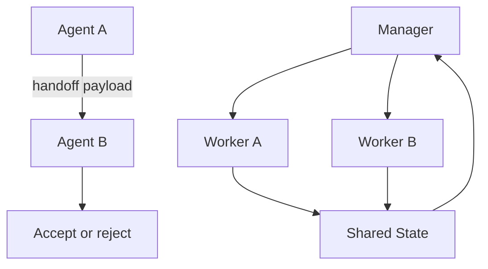

# 多 Agent 中 handoff 和 manager pattern 有什么区别？

## 30 秒回答

handoff 是任务控制权从一个 Agent 转给另一个 Agent。manager pattern 是由中心 Orchestrator 持续拥有调度权，其他 Agent 只领取子任务。前者灵活但容易责任不清，后者可控但中心复杂度更高。生产系统通常用 manager 控制高风险 handoff。

## 面试定位

这题考的是编排模式边界。面试官想确认你知道 handoff 不是普通消息转发，也不是 tool call。

回答要说清架构、数据流、指标、取舍和追问。关键词包括 handoff payload、capability、state_summary、ownership、return_policy 和 trace。

## 标准回答

handoff 更像“把这件事交给你负责”。它需要接收方检查 capability 和权限，并决定 accept、reject 或 ask clarification。handoff 后 ownership 会转移，原 Agent 根据 return_policy 等待或退出。

manager pattern 更像“中心调度”。Orchestrator 分派任务、收集中间产物、处理超时和冲突。Worker Agent 不直接互相转交，而是通过 manager 和 shared state 协作。

如果系统要求强审计、权限控制和稳定排障，我会优先用 manager pattern。只有在自治 Agent 网络、低风险协作或专家 Agent 很独立时，才考虑直接 handoff。

## 架构与运行机制

handoff payload 应包含 task_id、capability、state_summary、artifact_refs、constraints、deadline、return_policy 和 trace_id。manager pattern 则把这些字段放在中心任务图中统一管理。

## 可画图

画两张小图最清楚。左边是 A 直接转给 B，标注 ownership 转移。右边是 manager 分派给多个 worker，标注调度权始终在中心。

## 系统设计案例

客服系统中，普通咨询 Agent 发现退款问题，可以 handoff 给 Refund Agent。但生产上更稳的是由 manager 判断退款权限、金额风险和用户身份，然后创建 refund task，Refund Agent 只处理受控子任务。

数据流是：入口 Agent 提出 handoff request，manager 查询 Agent Registry，生成 state_summary，目标 Agent 接收任务并写回结果。所有步骤进入 trace，便于审计。

## 真实问题与排障

如果 handoff 后任务卡住，先看目标 Agent 是否 accept，ownership 是否转移，return_policy 是否定义超时回退。若出现循环转交，检查 capability 描述是否过宽，以及最大 handoff depth 是否缺失。

指标包括 handoff_accept_rate、handoff_loop_rate、context_loss_rate、timeout_rate 和 recovery_success_rate。

## 面试官追问

- handoff 和 tool call 的区别是什么？
- 接收 Agent 可以拒绝吗？
- state_summary 应该怎样生成？
- manager 会不会成为瓶颈？
- 如何防止两个 Agent 同时写同一状态？

## 项目化回答

我会说在高风险业务里使用 manager pattern 做主编排，把 handoff 变成 schema 化任务转移。每次转移都带 payload、ownership、return_policy 和 trace，而不是让 Agent 互相自然语言聊天。

## 常见错误

- handoff 只传一段聊天摘要。
- ownership 不明确，两个 Agent 同时执行。
- 没有接收方拒绝机制。
- return_policy 缺失，失败后无法恢复。
- trace 看不到转交流程。

## 深挖技术细节

handoff 是控制权转移，必须有明确 payload。推荐字段包括 `handoff_id`、`task_id`、`from_agent`、`to_agent`、`capability_required`、`state_summary`、`artifact_refs`、`constraints`、`risk_level`、`deadline`、`return_policy`、`ownership`、`trace_id`。接收方要根据 capability、权限、上下文完整性和风险输出 `accept / reject / ask_clarification`，不能默认接单。

manager pattern 则把控制权保留在 Orchestrator。Manager 维护 task graph、shared state、worker capabilities、timeout、retry 和 arbiter。Worker 只处理子任务并回写 artifact。高风险业务更适合 manager，因为权限、审计和冲突处理集中；低风险专家协作可以使用直接 handoff，但仍要限制 handoff depth 和 loop。

排障要看 ownership 和 return_policy。handoff 后任务卡住，查目标 Agent 是否 accept、是否缺 artifact、是否超时；循环转交，查 capability 描述是否过宽；状态覆盖，查 shared state owner 和 reducer。指标包括 `handoff_accept_rate`、`handoff_reject_reason`、`handoff_loop_rate`、`context_loss_rate`、`timeout_rate`、`state_conflict_rate`。

## 边界条件与反例

反例一：A 把“你继续处理吧”这类自然语言丢给 B，B 缺少约束和 artifact，最后误执行。反例二：A handoff 后仍继续执行，B 也执行，两个 Agent 同时写同一状态。反例三：没有 return_policy，B 失败后系统不知道回到 A、manager 还是用户。

边界在于：handoff 适合职责明确、接收方能力独立、状态边界清楚的任务；状态强耦合或高风险审批更适合 manager。handoff 和 tool call 不同：tool call 是调用能力，handoff 是任务所有权转移。

## 深问准备

- 问：handoff 和 tool call 区别？答：tool call 不转移任务所有权，handoff 转移责任和后续控制权。
- 问：接收 Agent 可以拒绝吗？答：必须可以，拒绝原因包括能力不足、权限不足、上下文不完整或风险过高。
- 问：state_summary 怎么生成？答：从可信 state 和 artifact refs 投影，不只用聊天摘要。
- 问：如何防无限 handoff？答：handoff depth、capability 精准匹配、manager arbiter 和 loop detection。

## 来源与延伸阅读

- [OpenAI Agents SDK Handoffs](https://openai.github.io/openai-agents-python/handoffs/)
- [LangChain Multi-agent](https://docs.langchain.com/oss/python/langchain/multi-agent)
- [OpenAI Agents SDK Tracing](https://openai.github.io/openai-agents-python/tracing/)
