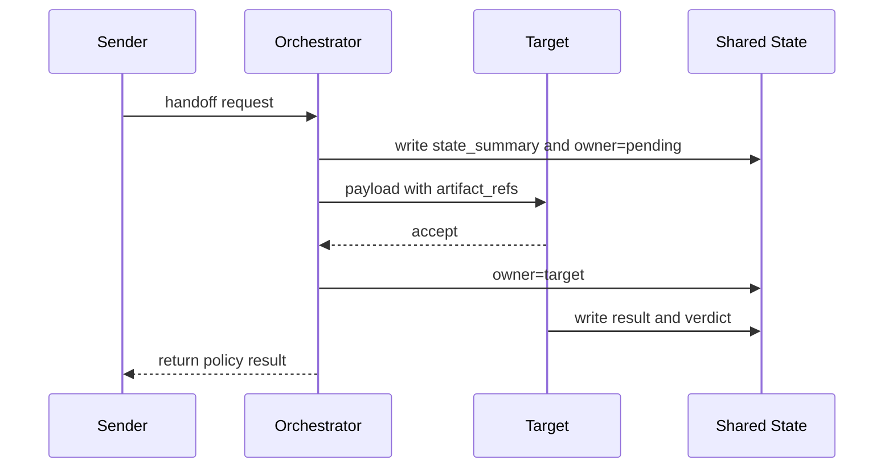

# 如何避免 handoff 后上下文丢失或责任不清？

## 30 秒回答

要避免上下文丢失，handoff payload 必须结构化，包含 task_id、state_summary、artifact_refs、constraints、ownership、deadline 和 return_policy。要避免责任不清，shared state 中必须记录当前 owner、可写资源、接收状态和 trace span。

## 面试定位

这题是对 handoff 的深入追问。面试官想知道你能不能把“转交”设计成可恢复协议，而不是靠 prompt 摘要。

回答中要覆盖架构、数据流、指标、取舍和追问。重点是上下文最小化、责任归属和失败回退。

## 标准回答

第一，state_summary 要由系统生成，不应只依赖模型自由总结。它需要包含用户目标、当前阶段、已完成步骤、关键约束、风险点和 artifact_refs。

第二，ownership 必须进入状态机。接收方 accept 后，某些资源的写权限转给它。原 Agent 只能等待返回或处理其他子任务，不能继续改同一状态。

第三，return_policy 要定义成功、失败、拒绝、超时和人工介入。没有 return_policy，handoff 一旦失败就会悬挂。

第四，trace 要串起 sender、orchestrator 和 receiver。排障时能看到谁发起、谁接收、携带了什么上下文，以及哪个环节丢了信息。

## 架构与运行机制

handoff 的数据流应该通过 shared state 和 artifact 引用，而不是复制整段历史。这样既减少 token，也避免把不必要的敏感内容传给目标 Agent。

## 可画图

可以画状态机：requested、accepted、running、blocked、completed、failed、returned。每个状态旁边写 owner 和允许动作。

## 系统设计案例

Browser Agent 在网页上发现支付动作，需要转给 Risk Agent。payload 应包含当前页面、用户目标、候选动作、风险原因和截图引用。Risk Agent 不需要完整浏览历史，也不应该拿到无关 cookie 或凭据。

数据流是：Browser Agent 请求 handoff，Orchestrator 创建 risk review task，Risk Agent 输出 allow、deny 或 ask_user。若 allow，原流程继续。若 deny，系统停止动作并向用户解释。

## 真实问题与排障

如果目标 Agent 说“缺上下文”，检查 state_summary 是否缺关键约束，artifact_refs 是否过期，权限是否不足。若出现责任不清，查看 owner 字段和写锁日志。

指标包括 context_loss_rate、handoff_reject_rate、owner_conflict_count、handoff_timeout_rate 和 post_handoff_error_rate。

## 面试官追问

- state_summary 由谁生成，如何验证？
- 是否应该传完整历史？
- 接收方拒绝后谁负责恢复？
- ownership 如何与数据库事务或锁配合？
- 高风险 handoff 什么时候需要人工确认？

## 项目化回答

我会把 handoff 当成一个小型协议。payload 结构化，artifact 用引用传递，shared state 记录 owner，return_policy 处理异常，trace 用于回放。这样即使 Agent 换了实现，编排层仍能稳定工作。

## 常见错误

- 只传自然语言摘要，缺少 artifact 引用。
- 接收状态没有进入状态机。
- 原 Agent 和目标 Agent 同时写。
- 超时后没有恢复路径。
- 排障时找不到 handoff span。

## 深挖技术细节

handoff 后不丢上下文，关键是 payload 由系统从可信 State 投影，而不是由上游 Agent 随手总结。payload 至少包含 `handoff_id`、`task_id`、`source_agent`、`target_agent`、`state_summary`、`hard_constraints`、`artifact_refs`、`allowed_write_scope`、`risk_level`、`deadline`、`return_policy`、`trace_id`。`artifact_refs` 负责传递截图、PDF、diff、日志、证据表等大对象，避免复制完整历史。

责任清晰要靠 ownership 状态机。requested 阶段 owner 仍是 sender 或 orchestrator；accepted 后目标 Agent 拿到明确写权限；blocked/failed 时按 return_policy 退回、重试、转人工或取消。shared state 每个字段应有 owner 和 version，写入时做 compare-and-swap，避免两个 Agent 同时更新同一资源。

验证 handoff 质量要看 trace。handoff span 应记录 sender、receiver、payload hash、accept/reject reason、owner change、artifact access、timeout 和 final verdict。指标包括 `context_loss_rate`、`handoff_reject_rate`、`owner_conflict_count`、`handoff_timeout_rate`、`post_handoff_error_rate` 和 `artifact_access_denial_rate`。

## 边界条件与反例

反例一：只把“帮我审查一下”发给 Risk Agent，没有当前页面、候选动作和风险原因，目标 Agent 只能猜。反例二：目标 Agent accept 后，原 Agent 仍继续执行支付动作，造成双写。反例三：return_policy 未定义，目标 Agent timeout 后任务悬挂。

边界在于：handoff 不适合高度耦合、频繁共享中间状态的任务，这类任务更适合 manager pattern 或单 Agent 内部工具调用。高风险 handoff 要经过 Orchestrator 和权限检查，不能让两个 Agent 直接自然语言转交。

## 深问准备

- 问：state_summary 谁生成？答：由 Orchestrator 或 Context Projector 从可信 state 生成，目标 Agent 可校验缺失字段。
- 问：是否传完整历史？答：通常不传，传 artifact refs、trace range 和必要约束，敏感内容按 scope 授权。
- 问：接收方拒绝后谁负责？答：return_policy 指定 sender、manager、fallback Agent 或 human handoff。
- 问：ownership 如何配合锁？答：shared state 字段有 owner/version，写入用 compare-and-swap 或短租约锁。

## 来源与延伸阅读

- [OpenAI Agents SDK Handoffs](https://openai.github.io/openai-agents-python/handoffs/)
- [LangChain Multi-agent](https://docs.langchain.com/oss/python/langchain/multi-agent)
- [OpenAI Agents SDK Tracing](https://openai.github.io/openai-agents-python/tracing/)
